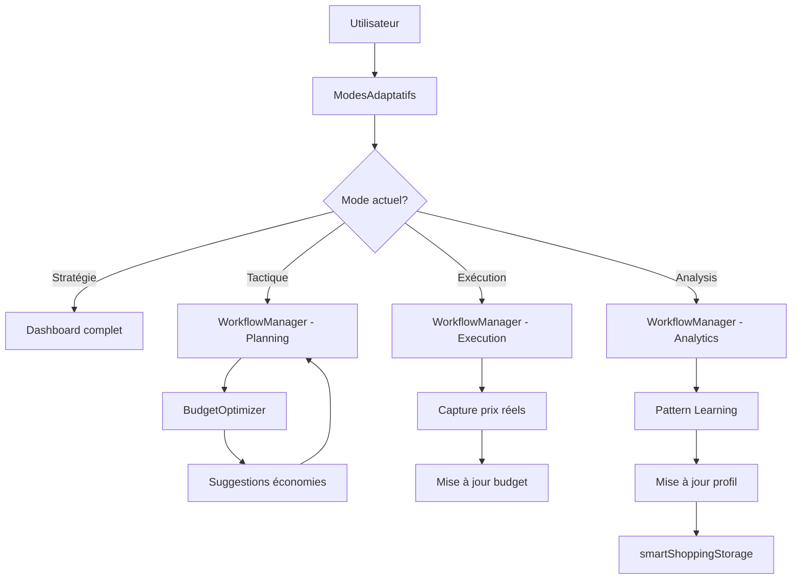

# Design Document - Smart Shopping Phases 6-7

## Overview

Ce document décrit l'architecture et le design des composants pour finaliser le module Smart Shopping. Les phases 6-7 ajoutent un workflow orchestré complet et une interface adaptative révolutionnaire qui transforme l'expérience utilisateur selon le contexte.

## Architecture

### Vue d'ensemble

```
SmartShoppingTab (existant)
├── WorkflowManager (nouveau) - Orchestrateur des 3 phases
│   ├── PlanningPhase (nouveau)
│   ├── ExecutionPhase (wrapper existant ExecutionMode)
│   └── AnalyticsPhase (wrapper existant AnalyticsPerformance)
├── ModesAdaptatifs (nouveau) - 4 modes contextuels
│   ├── StrategieMode
│   ├── TactiqueMode
│   ├── ExecutionMode
│   └── AnalysisMode
├── BudgetOptimizer (nouveau) - Suggestions économies
└── SettingsManager (nouveau) - Paramètres utilisateur
```

### Flux de données



## Components and Interfaces

### 1. WorkflowManager

**Responsabilité**: Orchestrer les 3 phases du workflow (Planification → Exécution → Analytics)

**Props**:
```typescript
interface WorkflowManagerProps {
  listeId?: string; // ID liste existante ou undefined pour nouvelle
  onComplete: () => void;
}
```

**State**:
```typescript
interface WorkflowState {
  phase: 'planning' | 'execution' | 'analytics';
  liste: Liste;
  estimations: Map<string, number>; // articleId -> prix estimé
  realisations: Map<string, number>; // articleId -> prix réel
  optimizations: Optimization[];
}
```

**Méthodes**:
- `startPlanning()`: Initialise phase planification
- `validatePlanning()`: Valide liste et passe en exécution
- `startExecution()`: Active mode courses
- `completeExecution()`: Termine courses et passe en analytics
- `finishAnalytics()`: Finalise workflow et sauvegarde learnings

### 2. PlanningPhase

**Responsabilité**: Interface de planification avec estimations et optimisations

**Props**:
```typescript
interface PlanningPhaseProps {
  liste: Liste;
  onUpdateListe: (liste: Liste) => void;
  onValidate: () => void;
  onRequestOptimization: () => void;
}
```

**Sections**:
1. **Template Selection**: Choix template avec pré-remplissage
2. **Liste Builder**: Ajout/modification articles avec prix estimés
3. **Budget Summary**: Résumé budget avec alertes
4. **Optimization Panel**: Suggestions économies du BudgetOptimizer

**Fonctionnalités**:
- Auto-complétion articles avec historique prix
- Calcul budget estimé temps réel
- Validation contraintes budget
- Intégration suggestions BudgetOptimizer

### 3. BudgetOptimizer

**Responsabilité**: Analyser liste et générer suggestions d'économies

**Interface**:
```typescript
interface Optimization {
  type: 'substitution' | 'promo' | 'magasin' | 'quantite';
  articleId: string;
  description: string;
  economie: number;
  confiance: number; // 0-100
  action: () => void;
}

interface BudgetOptimizerProps {
  liste: Liste;
  budget: number;
  onApplyOptimization: (optimization: Optimization) => void;
}
```

**Algorithmes**:

1. **Détection Substitutions**:
```javascript
function findSubstitutions(article) {
  // 1. Chercher alternatives même catégorie
  const alternatives = inventaire.filter(a => 
    a.categorie === article.categorie && 
    a.prix < article.prixEstime
  );
  
  // 2. Vérifier compatibilité profil marques
  const compatible = alternatives.filter(alt => {
    const profil = getProfilMarque(alt.marque);
    return profil.type !== 'EXCLUSIF' || profil.nom === article.marque;
  });
  
  // 3. Calculer économie et confiance
  return compatible.map(alt => ({
    type: 'substitution',
    articleId: article.id,
    description: `Remplacer ${article.nom} par ${alt.nom}`,
    economie: article.prixEstime - alt.prix,
    confiance: calculateConfiance(article, alt),
    action: () => replaceArticle(article.id, alt)
  }));
}
```

2. **Détection Promos Pertinentes**:
```javascript
function findPromos(liste) {
  return promos.filter(promo => {
    // 1. Article dans la liste?
    const article = liste.articles.find(a => a.nom === promo.produit);
    if (!article) return false;
    
    // 2. Vérifier faisabilité (inventaire + péremption)
    const feasibility = checkPromoFeasibility(promo);
    if (!feasibility.recommande) return false;
    
    // 3. Calculer économie
    const economie = article.prixEstime - promo.prixPromo;
    return economie > 0;
  }).map(promo => ({
    type: 'promo',
    articleId: findArticleId(promo.produit),
    description: `Promo ${promo.produit}: ${promo.reduction}%`,
    economie: calculateEconomie(promo),
    confiance: 95,
    action: () => applyPromo(promo)
  }));
}
```

3. **Optimisation Magasin**:
```javascript
function optimizeMagasin(liste) {
  const magasins = ['Action', 'Grand Frais', 'Auchan', 'Carrefour', 'Leclerc'];
  
  const comparaisons = magasins.map(magasin => {
    const total = liste.articles.reduce((sum, article) => {
      const prix = getPrixMagasin(article, magasin);
      return sum + (prix || article.prixEstime);
    }, 0);
    
    return { magasin, total };
  });
  
  const optimal = comparaisons.sort((a, b) => a.total - b.total)[0];
  const actuel = liste.magasinCible || 'Carrefour';
  const economie = getPrixMagasin(actuel) - optimal.total;
  
  if (economie > 5) { // Seuil 5€
    return {
      type: 'magasin',
      description: `Changer pour ${optimal.magasin}`,
      economie,
      confiance: 85,
      action: () => changeMagasin(optimal.magasin)
    };
  }
  
  return null;
}
```

### 4. ModesAdaptatifs

**Responsabilité**: Gérer les 4 modes contextuels avec transitions fluides

**Props**:
```typescript
interface ModesAdaptatifsProps {
  modeActuel: 'strategie' | 'tactique' | 'execution' | 'analysis';
  onChangeMode: (mode: string) => void;
}
```

**Modes**:

1. **Mode Stratégie**: Dashboard complet
   - Toutes les métriques (budget, listes, inventaire, analytics)
   - Projections long terme
   - Graphiques tendances
   - Navigation complète

2. **Mode Tactique**: Planification liste
   - WorkflowManager en phase Planning
   - BudgetOptimizer visible
   - Templates et suggestions
   - Focus sur création liste

3. **Mode Exécution**: Interface épurée magasin
   - WorkflowManager en phase Execution
   - Uniquement liste active
   - Gros boutons tactiles
   - Budget restant prominent
   - Zéro distraction

4. **Mode Analysis**: Analytics détaillées
   - WorkflowManager en phase Analytics
   - Graphiques performance
   - Insights et learnings
   - Recommandations futures

**Transitions**:
```javascript
function transitionMode(from, to) {
  // 1. Sauvegarder contexte actuel
  saveContext(from);
  
  // 2. Animation sortie (fade out + scale)
  await animateOut(from, {
    opacity: 0,
    scale: 0.95,
    duration: 200
  });
  
  // 3. Charger contexte nouveau mode
  const context = loadContext(to);
  
  // 4. Animation entrée (fade in + scale)
  await animateIn(to, {
    opacity: 1,
    scale: 1,
    duration: 200
  });
  
  // 5. Pré-charger données si nécessaire
  prefetchData(to);
}
```

### 5. SettingsManager

**Responsabilité**: Gérer paramètres utilisateur Smart Shopping

**Settings**:
```typescript
interface SmartShoppingSettings {
  magasinsPreferences: string[]; // Ordre préférence
  seuilsAlertes: {
    budgetWarning: number; // % budget pour alerte
    budgetCritical: number; // % budget pour critique
    stockBas: number; // Quantité seuil stock bas
  };
  notifications: {
    promos: boolean;
    stockBas: boolean;
    depassementBudget: boolean;
  };
  affichage: {
    deviseSymbol: string;
    formatDate: string;
    theme: 'light' | 'dark' | 'auto';
  };
  optimisations: {
    autoSuggestSubstitutions: boolean;
    autoDetectPromos: boolean;
    learningEnabled: boolean;
  };
}
```

## Data Models

### Workflow State

```typescript
interface WorkflowState {
  id: string;
  listeId: string;
  phase: 'planning' | 'execution' | 'analytics';
  dateDebut: number;
  dateFin?: number;
  
  planning: {
    templateUtilise?: string;
    budgetEstime: number;
    optimizationsAppliquees: string[]; // IDs optimizations
  };
  
  execution: {
    dateDebut: number;
    dateFin?: number;
    articlesAchetes: number;
    articlesNonTrouves: number;
    articlesRemplaces: number;
    ajoutsDynamiques: number;
    budgetReel: number;
  };
  
  analytics: {
    ecarts: Array<{
      articleId: string;
      estime: number;
      reel: number;
      ecartPourcent: number;
    }>;
    performance: {
      respectBudget: boolean;
      economiesRealisees: number;
      articlesOublies: string[];
    };
    learnings: Array<{
      type: string;
      description: string;
      confiance: number;
    }>;
  };
}
```

### Optimization

```typescript
interface Optimization {
  id: string;
  type: 'substitution' | 'promo' | 'magasin' | 'quantite';
  listeId: string;
  articleId?: string;
  description: string;
  economie: number;
  confiance: number; // 0-100
  dateCreation: number;
  appliquee: boolean;
  dateApplication?: number;
  
  details: {
    avant?: any;
    apres?: any;
    raison: string;
  };
}
```

## Correctness Properties

*A property is a characteristic or behavior that should hold true across all valid executions of a system-essentially, a formal statement about what the system should do. Properties serve as the bridge between human-readable specifications and machine-verifiable correctness guarantees.*

### Property 1: Workflow Phase Progression

*For any* workflow state, transitioning from planning to execution to analytics should preserve all data from previous phases without loss.

**Validates: Requirements 1.1, 1.3, 1.4**

### Property 2: Budget Consistency

*For any* liste in execution phase, the sum of prix réels should always equal the budget réel displayed to the user.

**Validates: Requirements 3.2, 3.4**

### Property 3: Optimization Validity

*For any* optimization suggested by BudgetOptimizer, applying it should result in a budget estimé lower than or equal to the original.

**Validates: Requirements 2.3, 2.4, 6.1, 6.5**

### Property 4: Mode Transition Preservation

*For any* mode transition, all user data and context should be preserved and restored correctly when returning to the original mode.

**Validates: Requirements 5.5**

### Property 5: Analytics Accuracy

*For any* completed workflow, the écarts calculated in analytics phase should match the difference between estimations in planning and realisations in execution.

**Validates: Requirements 4.1, 4.2**

### Property 6: Performance Bounds

*For any* user interaction, the response time should be less than 100ms for UI updates and less than 500ms for calculations.

**Validates: Requirements 7.1, 7.2, 7.3**

### Property 7: Persistence Reliability

*For any* modification to liste or workflow state, the data should be persisted to IndexedDB within 200ms and be recoverable on next session.

**Validates: Requirements 8.1, 8.2, 8.4**

## Error Handling

### Stratégies par composant

1. **WorkflowManager**:
   - Validation phase transitions
   - Rollback si erreur pendant transition
   - Sauvegarde état avant chaque transition

2. **BudgetOptimizer**:
   - Validation données entrée (liste, budget)
   - Gestion erreurs calcul (division par zéro, valeurs négatives)
   - Fallback si API prix indisponible

3. **ModesAdaptatifs**:
   - Gestion erreurs chargement contexte
   - Fallback mode par défaut si erreur
   - Retry automatique transitions échouées

4. **PersistenceLayer**:
   - Retry automatique (3 tentatives)
   - Queue sauvegarde si IndexedDB indisponible
   - Alerte utilisateur si échec persistant

### Error Boundaries

Utiliser `SmartShoppingErrorBoundary` existant pour wrapper tous les nouveaux composants.

## Testing Strategy

### Unit Tests

**Framework**: Vitest

**Composants à tester**:
1. `WorkflowManager`: Transitions phases, validation état
2. `BudgetOptimizer`: Algorithmes optimisation, calculs économies
3. `ModesAdaptatifs`: Changements mode, sauvegarde contexte
4. `PlanningPhase`: Validation liste, calculs budget

**Exemples tests**:
```javascript
describe('BudgetOptimizer', () => {
  it('should find valid substitutions', () => {
    const liste = createTestListe();
    const optimizations = findSubstitutions(liste.articles[0]);
    expect(optimizations).toHaveLength(greaterThan(0));
    expect(optimizations[0].economie).toBeGreaterThan(0);
  });
  
  it('should respect profil marques', () => {
    const article = { marque: 'Nutella', type: 'EXCLUSIF' };
    const optimizations = findSubstitutions(article);
    expect(optimizations).toHaveLength(0); // Pas de substitution pour marque exclusive
  });
});
```

### Property-Based Tests

**Framework**: fast-check

**Configuration**: Minimum 100 itérations par test

**Properties à tester**:

1. **Property 1: Workflow Phase Progression**
```javascript
// Feature: smart-shopping, Property 1: Workflow Phase Progression
it('should preserve data through phase transitions', () => {
  fc.assert(
    fc.property(
      fc.record({
        liste: listeArbitrary,
        estimations: fc.dictionary(fc.string(), fc.float({ min: 0, max: 1000 }))
      }),
      ({ liste, estimations }) => {
        const workflow = new WorkflowManager(liste);
        workflow.startPlanning();
        workflow.setEstimations(estimations);
        workflow.validatePlanning();
        
        // Vérifier que estimations sont préservées
        expect(workflow.state.planning.estimations).toEqual(estimations);
        
        workflow.startExecution();
        // Vérifier que estimations sont toujours là
        expect(workflow.state.planning.estimations).toEqual(estimations);
      }
    ),
    { numRuns: 100 }
  );
});
```

2. **Property 2: Budget Consistency**
```javascript
// Feature: smart-shopping, Property 2: Budget Consistency
it('should maintain budget consistency', () => {
  fc.assert(
    fc.property(
      fc.array(fc.record({
        id: fc.uuid(),
        prixReel: fc.float({ min: 0, max: 100 })
      })),
      (articles) => {
        const workflow = new WorkflowManager();
        workflow.startExecution();
        
        articles.forEach(article => {
          workflow.checkArticle(article.id, article.prixReel);
        });
        
        const sumPrix = articles.reduce((sum, a) => sum + a.prixReel, 0);
        expect(workflow.state.execution.budgetReel).toBeCloseTo(sumPrix, 2);
      }
    ),
    { numRuns: 100 }
  );
});
```

3. **Property 3: Optimization Validity**
```javascript
// Feature: smart-shopping, Property 3: Optimization Validity
it('should only suggest valid optimizations', () => {
  fc.assert(
    fc.property(
      listeArbitrary,
      (liste) => {
        const budgetInitial = calculateBudget(liste);
        const optimizer = new BudgetOptimizer(liste);
        const optimizations = optimizer.findOptimizations();
        
        optimizations.forEach(opt => {
          const listeOptimisee = applyOptimization(liste, opt);
          const budgetOptimise = calculateBudget(listeOptimisee);
          
          expect(budgetOptimise).toBeLessThanOrEqual(budgetInitial);
          expect(opt.economie).toBeGreaterThan(0);
        });
      }
    ),
    { numRuns: 100 }
  );
});
```

4. **Property 4: Mode Transition Preservation**
```javascript
// Feature: smart-shopping, Property 4: Mode Transition Preservation
it('should preserve context through mode transitions', () => {
  fc.assert(
    fc.property(
      fc.record({
        mode: fc.constantFrom('strategie', 'tactique', 'execution', 'analysis'),
        context: fc.object()
      }),
      ({ mode, context }) => {
        const modes = new ModesAdaptatifs();
        modes.setMode(mode);
        modes.setContext(context);
        
        const savedContext = modes.getContext();
        
        // Changer de mode et revenir
        modes.setMode('strategie');
        modes.setMode(mode);
        
        const restoredContext = modes.getContext();
        expect(restoredContext).toEqual(savedContext);
      }
    ),
    { numRuns: 100 }
  );
});
```

### Integration Tests

**Scénarios**:
1. Workflow complet: Planning → Execution → Analytics
2. Optimizations: Génération → Application → Validation
3. Mode transitions: Tous les changements possibles
4. Persistence: Sauvegarde → Fermeture → Restauration

## Performance Optimizations

### 1. Memoization

```javascript
// Memoize calculs coûteux
const memoizedOptimizations = useMemo(() => {
  return budgetOptimizer.findOptimizations(liste);
}, [liste.articles, liste.budget]);
```

### 2. Debouncing

```javascript
// Debounce sauvegardes
const debouncedSave = useDebouncedCallback(
  (data) => smartShoppingStorage.saveListe(data),
  200
);
```

### 3. GPU Animations

```css
/* Utiliser transform pour animations GPU */
.mode-transition {
  transform: translateX(0);
  transition: transform 200ms ease-out;
  will-change: transform;
}
```

### 4. Code Splitting

```javascript
// Lazy load composants lourds
const AnalyticsPhase = lazy(() => import('./AnalyticsPhase'));
const BudgetOptimizer = lazy(() => import('./BudgetOptimizer'));
```

### 5. IndexedDB Optimization

```javascript
// Utiliser transactions pour batch operations
async function saveBatch(items) {
  const db = await initDB();
  const tx = db.transaction('listes', 'readwrite');
  
  await Promise.all(
    items.map(item => tx.store.put(item))
  );
  
  await tx.done;
}
```

## Accessibility

### ARIA Labels

Tous les composants doivent avoir:
- `aria-label` pour boutons sans texte
- `aria-describedby` pour descriptions contextuelles
- `role` approprié pour éléments interactifs
- `aria-live` pour notifications dynamiques

### Keyboard Navigation

- Tab navigation complète
- Shortcuts clavier pour actions fréquentes
- Focus visible sur tous les éléments interactifs
- Escape pour fermer modals/panels

### Screen Readers

- Annonces pour changements de phase
- Descriptions pour métriques et graphiques
- Labels explicites pour tous les champs
