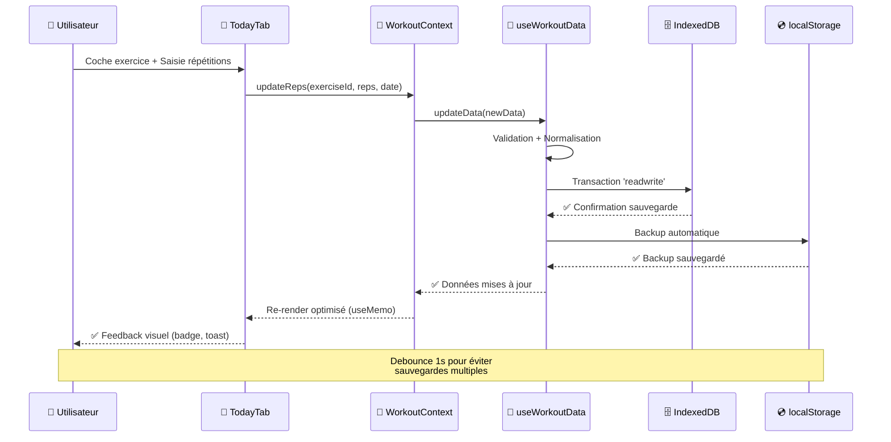
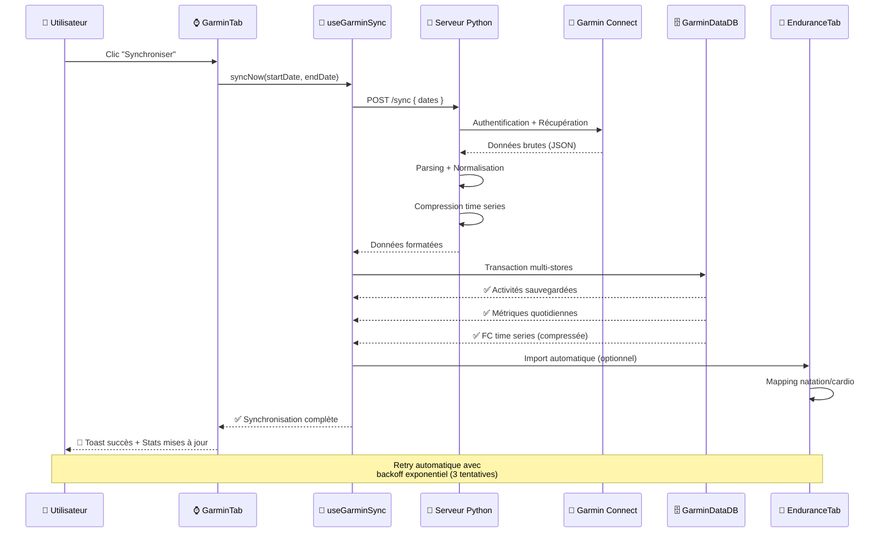
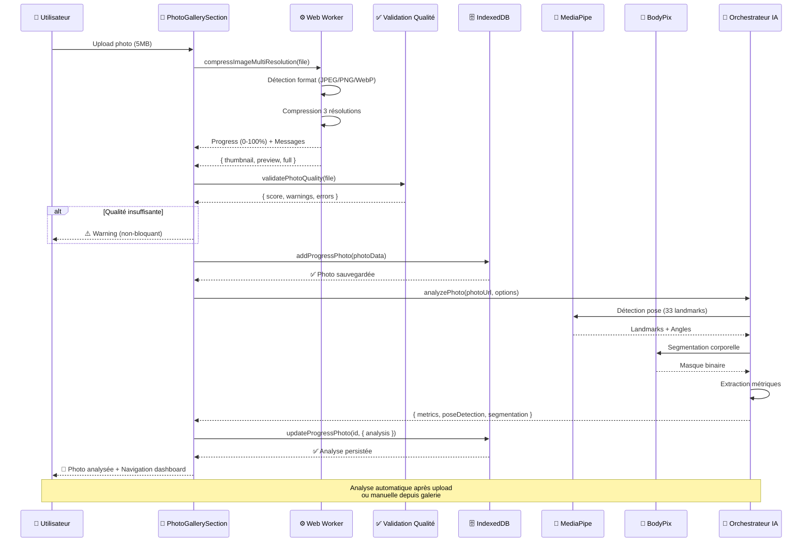
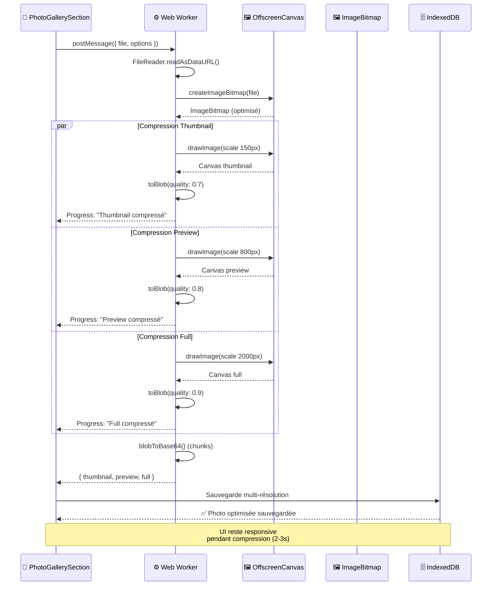
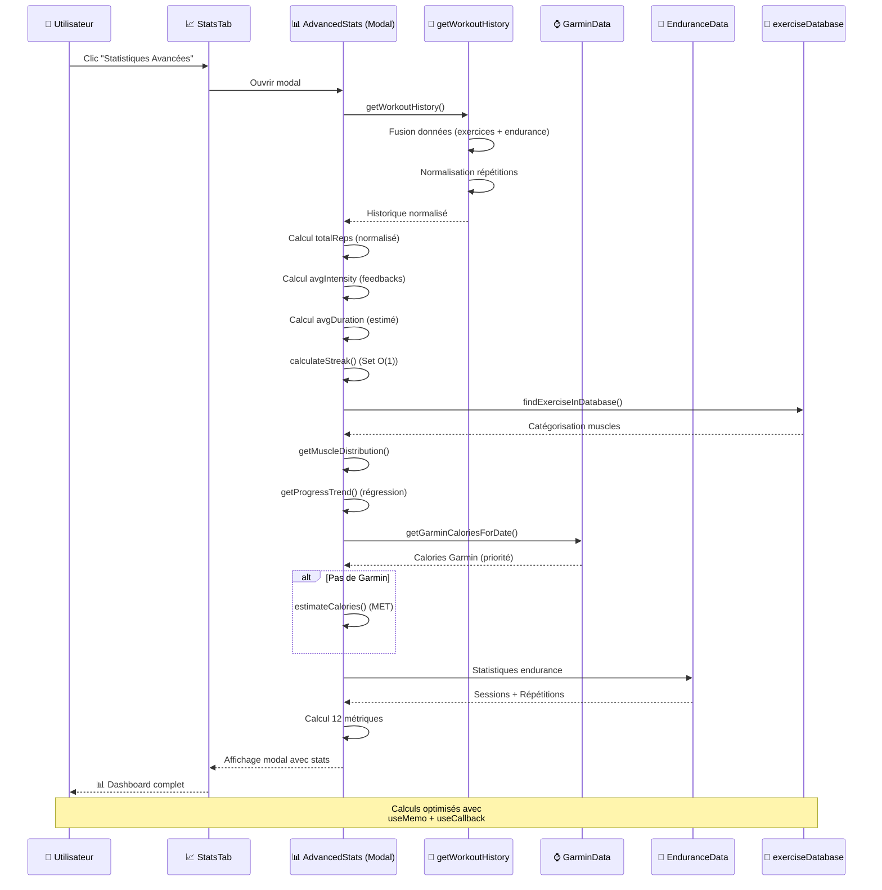
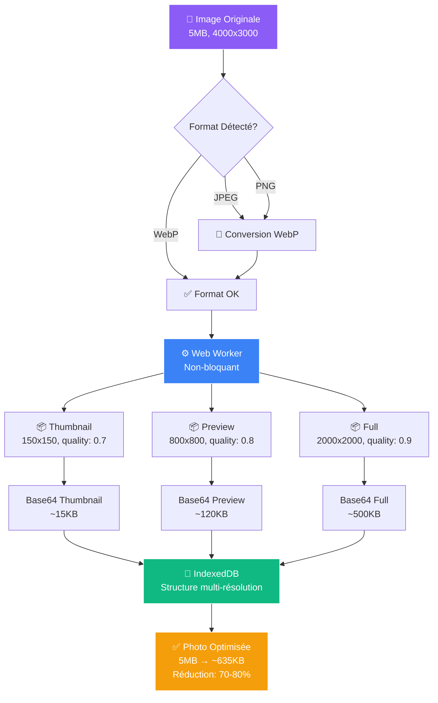
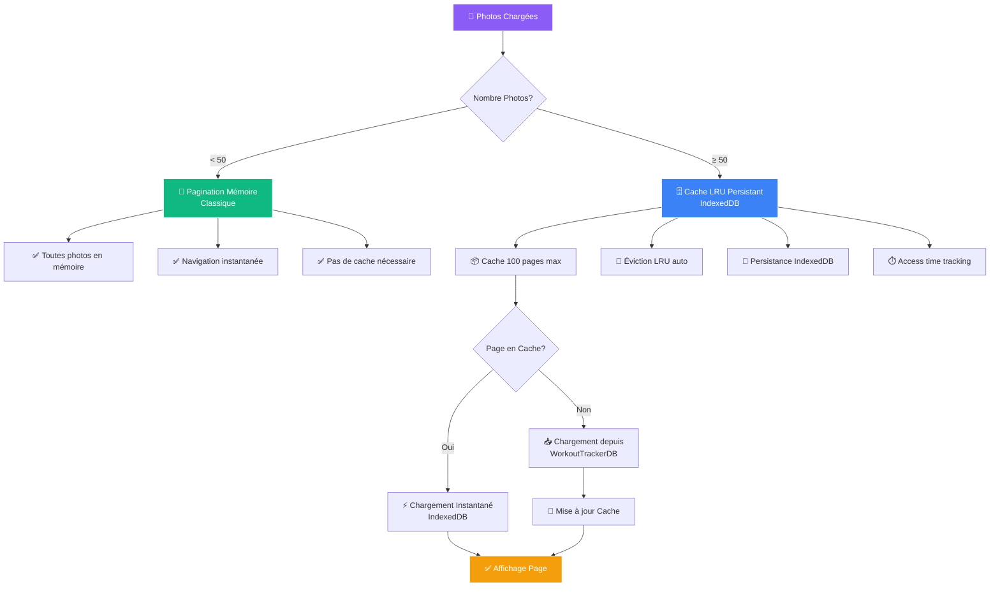
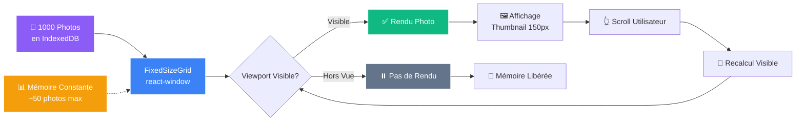

# 🚀 Momentum - Plateforme Complète de Suivi d'Entraînement Personnel

<div align="center">

[](https://github.com/zingariello1314/workouttracker)

[](https://reactjs.org/)
[](https://vitejs.dev/)
[](https://tailwindcss.com/)
[](https://web.dev/progressive-web-apps/)
[](https://developer.mozilla.org/en-US/docs/Web/API/IndexedDB_API)
[](LICENSE)

**Application Web Progressive (PWA) de niveau professionnel pour le suivi complet d'entraînement**

[🚀 Démo Live](#) • [📖 Documentation](#-documentation-complète) • [🛠️ Installation](#-installation--déploiement) • [🤝 Contribuer](#-contribution--communauté)

[⭐ Star sur GitHub](https://github.com/zingariello1314/workouttracker/stargazers) • [💬 Discussions](https://github.com/zingariello1314/workouttracker/discussions) • [🐛 Signaler un Bug](https://github.com/zingariello1314/workouttracker/issues) • [📧 Contact](mailto:contact@momentum-fitness.app)

</div>

---

## 📋 Table des Matières

<details>
<summary>Cliquez pour développer la navigation complète</summary>

- [🎯 Vue d'Ensemble](#-vue-densemble)
- [🏗️ Architecture & Stack Technologique](#️-architecture--stack-technologique)
- [📱 Documentation Complète - Les 14 Onglets](#-documentation-complète---les-14-onglets)
- [🔗 Interconnexion des Onglets](#-interconnexion-des-onglets)
- [🛠️ Installation & Déploiement](#️-installation--déploiement)
- [🚀 Performance & Optimisations](#-performance--optimisations)
- [🔒 Sécurité & Confidentialité](#-sécurité--confidentialité)
- [🤝 Contribution & Communauté](#-contribution--communauté)
- [📄 Licence](#-licence)
- [👨‍💻 Auteur & Contact](#-auteur--contact)
- [🌟 Soutenez le Projet](#-soutenez-le-projet)

</details>

---

## 🎯 Vue d'Ensemble

**Momentum** est une application web progressive (PWA) sophistiquée développée avec **React 18+** et **Vite 5+**, offrant une expérience complète de gestion d'entraînement. L'application intègre **14 onglets spécialisés**, un système de suivi corporel avancé avec **analyse IA**, des fonctionnalités d'analyse de données statistiques poussées, et une **intégration complète avec Garmin Connect**.

### ✨ Points Forts Principaux

<table>
<tr>
<td width="50%">

#### 🎨 Interface & Design
- Thème sombre élégant avec gradients et animations fluides
- 100% Responsive (mobile, tablette, desktop)
- Transitions et micro-interactions soignées
- Design system cohérent et moderne

</td>
<td width="50%">

#### 💾 Stockage & Performance
- IndexedDB pour persistance volumineuse (GB)
- localStorage backup automatique
- Lazy loading (réduction bundle ~40%)
- Memoization (réduction re-renders ~70%)

</td>
</tr>
<tr>
<td width="50%">

#### 🤖 Intelligence Artificielle
- Analyse photos : MediaPipe (pose) + BodyPix (segmentation)
- Prédictions ML : Régression linéaire avec intervalles confiance
- Détection déséquilibres musculaires
- Recommandations personnalisées

</td>
<td width="50%">

#### 📊 Visualisation & Analytics
- 20+ graphiques interactifs (Recharts + Canvas)
- Heatmap calendrier annuel
- Corrélations multi-métriques
- Export PDF personnalisable

</td>
</tr>
<tr>
<td width="50%">

#### ⌚ Intégration Garmin
- Synchronisation complète Garmin Connect
- 4 types d'activités (natation, cardio, etc.)
- Métriques quotidiennes (FC, sommeil, stress, body battery)
- Compression time series optimisée

</td>
<td width="50%">

#### 🔒 Confidentialité
- 100% Privé : Toutes données sur appareil
- Pas de tracking tiers
- Conformité RGPD/CCPA
- Export/Import complet

</td>
</tr>
</table>

### 📊 Métriques Clés

| Métrique | Valeur |
|----------|--------|
| **Onglets Spécialisés** | 14 |
| **Graphiques Disponibles** | 20+ |
| **Bases IndexedDB** | 4 |
| **Types d'Activités Endurance** | 5 |
| **Sections Suivi Corporel** | 10 |
| **Bundle Initial (gzipped)** | ~500KB |
| **Temps Chargement (3G)** | <2s |
| **Support Données** | 10,000+ séances, 1000+ photos |
| **Taux Succès Sync Garmin** | ~95% |

---

**✅ CHAPITRE 1 TERMINÉ - Vue d'Ensemble**

---

## 🏗️ Architecture & Stack Technologique

### 📦 Stack Moderne & Performant

<table>
<tr>
<th width="25%">Technologie</th>
<th width="15%">Version</th>
<th width="60%">Usage & Bénéfices</th>
</tr>
<tr>
<td><strong>React</strong></td>
<td>18.3.1+</td>
<td>
• Framework UI avec Hooks, Context API, Suspense<br>
• Composants fonctionnels optimisés<br>
• Concurrent Features pour performance
</td>
</tr>
<tr>
<td><strong>Vite</strong></td>
<td>5.4.10+</td>
<td>
• Build tool ultra-rapide (HMR <50ms)<br>
• Tree-shaking automatique<br>
• Optimisations production avancées
</td>
</tr>
<tr>
<td><strong>Tailwind CSS</strong></td>
<td>3.4.14+</td>
<td>
• Utility-first responsive<br>
• PurgeCSS automatique<br>
• Design system cohérent
</td>
</tr>
<tr>
<td><strong>IndexedDB</strong></td>
<td>Native</td>
<td>
• Persistance volumineuse (plusieurs GB)<br>
• Transactions atomiques<br>
• Indexation pour requêtes rapides
</td>
</tr>
<tr>
<td><strong>Recharts</strong></td>
<td>Latest</td>
<td>
• Visualisation données avancée<br>
• Responsive automatique<br>
• Accessibilité intégrée
</td>
</tr>
<tr>
<td><strong>MediaPipe</strong></td>
<td>Latest</td>
<td>
• Détection pose (33 landmarks)<br>
• Analyse photos progression<br>
• Extraction métriques corporelles
</td>
</tr>
<tr>
<td><strong>BodyPix</strong></td>
<td>Latest</td>
<td>
• Segmentation corporelle<br>
• Masque binaire personne/arrière-plan<br>
• Calcul proportions automatique
</td>
</tr>
</table>

### 🗄️ Architecture des Données - 4 Bases IndexedDB

```
┌─────────────────────────────────────────────────────────────────┐
│                    ARCHITECTURE INDEXEDDB                        │
└─────────────────────────────────────────────────────────────────┘

┌─────────────────────────────────────────────────────────────────┐
│ 1. WorkoutTrackerDB (v1)                                        │
├─────────────────────────────────────────────────────────────────┤
│ Object Store: workouts                                          │
│ Clé: 'main'                                                     │
│                                                                 │
│ Contient:                                                       │
│  • Données d'entraînement (exercices, répétitions)              │
│  • Photos de progression (multi-résolution)                     │
│  • Métriques corporelles (poids, mensurations)                 │
│  • Entrées impédancemétrie                                     │
│  • Feedbacks de session                                        │
│  • Variations journalières                                     │
│  • Données endurance (5 activités)                             │
│  • Défis et challenges                                         │
└─────────────────────────────────────────────────────────────────┘

┌─────────────────────────────────────────────────────────────────┐
│ 2. GarminDataDB (v1)                                            │
├─────────────────────────────────────────────────────────────────┤
│ Object Stores:                                                  │
│  • activities      → Activités (natation, cardio, etc.)        │
│  • dailyMetrics    → Métriques quotidiennes                    │
│  • heartRate       → FC time series (compressée)              │
│  • sleep           → Données sommeil                             │
│  • stress          → Niveaux stress                             │
│  • bodyBattery     → Body Battery                              │
│  • respiration     → Respiration                               │
│                                                                 │
│ Indexation: Par date, type d'activité                           │
└─────────────────────────────────────────────────────────────────┘

┌─────────────────────────────────────────────────────────────────┐
│ 3. HomepageImagesDB (v2)                                        │
├─────────────────────────────────────────────────────────────────┤
│ Object Store: images                                            │
│ Indexation: type, timestamp                                     │
│                                                                 │
│ Contient:                                                       │
│  • Images de fond personnalisables                             │
│  • Rotation automatique (2 min)                                 │
│  • Validation Base64 stricte                                   │
└─────────────────────────────────────────────────────────────────┘

┌─────────────────────────────────────────────────────────────────┐
│ 4. WorkoutTrackerContextDB (v1)                                 │
├─────────────────────────────────────────────────────────────────┤
│ Object Store: contextData                                      │
│                                                                 │
│ Contient:                                                       │
│  • État React (onglets actifs)                                 │
│  • Préférences utilisateur                                     │
│  • Configuration interface                                     │
└─────────────────────────────────────────────────────────────────┘
```

### 🔄 Architecture React - Flux de Données

```
┌─────────────────────────────────────────────────────────────────┐
│                    ARCHITECTURE REACT                           │
└─────────────────────────────────────────────────────────────────┘

                    ┌──────────────┐
                    │   App.jsx    │
                    │  (Root)      │
                    └──────┬───────┘
                           │
        ┌──────────────────┼──────────────────┐
        │                  │                  │
        ▼                  ▼                  ▼
┌──────────────┐  ┌──────────────┐  ┌──────────────┐
│ ToastProvider│  │WorkoutProvider│  │GarminProvider│
│ (Notifications)│ │ (État Global) │  │ (Garmin Data)│
└──────────────┘  └──────┬───────┘  └──────────────┘
                         │
        ┌────────────────┼────────────────┐
        │                │                │
        ▼                ▼                ▼
┌──────────────┐ ┌──────────────┐ ┌──────────────┐
│WorkoutContext│ │useWorkoutData│ │useWorkoutLogic│
│ (Context API)│ │ (IndexedDB)  │ │ (Logique)    │
└──────────────┘ └──────────────┘ └──────────────┘
        │
        │ Fournit: activeTab, data, getWorkoutHistory, etc.
        │
        ▼
┌─────────────────────────────────────────────────────────┐
│              COMPOSANTS (14 Onglets)                    │
│  ┌──────────┐ ┌──────────┐ ┌──────────┐ ┌──────────┐  │
│  │  Home    │ │ Aujourd' │ │  Saisie  │ │ Progress │  │
│  │  Page    │ │   hui    │ │          │ │          │  │
│  └──────────┘ └──────────┘ └──────────┘ └──────────┘  │
│  ┌──────────┐ ┌──────────┐ ┌──────────┐ ┌──────────┐  │
│  │ Endurance│ │ Calendrier│ │ Programme│ │ Graphiques│ │
│  └──────────┘ └──────────┘ └──────────┘ └──────────┘  │
│  ┌──────────┐ ┌──────────┐ ┌──────────┐ ┌──────────┐  │
│  │ Statist. │ │ Exercices│ │ Historique│ │ Prédict. │  │
│  └──────────┘ └──────────┘ └──────────┘ └──────────┘  │
│  ┌──────────┐ ┌──────────┐ ┌──────────┐ ┌──────────┐  │
│  │Équilibrage│ │  Garmin  │ │ Paramètres│          │  │
│  └──────────┘ └──────────┘ └──────────┘ └──────────┘  │
└─────────────────────────────────────────────────────────┘
```

### 🎯 Patterns Architecturaux Implémentés

#### 1. Context API - État Global Partagé

```javascript
// WorkoutContext.jsx
const WorkoutProvider = ({ children }) => {
  const [activeTab, setActiveTab] = useState('home');
  const [data, setData] = useState({...});
  const { data: workoutData, updateData, loadFromDB } = useWorkoutData();
  
  return (
    <WorkoutContext.Provider value={{
      activeTab, setActiveTab,
      data: workoutData,
      getWorkoutHistory,
      // ... 50+ fonctions exposées
    }}>
      {children}
    </WorkoutContext.Provider>
  );
};
```

**Bénéfices** :
- ✅ Évite prop drilling (pas de passage props sur 3+ niveaux)
- ✅ État global accessible partout
- ✅ Performance avec memoization
- ✅ Séparation claire logique/UI

#### 2. Custom Hooks - Logique Réutilisable

```javascript
// useWorkoutData.js
export const useWorkoutData = () => {
  const [data, setData] = useState({...});
  
  const loadFromDB = useCallback(async () => {
    // Chargement IndexedDB avec migration automatique
    const db = await openDB('WorkoutTrackerDB', 1);
    const result = await db.get('workouts', 'main');
    return migrateData(result?.data || {});
  }, []);
  
  const saveToDB = useCallback(async (data) => {
    // Sauvegarde avec debounce (1s)
    // Backup localStorage automatique
  }, []);
  
  return { data, loadFromDB, saveToDB, ... };
};
```

**Bénéfices** :
- ✅ Logique réutilisable entre composants
- ✅ Séparation responsabilités
- ✅ Testabilité améliorée
- ✅ Maintenance facilitée

#### 3. Lazy Loading - Performance Optimale

```javascript
// Chargement à la demande
const PhotoGlobalDashboard = lazy(() => import('./PhotoGlobalDashboard'));
const PhotoMuscleAnalysis = lazy(() => import('./PhotoMuscleAnalysis'));

// Utilisation avec Suspense
<Suspense fallback={<Loader />}>
  <PhotoGlobalDashboard />
</Suspense>
```

**Impact** :
- 📉 Bundle initial : ~500KB → ~300KB (-40%)
- ⚡ Temps chargement : <2s (3G)
- 🚀 First Contentful Paint : <1.5s

#### 4. Memoization - Réduction Re-renders

```javascript
// useMemo pour calculs coûteux
const chartData = useMemo(() => {
  const history = getWorkoutHistory();
  const filtered = history.filter(/* ... */);
  return transformData(filtered);
}, [workoutHistory, selectedPeriod]);

// useCallback pour fonctions stables
const handleClick = useCallback((id) => {
  doSomething(id);
}, [dependency]);
```

**Impact** :
- 📉 Re-renders inutiles : -70%
- ⚡ Temps interaction : <100ms
- 🚀 Performance UI : Fluide même avec 1000+ items

#### 5. Error Boundaries - Gestion Erreurs Gracieuse

```javascript
class BodyTrackingErrorBoundary extends React.Component {
  state = { hasError: false };
  
  static getDerivedStateFromError(error) {
    return { hasError: true };
  }
  
  componentDidCatch(error, errorInfo) {
    log.error('Error caught', error, errorInfo);
  }
  
  render() {
    if (this.state.hasError) {
      return <ErrorFallback />;
    }
    return this.props.children;
  }
}
```

**Bénéfices** :
- ✅ Application ne crash pas complètement
- ✅ Feedback utilisateur gracieux
- ✅ Logging erreurs pour debugging

#### 6. Web Workers - UI Non-Bloquante

```javascript
// Compression images dans worker
const worker = new Worker('/workers/imageCompressionWorker.js');
worker.postMessage({ file, options });
worker.onmessage = (event) => {
  const { progress, result } = event.data;
  setUploadProgress(progress);
  if (result) handleComplete(result);
};
```

**Impact** :
- ⚡ UI reste responsive pendant compression
- 🚀 Compression 5MB image : 2-3s (vs 5-8s synchrone)
- 💪 Support images jusqu'à 20MB

### 📊 Flux de Données Détaillé - Diagrammes Interactifs

#### 🔄 Flux 1 : Saisie d'Exercice (Onglet "Aujourd'hui")



#### 🔄 Flux 2 : Synchronisation Garmin Connect



#### 🔄 Flux 3 : Upload & Analyse Photo IA



#### 🔄 Flux 4 : Compression Multi-Résolution (Web Worker)



#### 🔄 Flux 5 : Calcul Statistiques Avancées



### 🔧 Optimisations Techniques Avancées

#### Compression Multi-Résolution (Photos)

<details>
<summary>📊 Diagramme de Flux Détaillé - Cliquez pour développer</summary>



</details>

**Résultat** :
- 📉 **Réduction taille** : 5MB → ~635KB (70-80%)
- ⚡ **Temps compression** : 2-3s (non-bloquant)
- 💾 **Stockage optimisé** : 3 résolutions selon usage

#### Pagination Intelligente (Photos)

<details>
<summary>📊 Diagramme de Décision - Cliquez pour développer</summary>



</details>

**Avantages** :
- ⚡ **Navigation instantanée** : Pages visitées en cache
- 💾 **Persistance** : Cache survit au rechargement
- 🔄 **Éviction intelligente** : LRU automatique
- 📊 **Tracking** : Access time pour optimisation

#### Virtualisation (Grandes Listes)

<details>
<summary>📊 Architecture Virtualisation - Cliquez pour développer</summary>



</details>

**Performance** :
- 🚀 **Support 1000+ photos** : Sans lag
- 💾 **Mémoire constante** : ~50 photos max en mémoire
- ⚡ **Scroll fluide** : 60 FPS garanti
- 📉 **Rendu optimisé** : Seulement photos visibles

### 📈 Métriques de Performance Détaillées

<table>
<tr>
<th>Métrique</th>
<th>Valeur</th>
<th>Objectif</th>
<th>Status</th>
</tr>
<tr>
<td><strong>Bundle Initial (gzipped)</strong></td>
<td>~500KB</td>
<td><600KB</td>
<td>✅ Atteint</td>
</tr>
<tr>
<td><strong>First Contentful Paint</strong></td>
<td><1.5s</td>
<td><2.0s</td>
<td>✅ Atteint</td>
</tr>
<tr>
<td><strong>Largest Contentful Paint</strong></td>
<td><2.5s</td>
<td><3.0s</td>
<td>✅ Atteint</td>
</tr>
<tr>
<td><strong>Time to Interactive</strong></td>
<td><3.5s</td>
<td><4.0s</td>
<td>✅ Atteint</td>
</tr>
<tr>
<td><strong>Cumulative Layout Shift</strong></td>
<td><0.1</td>
<td><0.1</td>
<td>✅ Atteint</td>
</tr>
<tr>
<td><strong>Re-renders Réduits</strong></td>
<td>-70%</td>
<td>-50%</td>
<td>✅ Dépassé</td>
</tr>
<tr>
<td><strong>Bundle Réduit (Lazy)</strong></td>
<td>-40%</td>
<td>-30%</td>
<td>✅ Dépassé</td>
</tr>
</table>

### 🎨 Design System

#### Palette de Couleurs

```
┌─────────────────────────────────────────────────────────────┐
│                    PALETTE DE COULEURS                      │
└─────────────────────────────────────────────────────────────┘

Primaires (Slate)
  ┌─────────┬─────────┬─────────┬─────────┐
  │ #0f172a │ #1e293b │ #334155 │ #475569 │
  │ 900     │ 800     │ 700     │ 600     │
  └─────────┴─────────┴─────────┴─────────┘

Accents
  ┌─────────┬─────────┬─────────┬─────────┬─────────┐
  │ #8b5cf6 │ #ec4899 │ #3b82f6 │ #10b981 │ #f59e0b │
  │ Purple  │ Pink    │ Blue    │ Green   │ Orange  │
  └─────────┴─────────┴─────────┴─────────┴─────────┘

Gradients
  • Primary: linear-gradient(135deg, #8b5cf6 0%, #ec4899 100%)
  • Success: linear-gradient(135deg, #10b981 0%, #34d399 100%)
  • Warning: linear-gradient(135deg, #f59e0b 0%, #fbbf24 100%)
```

#### Composants UI Réutilisables

| Composant | Variantes | Usage |
|-----------|-----------|-------|
| **Button** | 8 (primary, secondary, danger, etc.) | Actions utilisateur |
| **Card** | Modulaire (header/body/footer) | Conteneurs contenu |
| **Input** | Text, number, date, checkbox | Formulaires |
| **Modal** | Simple, confirm, form | Superpositions |
| **Toast** | Success, error, warning, info | Notifications |
| **Badge** | Status, count, label | Indicateurs |

### 🎬 Diagrammes de Séquence Interactifs

Les diagrammes ci-dessus utilisent **Mermaid**, un langage de diagrammes open-source supporté nativement par GitHub. Ils sont interactifs et peuvent être zoomés/navigués.

**Technologies utilisées** :
- **Mermaid.js** : Diagrammes de séquence, flowcharts, architecture
- **Rendu natif GitHub** : Support automatique dans README
- **Interactivité** : Zoom, navigation, export SVG/PNG

**Types de diagrammes inclus** :
- 📊 **Sequence Diagrams** : Flux d'interactions entre composants (5 diagrammes)
- 🔄 **Flowcharts** : Décisions et processus (3 diagrammes)
- 🏗️ **Architecture Diagrams** : Structure système

**Fonctionnalités** :
- ✅ **Zoom interactif** : Cliquez pour agrandir
- ✅ **Navigation fluide** : Scroll horizontal/vertical
- ✅ **Export** : SVG/PNG pour documentation
- ✅ **Responsive** : S'adapte à tous les écrans

---

**✅ CHAPITRE 2 TERMINÉ - Architecture & Stack Technologique**

*Validez ce chapitre avant de continuer avec la Documentation Complète des 14 Onglets*
