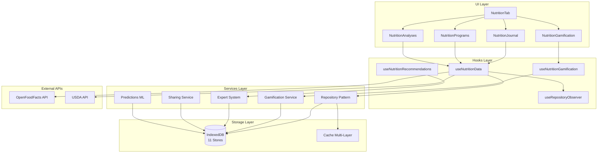
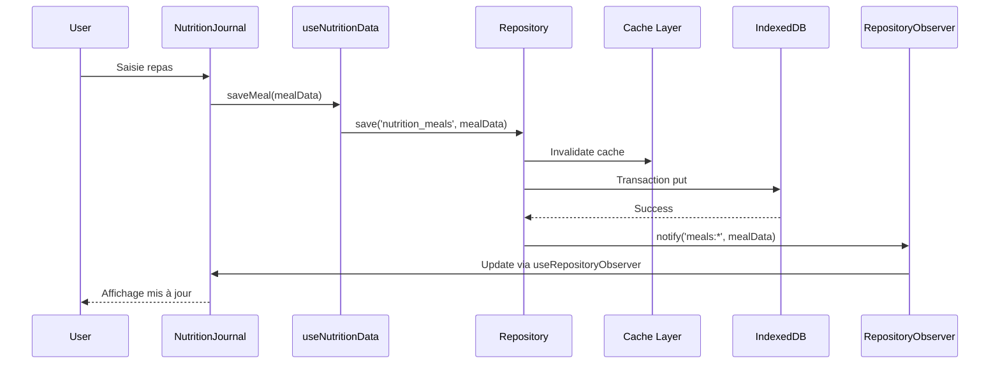
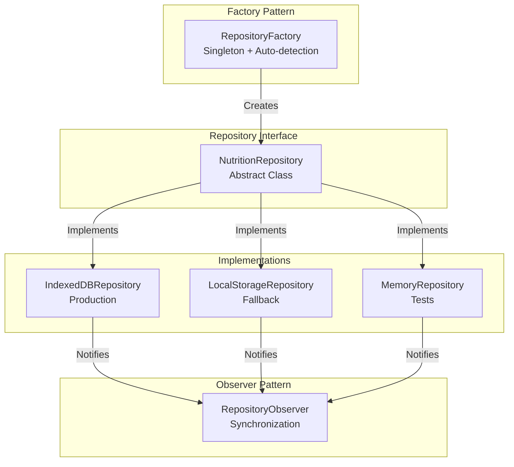
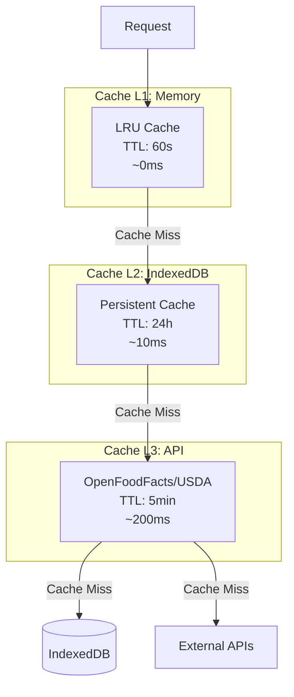

# 📊 Diagrammes Architecture - Onglet Nutrition

> **Objectif** : Visualiser l'architecture de l'onglet Nutrition pour améliorer l'onboarding et la compréhension.

---

## 📊 Diagrammes Disponibles

### 1. Architecture Globale

**Fichier** : `diagrams/architecture-global.mmd`

**Description** : Visualise les 4 couches principales de l'architecture :
- UI Layer (React Components)
- Hooks Layer (React Hooks)
- Services Layer (Business Logic)
- Storage Layer (IndexedDB + Cache)

**Utilisation** : Comprendre la structure globale et les interactions entre couches.



---

### 2. Flux de Données

**Fichier** : `diagrams/data-flow.mmd`

**Description** : Visualise le flux complet de bout en bout :
- Saisie utilisateur → Hook → Repository → IndexedDB
- Consultation → Cache L1 → L2 → L3 → IndexedDB
- Synchronisation automatique via Observer Pattern

**Utilisation** : Comprendre comment les données circulent dans l'application.



---

### 3. Repository Pattern

**Fichier** : `diagrams/repository-pattern.mmd`

**Description** : Visualise le Repository Pattern :
- Factory Pattern (singleton, auto-detection)
- Repository Interface (abstraction)
- Implémentations (IndexedDB, LocalStorage, Memory)
- Observer Pattern (synchronisation)

**Utilisation** : Comprendre l'abstraction de l'accès aux données.



---

### 4. Hiérarchie de Cache

**Fichier** : `diagrams/cache-hierarchy.mmd`

**Description** : Visualise la résolution multi-niveaux du cache :
1. L1 (Memory) : ~0ms, TTL 60s
2. L2 (IndexedDB) : ~10ms, TTL 24h
3. L3 (API) : ~200ms, TTL 5min
4. Sources : IndexedDB stores, External APIs

**Utilisation** : Comprendre la stratégie de cache et l'ordre de résolution.



---

## 🛠️ Génération SVG

Pour générer les SVG depuis les fichiers Mermaid :

```bash
# Installer Mermaid CLI
npm install -g @mermaid-js/mermaid-cli

# Générer tous les SVG
cd docs/nutrition/diagrams
mmdc -i architecture-global.mmd -o architecture-global.svg
mmdc -i data-flow.mmd -o data-flow.svg
mmdc -i repository-pattern.mmd -o repository-pattern.svg
mmdc -i cache-hierarchy.mmd -o cache-hierarchy.svg
```

---

## 📚 Utilisation

Ces diagrammes sont intégrés dans :
- **README.md** : Vue d'ensemble
- **ARCHITECTURE_NUTRITION.md** : Documentation détaillée
- **Documentation développeurs** : Onboarding nouveaux développeurs

---

**Dernière mise à jour** : 2025-01-16  
**Version** : 1.0

