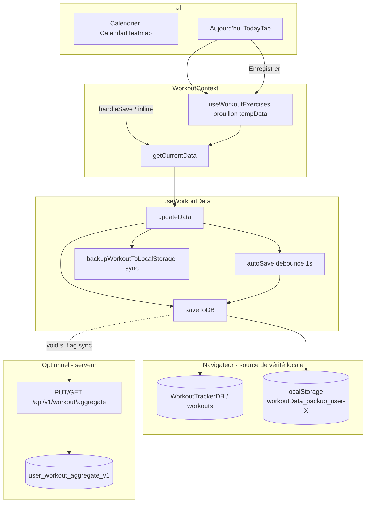

# Analyse profonde — Persistance « Aujourd'hui » & « Calendrier »

**Date** : 2026-06-05  
**Dernière mise à jour correctifs** : 2026-06-05 — Phase 1 implémentée (voir §12).  
**Périmètre** : tout ce que l'utilisateur saisit dans les onglets Sport `today` et `calendar`, sa persistance long terme par utilisateur, et le bug du bouton **Enregistrer** (chargement infini → message « La sauvegarde prend trop de temps »).  
**Mot d'ordre** : pour chaque utilisateur connecté, **toutes** les données saisies doivent survivre indéfiniment — arrêt du serveur, rafraîchissement, fermeture d'onglet.

---

## 1. Synthèse exécutive

| Constat | Gravité |
|---------|---------|
| La persistance **locale** (IndexedDB + backup `localStorage`) est bien le modèle cible ; le serveur est un **pilote optionnel** (`VITE_WORKOUT_AGGREGATE_CLOUD_SYNC`). | — |
| Chaque sauvegarde écrit **l'agrégat workout entier** (photos, historique perf, endurance, etc.), pas seulement la séance du jour → lenteur / blocage UI. | **Critique** |
| `flushPendingSaveNow` est **appelé** par `WorkoutContext` mais **non exporté** par `useWorkoutData` → flush avant fermeture d'onglet **inefficace**. | **Critique** |
| Aujourd'hui : timeout 25 s (`SESSION_SAVE_TIMEOUT`) ; Calendrier : **aucun timeout** → bouton peut rester bloqué indéfiniment. | **Critique** |
| Pas de mutex sur `saveToDB` → écritures IndexedDB concurrentes possibles (autoSave debounce + Enregistrer + swap repos). | **Majeur** |
| `backupWorkoutToLocalStorage` fait un `JSON.stringify` **synchrone** de tout le blob à chaque `updateData` → freeze UI sur gros profils. | **Majeur** |
| Brouillon Aujourd'hui + Calendrier partagent `getCurrentData()` → risques de fusion / écrasement si les deux onglets sont utilisés en parallèle. | **Majeur** |

**Verdict** : les données *peuvent* persister localement, mais le chemin de sauvegarde actuel est **trop lourd, concurrent et partiellement cassé** (flush manquant). C'est la cause la plus probable du bouton Enregistrer bloqué jusqu'au timeout.

---

## 2. Inventaire des données concernées

Tout passe par l'**agrégat workout** (`useWorkoutData` → store IndexedDB `WorkoutTrackerDB` / `workouts`, clé `id` = `storageKey`).

### 2.1 Clé utilisateur

```text
admin     → storageKey = "main"
connecté  → storageKey = "user-{id}"
déconnecté / auth en cours → storageKey = "anonymous" + mode éphémère (pas d'écriture IndexedDB)
```

Source : `WorkoutContext.jsx` (`storageKey` mémorisé depuis `currentUser`).

### 2.2 Données saisies dans **Aujourd'hui**

| Domaine | Champs IndexedDB | Format de clé |
|---------|------------------|---------------|
| Exercices cochés | `checkedExercises` | `YYYY-MM-DD_{exerciseId}` ou `..._{exerciseId}_semaineA/B` |
| Répétitions | `reps` | idem |
| Poids / haltères | `exerciseWeights`, `exerciseWeightPerArm`, `exerciseSetWeights` | idem |
| Ressenti séance | `exerciseSessionEffortStars`, `exerciseSessionPleasureStars`, `exerciseSessionPerceived` | idem |
| Étirements | `checkedStretches`, `stretchSessionEffortStars` | `YYYY-MM-DD_{matin\|midi\|soir\|slotId}` |
| Exercices exceptionnels | `dailyVariations[date].additionalExercises` | par date |
| Adaptation séries | `dailyVariations[date].seriesOverrides` | par date |
| Activité complémentaire | clés `checkedExercises` / `reps` dédiées | `..._complementary_{nom}` |
| Swap jour de repos | `restDaySwaps` | par `programId` + semaine |
| Circuits du jour | `circuitProgress[date]` | par date |
| Perf enregistrée depuis Today | `exerciseMaxHistory`, `exerciseMaxRecords` | global + ajout reps du jour |

**Non sauvegardé via le bouton Enregistrer du brouillon** (écriture immédiate ailleurs) : défis endurance complétés, feedback session, suppressions d'exercices du jour, etc. — ils appellent `updateData` directement.

### 2.3 Données saisies dans **Calendrier**

| Action UI | Champs touchés | Remarque |
|-----------|----------------|----------|
| Formulaire « Saisir une séance » (`handleSave`) | `reps`, `checkedExercises` uniquement | Ne persiste pas poids, étirements, ressenti |
| Édition inline reps (✓) | `reps` (+ garde `checkedExercises`) | `handleUpdateExerciseRepsFromCalendar` |
| Suppression enregistrement | `checkedExercises`, `reps`, `exerciseWeights` | `handleDeleteExerciseRecordFromCalendar` |
| Exercices exceptionnels calendrier | `dailyVariations` | via `markExceptionalExerciseComplete` |
| Justifications jour | `dayJustifications` | autre flux |

Le calendrier **lit** aussi : `enduranceData`, Garmin, intensité calculée — mais ne les écrit pas via le formulaire principal.

### 2.4 Données « collatérales » dans le même blob

À chaque `updateData` / `saveToDB`, **tout** est réécrit, y compris :

- `progressPhotos`, `progressEntries` (souvent **Base64** lourd)
- `enduranceData` (toutes sessions historiques)
- `exerciseMaxHistory`, `pyramidSessionLog`, `addictionQuitData`, `sessionFeedbacks`, etc.

C'est le goulot principal de performance.

### 2.5 Contexte programmes (hors agrégat, même utilisateur)

`WorkoutTrackerContextDB` — programmes actifs, `weekVariant`, `isGymMode` (`useWorkoutContextStorage`). Nécessaire pour afficher le bon workout dans Aujourd'hui / Calendrier, mais les **reps cochées** sont dans `workouts`.

---

## 3. Architecture de persistance



### 3.1 Garanties selon le scénario

| Scénario | Données conservées ? | Condition |
|----------|----------------------|-----------|
| F5 / rafraîchissement | Oui en principe | Utilisateur **connecté** ; chargement `loadFromDB` → repli `localStorage` |
| Fermeture onglet / navigateur | Partiellement | `pagehide` + `registerAppPersistenceFlush` — **mais flush autoSave cassé** (voir §5.3) ; brouillon Today flush via `visibilitychange` / `pagehide` dans `useWorkoutExercises` |
| Serveur backend arrêté | Oui (local) | IndexedDB + `localStorage` indépendants du serveur |
| Serveur actif + `VITE_WORKOUT_AGGREGATE_CLOUD_SYNC=1` | Local + copie cloud | Push **non bloquant** (`void flushWorkoutAggregateCloudPushNow`) ; GET au chargement avec fusion LWW sur `lastSaved` |
| Déconnexion | Risque | Passage en mode `ephemeral` : flush tenté avant bascule, mais `flushPendingSaveNow` undefined |
| Non connecté | **Non** (IndexedDB) | État en mémoire seulement ; pas d'écriture durable |

**Principe « pour toujours »** : aujourd'hui = **IndexedDB par `user-{id}`** + backup `localStorage`. Le serveur est une **réplique optionnelle**, pas la source unique.

---

## 4. Flux de sauvegarde détaillés

### 4.1 Aujourd'hui — modèle brouillon

1. Coche / reps / étirements → `updateTempExerciseData` / `updateTempStretchData` (pas d'écriture disque).
2. Barre « Modifications non sauvegardées » + bouton **Enregistrer**.
3. Clic Enregistrer → `handleSaveExercises` / `handleSaveStretches` :
   - `setIsSavingSessionDraft(true)` → libellé « Enregistrement… »
   - `withSessionSaveTimeout(25s)` enveloppe :
     - `maybeApplyRestDaySwapBeforeSave()` → peut ouvrir `window.confirm` **puis** `updateData` (1ère écriture complète)
     - `saveExerciseChanges()` → `persistFullDraft` → `updateData(payload, { strict: true })` (2e écriture)
   - Succès → `clearDraftState` ; timeout → toast `today.messages.saveTimeout`

Fichiers : `TodayTab.jsx`, `useWorkoutExercises.js`, `useWorkoutData.js`.

### 4.2 Calendrier — écriture directe

1. Formulaire workout-entry : `handleSave` → `setIsSaving(true)` → `updateData({ ...allDataForEntry, reps, checkedExercises })`.
2. **Pas de timeout** ; `finally { setIsSaving(false) }` seulement si `updateData` se termine.
3. Post-traitement : boucle `updateSelectedDate` (jusqu'à 5 × 200 ms) pour recalcul intensité — **après** `setIsSaving(false)`.

Fichier : `CalendarHeatmap.jsx` (~l.3813–4017).

### 4.3 Ce que fait `updateData` (point commun)

```text
setData(toStore)                    → déclenche autoSave debounce (1s) si pas chargement initial
backupWorkoutToLocalStorage (sync)  → JSON.stringify TOUT le blob
await saveToDB(toStore)             → validation + put IndexedDB + backup LS
```

`saveToDB` : `LocalWorkoutRepository.saveRawWorkoutRow` → `putWorkoutRow` → **nouvelle connexion IndexedDB à chaque appel** (`openWorkoutTrackerDb`).

---

## 5. Diagnostic du bug « Enregistrer bloqué / trop long »

### 5.1 Symptôme observé

- **Aujourd'hui** : bouton reste sur « Enregistrement… » puis message *« La sauvegarde prend trop de temps. Réessaie ou rafraîchis la page. »* (timeout 25 s, `SESSION_SAVE_TIMEOUT_MS`).
- **Calendrier** : bouton `loading={isSaving}` sans plafond — peut rester bloqué **au-delà** de 25 s sans message explicite.

### 5.2 Causes racines (par probabilité)

#### A. Coût de sauvegarde monolithique (très probable)

Chaque clic Enregistrer sérialise et écrit **l'intégralité** de l'historique utilisateur :

- `JSON.stringify` dans `backupWorkoutToLocalStorage` (**thread principal, synchrone**)
- Validation qui parcourt toutes les clés `reps` / `checkedExercises` / etc.
- `put` IndexedDB d'un document unique de plus en plus gros (photos Base64, années de reps)

Plus l'historique grossit, plus `await saveToDB` approche ou dépasse 25 s.

#### B. Écritures concurrentes sans mutex (probable)

- `updateData` → `await saveToDB` (manuel)
- `useEffect([data])` → `autoSave` 1 s après **chaque** `setData`
- `maybeApplyRestDaySwapBeforeSave` → **deuxième** `updateData` avant la sauvegarde du brouillon
- `cancelPendingAutoSave` n'annule que le **timer**, pas un `saveToDB` déjà en vol

IndexedDB sérialise les transactions sur un store, mais plusieurs `open` + transactions en parallèle créent une **file d'attente** opaque côté UI.

#### C. `flushPendingSaveNow` non exporté (bug confirmé)

`WorkoutContext.jsx` destructe `flushPendingSaveNow` depuis `useWorkoutData`, mais le hook ne le retourne pas :

```1325:1332:src/hooks/useWorkoutData.js
  return {
    data,
    updateData,
    saveToDB,
    loadFromDB,
    saveSessionFeedback,
    cancelPendingAutoSave
  };
```

Effet : `registerAppPersistenceFlush` appelle `await flushPendingSaveNow(...)` → **no-op** (`undefined`). Les sauvegardes debouncées en attente peuvent être **perdues** à la fermeture.

#### D. UX : confirm pendant l'état « Enregistrement… » (contribue à la perception de bug)

`maybeApplyRestDaySwapBeforeSave` ouvre `window.confirm` **après** `setIsSavingSessionDraft(true)`. L'utilisateur voit « Enregistrement… » alors que l'app attend une action modal — le timeout 25 s peut expirer pendant l'attente.

#### E. Connexion IndexedDB ouverte à chaque opération (performance)

`workoutDbGateway.js` : `openWorkoutTrackerDb()` à chaque `get`/`put`, pas de `db.close()`, pas de pool. Sous charge, latence cumulée.

#### F. Quota `localStorage` (cas limite)

`backupWorkoutToLocalStorage` écrit 3 clés dont une copie globale `workoutData_backup`. Sur profil volumineux → `QuotaExceededError` → ralentissements / échecs partiels (gérés en warn, pas toujours remontés à l'UI).

#### G. Sync cloud (moins probable pour le blocage)

`flushWorkoutAggregateCloudPushNow` est lancé en `void` (non await) dans `saveToDB` — ne bloque pas le bouton. En revanche, `fetchMomentumApiV1WorkoutAggregate` au **chargement** n'a **pas de timeout** → peut bloquer le boot, pas l'Enregistrer direct.

### 5.3 Pourquoi le message apparaît exactement à 25 s

```32:40:src/components/tabs/TodayTab.jsx
const SESSION_SAVE_TIMEOUT_MS = 25000;

function withSessionSaveTimeout(promise) {
  return Promise.race([
    promise,
    new Promise((_, reject) => {
      setTimeout(() => reject(new Error('SESSION_SAVE_TIMEOUT')), SESSION_SAVE_TIMEOUT_MS);
    })
  ]);
}
```

Le timeout **ne libère pas** la sauvegarde en cours : `saveToDB` continue en arrière-plan ; l'UI remet `isSavingSessionDraft` à false mais l'état disque peut être incohérent si l'écriture finit plus tard ou échoue.

---

## 6. Registre des failles

| ID | Failles | Impact persistance | Impact bug Enregistrer |
|----|---------|-------------------|------------------------|
| F-01 | Agrégat monolithique réécrit en entier | Données OK si écriture finit ; risque timeout | **Blocage UI** |
| F-02 | `backupWorkoutToLocalStorage` synchrone sur blob complet | Backup lent / quota | **Freeze + timeout** |
| F-03 | `autoSave` + `JSON.stringify` comparatif sur tout `data` à chaque changement | Écritures redondantes | Contention IDB |
| F-04 | Pas de mutex / file d'attente `saveToDB` | Ordre d'écritures non garanti | Latence / états incohérents |
| F-05 | `flushPendingSaveNow` non exporté | **Perte données** à fermeture | — |
| F-06 | Calendrier sans timeout ni feedback « trop long » | Même risque IDB | **Bouton infini** |
| F-07 | Double `updateData` (swap repos + brouillon) | 2× coût par Enregistrer | **2× lenteur** |
| F-08 | `window.confirm` après `isSavingSessionDraft=true` | — | Timeout pendant attente user |
| F-09 | Mode `ephemeral` si non connecté | **Aucune persistance** | — |
| F-10 | Calendrier `handleSave` ne sauve que reps/coches | Poids / étirements non saisis via ce formulaire | — |
| F-11 | `allDataForEntry` capturé au render (closure) | Écrasement si état parent a changé sans re-render | Données stale |
| F-12 | Brouillon Today + Calendrier via `getCurrentData()` | Fusion involontaire brouillon non voulu | Corruption perçue |
| F-13 | Fusion cloud LWW (`pickNewerWorkoutRawForLoad`) | Perte clés locales si cloud plus récent mais incomplet | Après F5 |
| F-14 | `openWorkoutTrackerDb` sans réutilisation connexion | Performance dégradée | Latence |
| F-15 | `fetchMomentumApiV1*` sans timeout | Boot bloqué si serveur lent | Indirect |
| F-16 | Timeout 25 s ne annule pas `saveToDB` | UI dit échec alors que save peut réussir après | Confusion / double clic |
| F-17 | Photos Base64 dans `workouts` | Taille blob → tout le système ralentit | **Cause structurelle** |

---

## 7. Plan d'action béton

### Phase 0 — Mesure (1–2 jours, sans changer le comportement métier)

1. **Instrumentation** temporaire dans `saveToDB` / `updateData` :
   - durée ms, taille `JSON.stringify` bytes, `storageKey`, source (`manual` | `autoSave` | `swap` | `calendar`).
2. **Script diagnostic** (console ou onglet Paramètres) : afficher taille agrégat, nombre de clés `reps`, présence `progressPhotos` Base64.
3. Reproduire : profil « léger » vs profil « 12 mois + photos » — confirmer corrélation taille / timeout.

**Critère de succès** : identifier si >80 % des timeouts correspondent à blob > X Mo ou > N clés.

---

### Phase 1 — Correctifs critiques (urgence bug Enregistrer)

| # | Action | Fichiers | Effet attendu |
|---|--------|----------|---------------|
| 1.1 | **Exporter `flushPendingSaveNow`** dans le return de `useWorkoutData` | `useWorkoutData.js` | Fermeture onglet fiable |
| 1.2 | **Mutex / file d'attente** : une seule `saveToDB` à la fois ; les suivantes attendent ou fusionnent le dernier snapshot | `useWorkoutData.js` | Fin des contention / hangs |
| 1.3 | **Désactiver `autoSave` quand `updateData` vient d'un save manuel** (`strict: true`) ou annuler le debounce post-`saveToDB` réussi | `useWorkoutData.js` | −50 % écritures |
| 1.4 | **Déplacer `maybeApplyRestDaySwapBeforeSave` avant `setIsSavingSessionDraft(true)`** ou exclure du timeout | `TodayTab.jsx` | Fin confirm pendant « Enregistrement… » |
| 1.5 | **Même timeout 25 s + message** sur Calendrier `handleSave` | `CalendarHeatmap.jsx` | Parité UX |
| 1.6 | **`getCurrentData()` frais dans `handleSave`** calendrier, pas `allDataForEntry` figé | `CalendarHeatmap.jsx` | Intégrité |

**Critère de succès Phase 1** : Enregistrer Aujourd'hui < 3 s sur profil moyen ; plus de bouton calendrier infini ; flush pagehide validé par test manuel.

---

### Phase 2 — Sauvegarde incrémentale (persistance « pour toujours » scalable)

Objectif : ne plus réécrire 50 Mo pour changer 3 reps.

| # | Action | Détail |
|---|--------|--------|
| 2.1 | **Séparer les stores** ou champs IDB : `sessionEntries` par date, `bodyProgress`, `endurance`, `metadata` | Migration versionnée `WorkoutTrackerDB` |
| 2.2 | API repository : `patchSessionDay(storageKey, dateStr, partial)` | Today + Calendar n'écrivent que le jour |
| 2.3 | **Photos hors agrégat** : référencer `HomepageImagesDB` / store dédié (déjà documenté body-tracking) | Réduit blob principal |
| 2.4 | Backup LS : **delta du jour** ou snapshot compressé async (`requestIdleCallback` / Worker) | Plus de freeze UI |
| 2.5 | Conserver l'agrégat legacy en lecture seule le temps de la migration | Rétrocompatibilité |

**Critère de succès Phase 2** : taille écriture Enregistrer < 50 Ko typiquement ; historique 5 ans supporté.

---

### Phase 3 — Robustesse multi-appareils & serveur

| # | Action |
|---|--------|
| 3.1 | Timeout 10 s sur tous les `fetch` sync (`fetchMomentumApiV1.js`) |
| 3.2 | Sync cloud **après** succès IDB local, en arrière-plan, avec retry backoff |
| 3.3 | Tests fusion LWW : scénario « local riche + cloud partiel plus récent » → aucune perte de clés `reps` |
| 3.4 | Documenter : **serveur optionnel** ; app utilisable 100 % offline avec compte connecté (IDB locale) |

---

### Phase 4 — Cohérence UX Aujourd'hui ↔ Calendrier

| # | Action |
|---|--------|
| 4.1 | Unifier le modèle : soit brouillon partout, soit écriture immédiate partout (recommandé : **immédiat incrémental** post-Phase 2) |
| 4.2 | Calendrier : étendre `handleSave` aux champs que Today persiste (poids, étirements si présents dans le formulaire) |
| 4.3 | Avertissement si brouillon Today sale + action Calendrier qui appelle `updateData` |

---

## 8. Plan de tests de non-régression

### 8.1 Persistance locale (serveur **éteint**)

- [ ] Connecté `user-A` : cocher 3 exos + reps → Enregistrer → F5 → données présentes
- [ ] Même scénario après fermeture onglet (pas kill process)
- [ ] Saisie Calendrier date passée → F5 → heatmap + détail jour OK
- [ ] Déconnexion / reconnexion même compte → données toujours là
- [ ] Compte `user-B` ne voit pas les données de `user-A`

### 8.2 Bug Enregistrer

- [ ] Profil avec >500 clés `reps` : Enregistrer < 5 s (après Phase 1)
- [ ] Clic double rapide Enregistrer : une seule écriture cohérente, pas d'état bloqué
- [ ] Swap repos + Enregistrer : pas de double timeout
- [ ] Calendrier : timeout affiché si save > 25 s (avant Phase 2) puis < 3 s (après)

### 8.3 Serveur allumé (`VITE_WORKOUT_AGGREGATE_CLOUD_SYNC=1`)

- [ ] Enregistrer avec serveur down : local OK, pas de blocage UI
- [ ] Enregistrer avec serveur up : local OK + push async
- [ ] F5 après sync : pas de régression reps

### 8.4 Cas limites

- [ ] `localStorage` plein : backup échoue mais IDB OK + message utilisateur
- [ ] IndexedDB indisponible (mode privé strict) : repli LS + avertissement

---

## 9. Priorisation recommandée

```text
Semaine 1  → Phase 0 mesure + Phase 1 (1.1–1.6)     ← débloque l'utilisateur
Semaine 2–4 → Phase 2 incrémental                    ← garantit « pour toujours » à l'échelle
Semaine 5+  → Phase 3 cloud + Phase 4 cohérence UX
```

---

## 10. Fichiers de référence (cartographie code)

| Rôle | Chemin |
|------|--------|
| UI Aujourd'hui + timeout | `src/components/tabs/TodayTab.jsx` |
| Brouillon exercices | `src/context/WorkoutContext/hooks/useWorkoutExercises.js` |
| Agrégat + IDB | `src/hooks/useWorkoutData.js` |
| Gateway IndexedDB | `src/services/workout/workoutDbGateway.js` |
| Repository local | `src/services/workout/LocalWorkoutRepository.js` |
| Backup localStorage | `src/utils/workoutPersistence.js` |
| UI Calendrier save | `src/components/CalendarHeatmap.jsx` |
| Contexte programmes | `src/context/WorkoutContext/hooks/useWorkoutContextStorage.js` |
| Flush global | `src/services/persistence/appPersistenceFlush.js`, `WorkoutContext.jsx` |
| Sync cloud pilote | `src/services/workout/workoutAggregateCloudSync.js`, `backend/api_v1_phase2.py` |
| Registre stores | `docs/sync/REGISTRE_INDEXEDDB_ET_LOCALSTORAGE.md` |

---

## 11. Conclusion

Le mot d'ordre « **chaque utilisateur, toutes les données, pour toujours** » est **architecturalement prévu** (IndexedDB scopée + backup `localStorage` + flush brouillon Today), mais **affaibli en pratique** par :

1. une sauvegarde **trop lourde** (agrégat monolithique + stringify synchrone) — cause principale du timeout Enregistrer ;
2. un bug **flushPendingSaveNow non exporté** — risque de perte à la fermeture ;
3. l'absence de **timeout et mutex** côté Calendrier et des **écritures concurrentes**.

Le plan ci-dessus traite d'abord le déblocage utilisateur (Phase 1), puis la durabilité à long terme (Phase 2 incrémental), alignée sur la volumétrie réelle des données saisies dans Aujourd'hui et Calendrier.

---

## 12. Correctifs appliqués (2026-06-05)

| ID | Statut | Changement |
|----|--------|------------|
| F-05 | ✅ | `flushPendingSaveNow` exporté par `useWorkoutData` |
| F-04 | ✅ | File d'attente `runSerializedSave` (une écriture IDB à la fois) |
| F-03 | ✅ | `suppressAutoSaveUntilRef` + empreinte légère (plus de `JSON.stringify` complet dans autoSave) |
| F-02 | ✅ | `scheduleBackupWorkoutToLocalStorage` + `flushPendingWorkoutBackup` |
| F-14 | ✅ | Cache connexion `openWorkoutTrackerDb` |
| F-07 / F-08 | ✅ | Swap repos **avant** `setIsSavingSessionDraft` (TodayTab) |
| F-06 | ✅ | `withSessionSaveTimeout` sur Calendrier + message dédié |
| F-11 | ✅ | `getCurrentData()` frais dans `handleSave` calendrier |
| F-12 | ✅ | `replaceDraftWorkoutData` après save calendrier si brouillon Today |
| F-10 | ✅ | Préservation / purge `exerciseWeights*` à la décochage calendrier |
| F-15 | ✅ | `fetchWithTimeout` 10 s sur GET/PUT workout aggregate |
| F-13 | ✅ | Fusion cloud élargie (`dailyVariations`, `enduranceData`, `dayJustifications`, etc.) |
| F-01 | ✅ | Store `workoutSessions` (IDB v12) + save incrémental par jour (`sessionDay`) |
| F-17 | ✅ | Put `workouts` métadonnées seulement si empreinte change — photos non réécrites à chaque Enregistrer |
| F-09 | ⏳ | Comportement voulu (éphémère hors auth) — pas de changement |
| F-16 | ⏳ | Timeout UI seulement ; annulation IDB non triviale |

### Correctifs racine (2026-06-05 — 2e passe)

| Problème observé | Cause réelle | Correctif |
|------------------|--------------|-----------|
| Enregistrer bloqué 25 s | `autoSave` lançait une **sauvegarde monolithique** 1 s après **chaque** chargement et **bloquait la file** `runSerializedSave` | **autoSave sur `setData` supprimé** ; save strict en **priorité** (reset file) |
| F5 sans coches | Backup **session** écrit mais **jamais relu** ; strict save ne faisait pas backup **complet** synchrone | `backupWorkoutToLocalStorage` **synchrone** sur strict + `loadSessionDayBackupsFromLocalStorage` au chargement |
| Phase 2 inefficace | `saveSessionDayIncremental` relisait/écrivait encore tout le blob **métadonnées** | Écriture **session seule** ; repli `patchSessionDayIntoWorkoutRow` si store absent |
| Données perdues après migration | `stripLegacySessionsFromWorkoutRow` effaçait l’agrégat avant garantie session | **Strip supprimé** ; migration copie seulement |

### Phase 2 — fichiers ajoutés

| Fichier | Rôle |
|---------|------|
| `src/utils/workoutSessionPersistence.js` | Extraction / fusion slices par jour |
| `src/services/workout/workoutSessionDbGateway.js` | CRUD store `workoutSessions` + migration legacy |
| `src/utils/sessionSaveTimeout.js` | Timeout partagé (Phase 1) |
