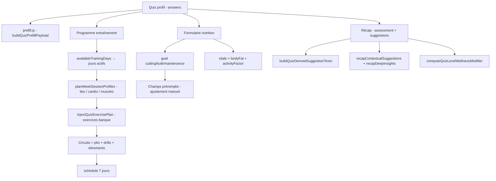

# Quiz profil Momentum — Impact sur les programmes (v10)

Document de référence décrivant **comment chaque réponse du questionnaire profil** influence le **programme d’entraînement généré**, le **préremplissage nutrition**, le **Récap** (suggestions / pistes / niveau), et ce qui reste **hors moteur** aujourd’hui.

**Version questionnaire :** `PROFILE_QUESTIONNAIRE_VERSION = 10`  
**Fichiers centraux :** `constants.js`, `quizInfluence.js`, `trainingScheduleFromQuiz.js`, `quizSessionPlanner.js`, `quizExercisePlanner.js`, `quizVolumeFromBaselines.js`, `quizStretchBudget.js`, `prefill.js`

---

## 1. Pipeline global

### Étapes concrètes (entraînement)

1. **Jours actifs** : uniquement les jours cochés dans `availableTrainingDays` (`buildTrainingScheduleFromQuizDays`).
2. **Profil par jour** : titre, lieu, force vs cardio, addon cardio (`quizSessionPlanner.js`).
3. **Exercices** : tirage pondéré dans une banque restreinte (~20 templates) filtrée par équipement et lieu (`quizExercisePlanner.js`).
4. **Séries/reps** : blueprint objectif + **repères max** si renseignés (`quizVolumeFromBaselines.js`).
5. **Enrichissements** : circuits abdos/métaboliques, pliométrie, drills course, étirements matin/midi/soir, notes cardio (`trainingScheduleFromQuiz.js` + planners dédiés).

### Étapes concrètes (nutrition)

Le quiz **ne génère pas** un plan repas complet automatiquement. Il **préremplit** le formulaire de création de programme nutrition (`NutritionProgramForm.jsx` via `prefill.js`) :

- objectif macro (`cutting`, `lean_bulk`, `bulking`, `maintenance`),
- % graisse estimé,
- facteur d’activité hors sport,
- sexe, âge, taille, poids de départ.

Les calories/macros par défaut (ex. 2500 kcal) restent des **valeurs de base** à affiner par l’utilisateur ou par le calculateur du formulaire.

---

## 2. Section « Objectifs de la mission »

### 2.1 `goalPhysique` — Type de corps visé

| Clé | Label |
|-----|--------|
| `lean_toned` | Sec et tonique |
| `muscular_defined` | Musclé et défini |
| `strong_powerful` | Fort & puissant |
| `balanced_functional` | Équilibré et fonctionnel |
| `athletic_performance` | Athlète de performance |
| `bulk_mass` | Masse maximale |
| `recomposition` | Recomposition |
| `endurance_lean` | Endurance & masse maigre |

**Entraînement**

- **Boost de groupes musculaires** (`GOAL_GROUP_BOOST` dans `quizExercisePlanner.js`) : oriente le score des exercices (ex. `bulk_mass` → plus upper/lower, moins cardio ; `endurance_lean` → cardio ++).
- **Blueprint séance** (`buildQuizTrainingSessionBlueprint`) :
  - `strong_powerful` : reps 4–8 force, plus de séries sur gros mouvements ;
  - `lean_toned` / `muscular_defined` : 8–15 ;
  - `endurance_lean` : 12–20 ou temps sous tension.
- **Cardio** : `computeCardioBiasMultiplier` — `endurance_lean` et `athletic_performance` augmentent légèrement le volume cardio suggéré ; `bulk_mass` le réduit si cardio non minimal.
- **Pliométrie** : injection si `athletic_performance` ou `endurance_lean` (`shouldInjectPlyometricsFromQuiz`).
- **Drills course** : idem + préférences cardio (`shouldInjectDrillsFromQuiz`).
- **Durée programme** : `adjustSuggestedProgramWeeks` (+1 à +2 semaines selon objectif).

**Nutrition**

- Mapping direct (`mapQuizGoalToNutritionGoal`) :

| goalPhysique | Objectif nutrition |
|--------------|-------------------|
| lean_toned | cutting |
| muscular_defined | lean_bulk |
| strong_powerful | bulking |
| balanced_functional | maintenance |
| athletic_performance | maintenance |
| bulk_mass | bulking |
| recomposition | lean_bulk |
| endurance_lean | cutting |

- **Poids cible (IMC)** : `estimateTargetWeightFromQuiz` utilise un BMI cible par objectif (ex. endurance ~21.6, bulk ~25).

**Récap**

- Combinaisons dans `buildQuizDerivedSuggestionTexts` (recomp + masse grasse, sec + déjà très fin, masse + priorité cardio, etc.).

---

### 2.2 `currentPhysique` — Physique actuel

**Entraînement**

- Indirect via cohérence objectif / volume (surtout suggestions Récap).
- Stocké dans `buildProgramPrefillHints` pour affichage / coach.

**Nutrition**

- **Modificateur objectif** : si `higher_bodyfat` et objectif serait `maintenance` → forcé en `cutting` ; si `very_slim` et objectif `cutting` → `maintenance` (`mapQuizGoalToNutritionGoal`).

**Récap**

- Phrases du type recomposition + « plus de masse grasse », lean + « très fin ».

---

### 2.3 `vitalsSelfReport` — Mesures (facultatif)

Champs : sexe, âge, poids (kg), taille (cm), mode poids cible (manuel / auto).

**Entraînement**

- Pas de filtre direct sur la liste d’exercices.
- Poids cible auto alimente les **suggestions** et exports profil.

**Nutrition**

- Préremplit `planProfile` : sexe, âge, taille, `baselineWeightKg`.
- Poids cible manuel ou estimé via IMC (`resolveTargetWeightFromQuiz`).

**Récap**

- IMC calculé pour alertes &lt; 18.5 ou ≥ 30 dans les suggestions quiz.

---

### 2.4 `priorityMuscleGroups` — Zones prioritaires (max 3)

**Entraînement**

- **Rotation hebdo** (`muscleRotationGroups` / `groupsForDayIndex`) : un bloc principal par jour (upper / lower / core) dérivé des priorités.
- **Score exercices** : groupes `upper`, `lower`, `core`, `cardio` boostés si priorité explicite ou muscle fin (pectoraux → upper, etc.).
- **Circuits** : priorité `core` → plus de jours circuit abdos (`resolveAbCircuitDaysPerWeek`).
- **Notes jour** : rappel des muscles ciblés dans `injectPreferredExerciseTypes`.

**Nutrition**

- Pas de lien direct aux macros.

**Récap**

- Cardio prioritaire, split haut/bas, conflit cardio minimal vs priorité cardio, etc.

---

### 2.5 `exerciseTypePreferences` — Types d’exercices (max 3)

Clés : `strength_compounds`, `hypertrophy`, `cardio_endurance`, `plyometrics`, `circuits_hiit`, `mobility_stretching`, `isometric_core`.

**Entraînement**

- **Score templates** : +3 cardio si `cardio_endurance`, +3 core si `isometric_core`, +1 plyo sur cardio, +1 composés « standard ».
- **Pliométrie / drills** : `plyometrics` et `cardio_endurance` déclenchent injections.
- **Circuits** : `circuits_hiit` → jusqu’à 2 jours circuit / semaine.
- **Mobilité** : si `mobility_stretching`, ajout possible d’un exercice « Bloc mobilité ciblée » sur le 1er jour actif (`trainingScheduleFromQuiz.js`).

**Nutrition**

- Aucun.

**Récap**

- Liens HIIT + endurance, circuits + débutant, etc.

---

### 2.6 `bodyFatPercentEstimate` — Slider % graisse

**Entraînement**

- **Non utilisé** dans la génération du `schedule`.

**Nutrition**

- Préremplit `planProfile.bodyFatPercent` à la création d’un programme nutrition depuis le quiz.

**Récap**

- Affiché dans le panneau bilan utilisateur (`RecapUserAssessmentPanel`).

---

## 3. Section « Expérience de combat »

### 3.1 `strengthBaselineMaxes` — Repères max (facultatif)

Champs typiques : pompes, tractions, dips, tractions australiennes, squat gobelet, fentes, gainage (secondes).

**Entraînement**

- **`applyBaselineToSeries`** : pour chaque mouvement mappé, calcule séries × reps (ou secondes) à ~45–62 % du max selon tier :
  - **beginner** (sous seuil) : moins de reps, 3 séries ;
  - **intermediate** : entre les deux ;
  - **advanced** (au-dessus seuil) : reps plus hautes, parfois 4–5 séries, sans « tuer » la séance.
- **`overallStrengthTier`** : influence le score des templates (`classic` favorisé si débutant, `standard` si avancé).
- **Philosophie** : les mouvements de base ne sont **pas exclus** toute la semaine ; une répétition du même exo est possible **tous les 2+ jours** (`weekStrengthUsedKeys` Map).

Seuils indicatifs (`BASELINE_THRESHOLDS`) :

| Champ | Débutant ≤ | Avancé ≥ |
|-------|------------|----------|
| pushupsMax | 10 | 25 |
| pullupsMax | 4 | 12 |
| dipsMax | 5 | 18 |
| plankSecMax | 35 s | 90 s |

**Nutrition**

- Aucun lien direct.

**Récap**

- `recapDeepInsights` peut commenter écart débutant/avancé si repères présents.

---

### 3.2 `experienceLevel` — Ancienneté d’entraînement

**Entraînement**

- **Nombre d’exercices** par séance (blueprint 4–6 débutant → 6–11 expert).
- **Score** : bonus templates `classic` pour débutants, `standard` pour avancés.
- **Circuits** : plafond 2 jours / semaine si débutant.
- **Pliométrie / drills** : templates légers → lourds selon niveau.
- **Durée programme suggérée** : débutant plafonné ~8 sem ; expert minimum ~8 sem.

**Nutrition**

- Via `prefill` : `experienceToDurationWeeks` (4 à 12 semaines de base avant `adjustSuggestedProgramWeeks`).

**Récap**

- Boost niveau global (`mapExperienceToLevelBoost` : 0 à +35).
- Suggestions (circuits + débutant, novice + performance).

---

### 3.3 `weeklyTrainingFrequencyCurrent` — Fréquence actuelle

**Entraînement**

- **Ne détermine pas** le nombre de jours du programme généré (c’est `availableTrainingDays`).

**Nutrition**

- Non utilisé dans le préremplissage nutrition.

**Récap**

- `quizExpectedSessionsPerWeek` pour comparer adhérence réelle vs déclarée.
- Suggestions fréquence faible / élevée.

---

### 3.4 `trainingLocation` — Lieux (multi, max 4)

**Entraînement**

- **Sites disponibles** pour toute la semaine (`resolveTrainingSites`).
- **Alternance maison / extérieur** : si les deux sont cochés, `pickStrengthSiteForDay` alterne (jamais les deux le même jour).
- **Jours cardio** : piste &gt; parc &gt; maison+corde.
- **Filtrage exercices** : chaque template a une liste `locations` ; ex. développé couché → salle uniquement.

**Nutrition**

- Aucun.

---

### 3.5 `availableEquipment` — Matériel

**Entraînement**

- Filtre strict : un exercice n’est proposé que si au moins un de ses `quizEquipment` est coché.
- `bodyweight` est **toujours** ajouté implicitement.
- Cas spéciaux maison : tractions sans barre, dips sans station, course fondamentale pas en `home_minimal`.
- **Cardio finisher** (notes) : corde, rameur, tapis, vélo selon matériel.
- **Cardio bias** : corde / machines cardio légèrement augmentent le multiplicateur.

**Nutrition**

- Aucun.

---

### 3.6 `weekAlternation` — Semaines A / B

| Valeur | Effet |
|--------|--------|
| `none` | Une seule liste d’exercices ; `salleVariants` supprimées |
| `ab_enabled` | Deux listes par jour (`semaineA` / `semaineB`) avec lieux distincts |

**Entraînement**

- Variante B = exercices différents pour le 2e lieu (`planVariantExercises`), count légèrement réduit.

**Nutrition / Récap**

- Mention dans description programme ; pas d’impact macros.

---

### 3.7 `weekAlternationSites` — Lieux A et B (si A/B activé)

- 1er choix = semaine A, 2e = semaine B.
- Si un seul lieu : complément automatique (salle ↔ extérieur selon matériel).

---

### 3.8 `triedTrainingStyles` — Styles déjà essayés

**Entraînement**

- **Pas de filtre** sur la banque d’exercices aujourd’hui.
- Texte descriptif programme / coach (`buildTrainingStyleSentence`).

**Récap**

- Callisthénie + haut du corps, HIIT + endurance, etc.

---

## 4. Section « Opérations quotidiennes »

### 4.1 `availableTrainingDays` — Jours disponibles

**Entraînement**

- **Seul levier** pour activer `active: true` sur le `schedule` (lun–dim en français).
- Jours non cochés = Repos, sans exercices imposés.

**Nutrition**

- Stocké dans prefill `suggestedDays` (informationnel).

---

### 4.2 `preferredTrainingWindow` — Créneau horaire préféré

**État actuel : réponse stockée uniquement.**

- Aucune incidence sur l’ordre des exercices, les étirements matin/soir (gérés par `stretchDistribution`), ni les rappels automatiques liés au quiz.

**Piste d’amélioration** : lier matin/soir aux blocs étirements ou aux notifications.

---

### 4.3 `preferredSessionDuration` — Durée typique de séance

| Clé | Budget cible (min) | Exos typiques |
|-----|-------------------|---------------|
| 15_30 | ~22 | 3–6 |
| 30_45 | ~38 | défaut |
| 45_60 | ~52 | |
| 60_90 | ~72 | jusqu’à ~11 |

**Entraînement**

- `getSessionBudget`, `resolveTargetExerciseCount`, `trimExercisesToSessionBudget` (coupe les derniers exos si dépassement temps estimé).
- Labels durée sur les profils de jour (`formatSessionDurationLabel`).
- Durée programme suggérée via `sessionDurationToWeeks` dans prefill.

**Récap**

- Suggestions séances courtes + objectif masse/force.

---

### 4.4 `activityOutsideTraining` — Activité hors sport

**Entraînement**

- `computeCardioBiasMultiplier` : sédentaire + envie cardio → léger +6 % ; très actif + cardio minimal → −7 %.

**Nutrition**

- `mapQuizActivityToFactor` → TDEE (1.2 à 1.725).

**Récap**

- Sédentarité + objectif cardio.

---

### 4.5 `sleepQuality` / 4.6 `stressLevel`

**Entraînement**

- `adjustSuggestedProgramWeeks` : mauvais sommeil ou stress élevé → **−2 semaines** suggérées (programme un peu plus court / prudent).

**Nutrition**

- Non branché automatiquement sur les calories.

**Récap**

- Suggestions sommeil / stress ; pas de réduction automatique du volume hebdo dans le `schedule`.

---

## 5. Section « Mobilité, cardio & formats de séance »

### 5.1 `stretchingHabit` — Fréquence d’étirement actuelle

**Entraînement**

- Si `stretchDistribution` absent : déduit les créneaux (`resolveStretchMomentsFromQuiz`) — jamais/rarement → aucun ; 5×/sem → matin+midi+soir.
- Textes des blocs matin/midi/soir (`buildQuizStretchingBlocks`) : durée et ton pédagogique.
- `adjustSuggestedProgramWeeks` : jamais/rarement → −1 semaine suggérée.

**Récap**

- `computeQuizLevelWellnessModifier` (+1 à +3 si bonne habitude).

---

### 5.2 `stretchingKnowledge` — Confiance en étirement

**Entraînement**

- Consignes plus pédagogiques si `unsure` / `want_guidance`.
- Modifier wellness Récap (+1 si confiant ou veut guidage).

---

### 5.3 `flexibilityLevel` — Souplesse perçue

**Entraînement**

- Textes prudence si `very_stiff` ou `below_avg`.
- `resolveStretchBudgetPlan` : séances un peu plus longues si raide, moins d’exos.
- Alerte hyperlaxité en soirée si `very_flexible`.

---

### 5.4 `stretchDistribution` — Créneaux planifiés

| Clé | Créneaux programme |
|-----|-------------------|
| none_scheduled | aucun |
| morning_only | matin |
| evening_only | soir |
| morning_evening | matin + soir |
| full_day | matin + midi + soir |

**Important :** pliométrie et drills course **ne consomment pas** ce budget.

---

### 5.5 `dailyStretchMinutesBudget` — Temps/jour étirements (v10)

| Clé | Minutes totales/jour |
|-----|---------------------|
| none | 0 (pas d’étirements générés) |
| 5_10 | 8 |
| 10_15 | 12 (défaut) |
| 15_25 | 20 |
| 25_40 | 35 |

Répartition : total ÷ nombre de créneaux actifs → nombre d’exercices et durée par exercice (`quizStretchBudget.js` + `pickQuizStretchesForMoment`).

---

### 5.6 `cardioTrainingDesire` — Place du cardio

| Clé | Jours cardio dédiés max* | Bias volume |
|-----|-------------------------|-------------|
| minimal | 1 | ×0.62 |
| light | 2 | ×0.84 |
| moderate | 3 | ×1 |
| high | 4 | ×1.16 |
| priority_hiit | 5 | ×1.30 |

\*Plafonné par le nombre de jours actifs.

**Entraînement**

- Répartition des **jours 100 % cardio** dans la semaine.
- Notes fin de séance cardio (`buildQuizTrainingSessionBlueprint`).
- Drills : plafond difficulté modulé.
- Circuits métaboliques si HIIT prioritaire.

**Récap**

- Conflits priorité cardio vs envie minimale ; HIIT + matériel.

---

### 5.7 `sameDayCardioAddon` — Cardio le jour de la force

| Clé | Effet |
|-----|--------|
| never | Pas d’addon (sauf jours cardio dédiés) |
| sometimes | ~35 % des jours force (hors jours cardio purs) |
| often | ~50 % |

**Entraînement**

- Profil `strength_plus_cardio` : titre « Force + cardio », durée affichée = séance + ~50 % du budget en minutes addon (`addonMinutes`).
- 2 exercices cardio ajoutés en fin de liste ce jour-là.

Désactivé si `cardioTrainingDesire === 'minimal'`.

---

### 5.8 `circuitTrainingStyle` — Formats d’enchaînement (multi)

**Entraînement**

- **Guidance texte** séance (`buildCircuitGuidanceFromStyles`).
- **Nombre de circuits** abdos/métaboliques par semaine.
- **Injection schedule** (`injectCircuitStylesIntoSchedule`) : repos réduits, tags superset sur premiers jours force si `like_supersets`.
- Blueprint : plus d’exos si `love_circuits` ; consigne séries droites si seul `prefer_straight`.

---

## 6. Section « Paramètres système »

### 6.1 `setReminderIntensity` — Rappels de série

**État actuel : stockage profil uniquement.**

- Non branché sur le moteur de génération ni sur les timers de séance dans le code parcouru.

---

### 6.2 `dailyChallengeDifficulty` — Défis quotidiens

**État actuel : stockage profil uniquement.**

- Les défis quotidiens ne lisent pas encore cette clé de façon centralisée depuis le quiz (à vérifier si module Défis utilise autre source).

---

## 7. Synthèse par domaine

### 7.1 Ce qui pilote vraiment le programme d’entraînement

| Domaine | Questions clés |
|---------|----------------|
| Calendrier | `availableTrainingDays` |
| Structure semaine | `cardioTrainingDesire`, `sameDayCardioAddon`, priorités muscles |
| Lieu & exos | `trainingLocation`, `availableEquipment`, `weekAlternation*` |
| Volume & temps | `preferredSessionDuration`, `experienceLevel`, `goalPhysique` |
| Intensité reps | `strengthBaselineMaxes`, `goalPhysique` |
| Accessoires séance | `circuitTrainingStyle`, `exerciseTypePreferences` |
| Étirements | `stretchDistribution`, `dailyStretchMinutesBudget`, habitudes souplesse |
| Bonus | plio, drills, circuits templates |

### 7.2 Ce qui pilote la nutrition (préremplissage)

| Question | Effet |
|----------|--------|
| `goalPhysique` + `currentPhysique` | Objectif cutting / bulk / maintenance |
| `bodyFatPercentEstimate` | Champ % graisse |
| `activityOutsideTraining` | Facteur activité TDEE |
| `vitalsSelfReport` | Sexe, âge, taille, poids |
| (indirect) `goalPhysique` + taille | Poids cible auto IMC |

**Non relié au quiz aujourd’hui :** `sleepQuality`, `stressLevel`, `preferredSessionDuration`, priorités musculaires, cardio déclaré → pas d’ajustement auto kcal jour d’entraînement vs repos (sauf lien manuel programme sport sélectionné dans le formulaire nutrition).

### 7.3 Ce qui pilote le Récap

- Presque toutes les sections via `buildQuizDerivedSuggestionTexts`, `recapContextualSuggestions`, `recapDeepInsights`.
- Niveau utilisateur : expérience + modifier wellness (étirements, cardio).
- Fréquence déclarée vs données réelles (pas, reps, cardio).

---

## 8. Limites connues du moteur actuel

1. **Banque d’exercices quiz réduite** (~20 clés) vs banque complète de l’app — risque de répétition ou d’exos « génériques ».
2. **`weeklyTrainingFrequencyCurrent` ≠ jours générés** — un utilisateur peut déclarer 1–2 jours mais cocher 5 jours dispo.
3. **`preferredTrainingWindow`** et **rappels/défis** sans effet génération.
4. **Nutrition** : préremplissage partiel, pas de plan repas automatique aligné sur chaque jour du programme sport.
5. **Sommeil / stress** : impact sur durée de cycle suggérée, pas sur volume séance réel.
6. **`triedTrainingStyles`** : décoratif pour la génération (pas de pondération callisthénie vs bodybuilding).
7. **Repères max** : seulement sur mouvements mappés ; pas de progression automatique semaine après semaine.
8. **Cohérence lieu** : alternance maison/parc bien gérée ; moins de logique « même salle toute la semaine » si 3+ lieux cochés.
9. **Régénération** : après modification du quiz, il faut **régénérer** le programme pour voir les changements (pas de sync live).

---

## 9. Pistes d’amélioration (réalisme & utilité)

### Priorité haute

| Piste | Pourquoi |
|-------|----------|
| Aligner `weeklyTrainingFrequencyCurrent` avec le nombre de jours actifs suggérés (ou avertissement) | Évite programmes irréalistes |
| Brancher `sleepQuality` / `stressLevel` sur volume (moins d’exos ou RPE) | Récupération réelle |
| Utiliser `preferredTrainingWindow` pour étirements / ordre cardio | Cohérence vécu utilisateur |
| Nutrition : calories jours sport vs repos depuis `availableTrainingDays` + programme actif | Lien sport ↔ nutrition |
| Progression automatique depuis repères max (semaine N+1) | Progression « grind » demandée |

### Priorité moyenne

| Piste | Pourquoi |
|-------|----------|
| Élargir templates ou scorer toute la `exerciseDatabase` | Variété et spécialisation |
| Pondérer `triedTrainingStyles` (cali → plus tractions/pompes) | Personnalisation crédible |
| Cardio : comparer sorties réelles vs slots prévus (déjà partiel en Récap) | Feedback utile |
| `setReminderIntensity` → préférences timer séance | Question système utile |
| Split automatique si 5–6 jours + haut+bas cochés | Évite séances monstrueuses |

### Priorité basse / qualité

| Piste | Pourquoi |
|-------|----------|
| Tests unitaires croisés quiz → schedule snapshot | Non-régression |
| Conflits explicites (bulk + endurance_lean cardio max) | Résolution automatique avec message |
| Variantes A/B avec matériel incompatible filtré | Moins d’exos impossibles en semaine B |

---

## 10. Checklist utilisateur

Pour un programme **à jour** avec le quiz v10 :

1. Compléter ou refaire le quiz (Paramètres) — notamment repères max et budget étirements.
2. Générer un **nouveau programme** depuis l’onglet Programme (quiz appliqué au `schedule`).
3. Optionnel : créer / mettre à jour le programme **nutrition** depuis le préremplissage quiz.
4. Consulter le **Récap** pour suggestions data-driven (pas seulement coches manquantes).

---

*Document généré à partir du code source du dépôt Momentum — à mettre à jour si `PROFILE_QUESTIONNAIRE_VERSION` ou les planners changent.*
