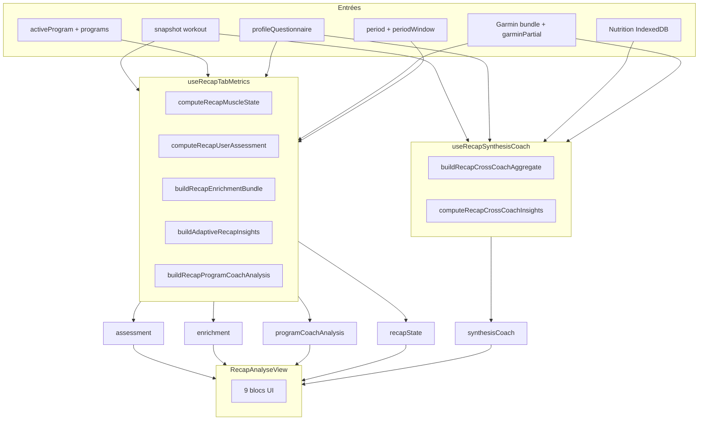

# Récap Sport → sous-onglet **Analyse** — Documentation technique

> **Périmètre strict :** uniquement la vue **Analyse** du Récap (`RecapAnalyseView`).  
> Les autres sous-onglets (Snapshot, Corps, Tendances, Sessions, Grades) sont **des vues séparées** avec leurs propres panneaux — ils ne partagent pas la même UI ni les mêmes blocs d’analyse que Analyse.

**Fichier UI :** `src/components/sport/recap/views/RecapAnalyseView.jsx`  
**Dernière mise à jour :** août 2026

---

## Table des matières

1. [Rôle du sous-onglet Analyse](#1-rôle-du-sous-onglet-analyse)
2. [Comment y accéder et props reçues](#2-comment-y-accéder-et-props-reçues)
3. [Pipeline de calcul (avant affichage)](#3-pipeline-de-calcul-avant-affichage)
4. [Structure visuelle (haut → bas)](#4-structure-visuelle-haut--bas)
5. [Création détaillée — vue d’ensemble du pipeline Analyse](#5-création-détaillée--vue-densemble-du-pipeline-analyse)
6. [Bloc 1 — Faits marquants période](#6-bloc-1--faits-marquants-période)
7. [Bloc 2 — Insights par horizon](#7-bloc-2--insights-par-horizon)
8. [Bloc 3 — Coach repères (benchmarks)](#8-bloc-3--coach-repères-benchmarks)
9. [Bloc 4 — Vision coach](#9-bloc-4--vision-coach)
10. [Bloc 5 — Calendrier · récup · défis](#10-bloc-5--calendrier--récup--défis)
11. [Bloc 6 — Structure du programme](#11-bloc-6--structure-du-programme)
12. [Bloc 7 — Signaux programme détaillés](#12-bloc-7--signaux-programme-détaillés)
13. [Bloc 8 — Points d’attention](#13-bloc-8--points-dattention)
14. [Bloc 9 — Synthèse entraînement · nutrition](#14-bloc-9--synthèse-entraînement--nutrition)
15. [Couche assessment (alimente plusieurs blocs)](#15-couche-assessment-alimente-plusieurs-blocs)
16. [Couche enrichment (alimente plusieurs blocs)](#16-couche-enrichment-alimente-plusieurs-blocs)
17. [Sources de données utilisées par Analyse](#17-sources-de-données-utilisées-par-analyse)
18. [Période sélectionnée](#18-période-sélectionnée)
19. [Inférence séries / charges (impact Analyse)](#19-inférence-séries--charges-impact-analyse)
20. [Tests automatisés (périmère Analyse)](#20-tests-automatisés-périmère-analyse)
21. [Limites connues](#21-limites-connues)
22. [Index fichiers (Analyse uniquement)](#22-index-fichiers-analyse-uniquement)

---

## 1. Rôle du sous-onglet Analyse

Analyse est la vue **coach / interprétation** du Récap. Elle ne montre pas :

- la carte corporelle 3D (→ **Corps**),
- les courbes journalières détaillées (→ **Tendances**),
- la progression exercice par exercice avec graphiques (→ **Sessions**),
- le score synthèse KPI du Snapshot,
- les grades XP (→ **Grades**).

Elle regroupe plutôt :

- des **insights textuels** (3 horizons temporels),
- des **comparaisons aux repères** (course, force, régularité),
- un **récit coach** (Vision coach),
- l’**analyse structurelle du programme actif**,
- une **synthèse cross-coach** entraînement + nutrition.

Tout est calculé **côté client** à partir du snapshot workout + Garmin + nutrition + quiz profil.

---

## 2. Comment y accéder et props reçues

### Montage

```
App.jsx (activeTab = 'recap')
  └─ RecapTab.jsx
       └─ RecapAnalyseView   ← quand activeView === 'analyse'
```

`RecapTab` passe explicitement :

| Prop | Origine | Usage dans Analyse |
|------|---------|-------------------|
| `assessment` | `useRecapTabMetrics` → `recapAssessment` | Insights horizons, suggestions, alignement plan, métriques période |
| `synthesisCoach` | `useRecapSynthesisCoach` | Cartes cross-coach nutrition + insights sport/combined/body |
| `enrichment` | `useRecapTabMetrics` | Complétion, jour semaine, poids, fenêtre |
| `programCoachAnalysis` | `useRecapTabMetrics` | Vision coach, dense analytics, structure, levels |
| `recapState` | `useRecapTabMetrics` | Top muscles (via PeriodHighlights) |
| `activeProgram` | WorkoutContext | Nom programme, structure |
| `profileQuestionnaireRaw` | AuthContext | Quiz incomplet, repères force |
| `period` | état UI (`deferredPeriod`) | Libellé période |
| `periodWindow` | `getRecapDateWindow(period)` | Bornes dates |
| `garminData` | `loadAllData()` (Garmin IndexedDB) | Course, kcal, highlights cardio |

### Contexte lu directement dans la vue

- `useWorkout()` : `getCurrentData()`, `setActiveTab` (lien quiz)
- `useTranslation()` : libellés i18n

---

## 3. Pipeline de calcul (avant affichage)

Analyse **ne calcule rien elle-même** : elle affiche des bundles pré-calculés. Deux hooks alimentent la vue :



### Ordre dans `useRecapTabMetrics` (hook partagé avec d’autres vues Récap, mais seules ces sorties intéressent Analyse)

1. `recapState` ← `computeRecapMuscleLoadEngine` — utilisé **uniquement** par PeriodHighlights (top muscles)
2. `recapAssessment` ← `computeRecapUserAssessment` — base score + suggestions + pistes legacy
3. `enrichment` ← `buildRecapEnrichmentBundle` — complétion, dayOfWeek, weight…
4. Fusion `recapAssessment.insights` ← `buildAdaptiveRecapInsights` (remplace/enrichit short/medium/long)
5. `programCoachAnalysis` ← `buildRecapProgramCoachAnalysis`

Calcul planifié via `requestIdleCallback` pour ne pas bloquer l’UI.

### Hook dédié synthèse bas de page

`useRecapSynthesisCoach` — fenêtre = `assessment.window28` (alignée sur la période Récap sélectionnée dans la plupart des cas).

---

## 4. Structure visuelle (haut → bas)

| # | Composant | Donnée principale |
|---|-----------|-------------------|
| 1 | `RecapPeriodHighlightsPanel` | Stats période calendrier |
| 2 | 3 colonnes `InsightColumn` | `assessment.insights.{short,medium,long}Term` |
| 3 | `RecapBenchmarkCoachPanel` | `buildRecapBenchmarkInsights` |
| 4 | `CoachVisionPanel` | `programCoachAnalysis.coachVisionReport` |
| 5 | `RecapDenseInsightsPanel` | `programCoachAnalysis.denseAnalytics` |
| 6 | `ProgramStructurePanel` | `programCoachAnalysis.structureReport` |
| 7 | `RecapSection` signaux | `programCoachAnalysis.levels` (aplatis) |
| 8 | Encart amber alertes | quiz, poids, `dataGaps` |
| 9 | 2 `CoachCard` | cross-coach entraînement + nutrition |

---

## 5. Création détaillée — vue d’ensemble du pipeline Analyse

Avant d’afficher quoi que ce soit, **RecapTab** déclenche deux pipelines. Analyse ne fait que **consommer** leurs sorties.

### Pipeline A — `useRecapTabMetrics` (obligatoire pour Analyse)

Exécuté dans un `requestIdleCallback` à chaque changement de : snapshot, période, programme actif, quiz, Garmin partial, nutrition partial.

| Étape | Fonction | Sortie utilisée par Analyse |
|-------|----------|----------------------------|
| A1 | `computeRecapMuscleState(snapshot, period, getExerciseNameById)` | `recapState` → top muscles (bloc 1) |
| A2 | `computeRecapUserAssessment({…})` | `recapAssessment` base (blocs 2, 7, 9, benchmarks) |
| A3 | `buildRecapEnrichmentBundle({…})` | `enrichment` (blocs 6, 8, 9, benchmarks, adaptive) |
| A4 | `buildAdaptiveRecapInsights({ legacyPistes: assessment.insights, … })` | **remplace** `assessment.insights` (bloc 2) |
| A5 | `buildRecapProgramCoachAnalysis({…})` | `programCoachAnalysis` (blocs 4, 5, 6, 7) |

**Fusion après A4 :**

```javascript
recapAssessmentMerged = {
  ...recapAssessment,
  insights: adaptive.insights,      // short / medium / long
  adaptiveKpis: adaptive.kpis
};
```

### Pipeline B — `useRecapSynthesisCoach` (bloc 9 uniquement)

Déclenché quand `assessment.window28` existe.

| Étape | Fonction | Sortie |
|-------|----------|--------|
| B1 | `useRecapCrossCoachNutrition` | repas IndexedDB sur fenêtre |
| B2 | `useRecapCrossCoachGarmin` | dailyMetrics + activités fenêtre |
| B3 | `buildRecapCrossCoachAggregate({…})` | agrégat `{ fitness, nutrition, body, garmin, … }` |
| B4 | `computeRecapCrossCoachInsights(aggregate)` | `{ cards[], dataGaps[] }` |

### Pipeline C — calcul **local** dans la vue (bloc 1 partiel, bloc 9)

| Calcul | Où | Quand |
|--------|-----|-------|
| `buildRecapPeriodCalendarAnalytics()` | `RecapPeriodHighlightsPanel` | À chaque render si `periodWindow.start` défini |
| `periodTrainingLine` | `RecapAnalyseView` useMemo | Jours actifs, reps, vol, distinct sur fenêtre |
| `buildRecapBenchmarkInsights()` | `RecapBenchmarkCoachPanel` useMemo | À chaque render (bloc 3) |

→ Les blocs 1 et 3 recalculent **dans le composant** (pas dans le hook idle), mais avec les mêmes snapshots.

---

## 6. Bloc 1 — Faits marquants période

**Composant :** `RecapPeriodHighlightsPanel.jsx`  
**Moteur :** `buildRecapPeriodCalendarAnalytics()` — `recapCalendarPeriodAnalytics.js`  
**Calcul :** local au composant (`useMemo`), pas dans `useRecapTabMetrics`.

### Prérequis d’affichage

```javascript
if (!periodWindow?.start || !periodWindow?.end) return null;
```

→ Sur période **`all`**, `start` est souvent `null` : **le panneau entier est masqué**.

### Algorithme pas à pas

```
ENTRÉE: workoutData, garminData, periodWindow {start, end}, period, recapState, getExerciseNameById

1. periodDays ← pour chaque date [start…end] :
     intensity.reps = reps cochées jour + reps endurance calendrier
     (sumCheckedRepsForDate + computeEnduranceDayMetricsForCalendar)

2. periodStats ← computeCalendarMonthSportStats(periodDays, workoutData, garminData)
     → agrège sur TOUTE la fenêtre :
        totalReps, runningKm, runningMinutes, otherExerciseMinutes,
        totalMinutes, totalKg, longestStreak, activeKcal, trainingDays

3. Pour chaque mois chevauchant [start…end] :
     monthDays ← jours du mois ∩ fenêtre
     sportStats ← computeCalendarMonthSportStats(monthDays, …)
     months[] ← { ym, label, sportStats }

4. recordHolders ← computeYearSportRecordHolders(months)
     → pour chaque métrique, index du « meilleur mois »

5. bestMonthsByMetric ← { metric → { value, ym, monthLabel } }

6. strength ← buildRecapStrengthCompareModel(workoutData, period, getExerciseNameById)
     topExercises ← strength.top3Exercises (max 5 affichés)

7. streakRange ← calculateLongestTrainingStreakInRange(workoutData, start, end)

8. topMuscleGroups ←
     SI recapState.repShareByGroup non vide :
       top 5 groupes par repShare (recapState)
     SINON :
       strength.top3MuscleGroups (fallback reps brutes)

9. Course :
     stored ← enduranceData.sessions.running
     merged ← mergeRunningSessionsWithGarmin(stored, garminById)
     runningRows ← filtrées sur [start…end]
     highlights ← computeRunningVolumeHighlights(runningRows)
     kindDistribution ← computeRunningKindDistribution (endurance/vitesse/fractionné…)
     bestSessions ← top 3 distances (dist > 0.2 km)

SORTIE: { periodStats, bestMonthsByMetric, topExercises, streakRange,
          topMuscleGroups, running, window }
```

### Détail des 9 tuiles (`periodStats`)

| Clé | Comment c’est calculé |
|-----|------------------------|
| `totalReps` | Somme reps muscu cochées + reps endurance comptées calendrier |
| `runningKm` | Sessions running (Momentum + Garmin fusionnées) |
| `runningMinutes` | Durée course convertie en minutes |
| `otherExerciseMinutes` | Corde, natation, boxe, gainage, etc. |
| `totalMinutes` | Somme activités physiques |
| `totalKg` | Volume kg×reps (`aggregateLiftVolumeKgByDate` sur fenêtre) |
| `longestStreak` | Plus longue série de jours avec activité |
| `activeKcal` | Somme kcal actives Garmin sur jours avec données |
| `trainingDays` | Jours avec au moins une activité reconnue |

---

## 7. Bloc 2 — Insights par horizon

**Composant :** 3 × `InsightColumn`  
**Donnée affichée :** `assessment.insights.{shortTerm, mediumTerm, longTerm}`  
**Limite UI :** 8 lignes max par colonne (`.slice(0, 8)` dans le composant ; le moteur limite déjà à 8/7/6).

### Chaîne complète de création

#### Étape 1 — Pistes legacy (`recapDeepInsights.js`)

`computeRecapUserAssessment` appelle `buildRecapPistes()` qui produit des **phrases brutes** à partir de :

- tenure, lifetime reps, momentum reps, delta poids 28j
- volume kg×reps, alignement séances, complétion programme
- Garmin dailyMetrics, historique exercices

→ Stocké temporairement dans `assessment.insights.{short,medium,long}Term` **avant** adaptive.

#### Étape 2 — Candidats adaptatifs (`buildAdaptiveRecapInsights`)

**Point d’entrée :** `buildAdaptiveRecapInsights(opts)` — `recapAdaptiveInsights.js`

**Construction du pool de candidats** (chaque candidat = `{ id, horizon, pillar, weight, text }`) :

| Builder | Pilier(s) | Horizon typique | Ce qu’il analyse |
|---------|-----------|-----------------|------------------|
| `legacyToCandidates(legacyPistes)` | `legacy` | short/medium/long | Reprend pistes étape 1 (weight=44) |
| `buildExerciseRepCandidates` | `training` | short | Dernières séances, PR reps par exo |
| `buildProgressionInsightCandidates` | `training` | medium | `volumeProgressionEngine` |
| `buildGtgCandidates` | `gtg` | short/medium | Mini-séries GTG, jours actifs |
| `buildGtgMaxLinkCandidates` | `gtg` | medium | Lien GTG ↔ max reps |
| `buildEnduranceAndChallengeCandidates` | `cardio`, `defis` | short/medium | Running km, défis actifs |
| `buildCalendarCandidates` | `calendar` | medium | Complétion, streak, adhérence |
| `buildGarminAndCorrelationCandidates` | `correlation`, `cardio` | short/medium | Sommeil, pas, kcal |
| `buildRecapMuscleAndMomentumCandidates` | `training` | medium/long | Charge muscle, momentum assessment |
| `buildSupplementaryCandidates` | divers | long | Programme actif, quiz |

Tous les candidats sont **concaténés** en un seul tableau `candidates[]`.

#### Étape 3 — Sélection par horizon (`selectBalancedInsightTexts`)

Pour chaque horizon (`short` | `medium` | `long`) :

```
pool ← candidats où c.horizon === horizon
picked ← []
usedPillars ← Set()

TANT QUE picked.length < limit (8 / 7 / 6) :
  pour chaque candidat c dans pool :
    score ← c.weight
    SI pilier déjà pris :
      pénalité −8 à −14 si poids proche du meilleur déjà pris pour ce pilier
    SI pilier === 'legacy' :
      pénalité −22 si legacy déjà pris ; −10 si picked ≥ 2
    score += hash(signature + c.id) % 17 × 0.3   // tie-break stable
  choisir candidat score max → picked
  marquer pilier + id utilisés

retourner picked.map(p => p.text)
```

**Effet produit :** diversité de **piliers** (training, gtg, cardio, calendar…) ; les insights legacy ne dominent pas si des signaux récents existent.

#### Étape 4 — Fusion dans assessment

```javascript
recapAssessment.insights = adaptive.insights;
recapAssessment.adaptiveKpis = {
  runningKm, runningSessions, streakCurrent, streakLongest,
  activeChallenges, activeKcalSum, gtgDays, gtgReps
};
```

### Suggestions (bloc 9, pas les colonnes)

`assessment.suggestions` est créé dans `computeRecapUserAssessment` via :

1. Meta programme quiz (`whyThisTemplate`, `warnings`)
2. `buildQuizDerivedSuggestionTexts(answers)`
3. Règles heuristiques : régularité < 45 %, reps sans charge, volume bas/haut, alignement plan…
4. `buildRecapContextualSuggestions` + merge + `filterSuggestionsForTone`

Max **4** affichées dans la carte Entraînement.

---

## 8. Bloc 3 — Coach repères (benchmarks)

**Composant :** `RecapBenchmarkCoachPanel.jsx`  
**Moteur :** `buildRecapBenchmarkInsights()` — calcul **local** `useMemo` à l’ouverture du panneau.

### Algorithme pas à pas

```
ENTRÉE: snapshot, enrichment.window, garminData, assessment, quiz, period

1. runningSessions ← extractRunningSessions (Momentum + Garmin)
2. records ← computeRunningPersonalRecords(sessions)
3. yearTotals / windowTotals ← computeRunningVolumeTotals (année / fenêtre)
4. trainingDays ← countTrainingDaysInRange OU assessment.activeDays28
5. sessionsPerWeek ← trainingDays / recapWindowWeeks(window)
6. strengthExtract ← extractBenchmarkMetricsByExercise(snapshot, window, getExerciseNameById)
     → par clé benchmark (pullups_strict, pushups, dips…) :
        maxSetReps, bestRecord, structuredSessionCount
7. windowTonnageKg ← somme kg×reps fenêtre
8. halfTrend ← computeWindowHalfTrend (moitié récente vs ancienne)

9. GÉNÉRATION candidats insights[] avec pushInsight(id, category, text, priority, drillDown?) :
```

#### Catégories et règles de génération (extrait)

| ID / règle | Condition | Catégorie | Priority |
|------------|-----------|-----------|----------|
| `pop_frequency` | sessions/sem ≥ 1.2× adulte moyen | consistency | 72 |
| `sess_tier` | palier sporty/invested | consistency | 68 |
| `km_vs_france` | km annuel ≥ 80 et ratio ≥ 2× pop FR | running | 75 |
| `best_pace_speed` | meilleure allure < 8 min/km | running | 78 |
| `race_{5k,10k,…}` | temps vs tiers `RUNNING_DISTANCE_BENCHMARKS` | running | 72–80 |
| Tractions / pompes / dips | max set vs `strengthExercises` tiers | strength | 65–85 |
| `tonnage_window` | tonnage fenêtre vs multiples poids corps | strength/wow | variable |
| `pullups_eiffel` | tractions strictes cumulées vs hauteur Tour Eiffel | wow | 82 |
| `paris_lyon` | km annuel ≥ 85 % Paris-Lyon | wow | 85 |
| Progression | `computeProgressionInsights` + `formatProgressionCoachText` | progression | ≥68 si drillDown |

Puis **`buildRichBenchmarkInsights`** ajoute des cartes enrichies (texte long, drillDown exercice).

#### Étape 10 — Sélection finale (`selectDiverseBenchmarkInsights`)

```
1. Filtrer : ids LOW_VALUE, textes vagues, progression sans drillDown si priority < 68
2. score(row) = priority
     + 12 si drillDown.dateYmd
     + 6 si drillDown.storageKey ou exerciseName
     − 20 strength sans drillDown
     − 15 running sans drillDown (sauf km_)
     + hash(id + seed) % 18
3. Trier score décroissant
4. Prendre max 18 cartes, max 4 par category
5. Une seule carte « analogie tonnage » (buses, éléphant…)
```

**Rotation :** `buildInsightRotationSeed(snapshot, strengthExtract, records)` — les cartes changent légèrement quand les PR / dates changent, sans tout mélanger.

### Drill-down

Si `insight.drillDown.dateYmd` → clic ouvre le **calendrier** sur ce jour (`requestOpenCalendarDay`).

---

## 9. Bloc 4 — Vision coach

**Composant :** `CoachVisionPanel.jsx`  
**Moteur principal :** `buildCoachVisionReport()` — appelé depuis `buildRecapProgramCoachAnalysis` (étape A5).

### Algorithme de création du rapport

```
ENTRÉE: activeProgram, snapshot, window, enrichment, assessment,
        garminPartial, garminData, quiz, recapState, denseAnalytics, …

1. narrative ← buildCoachVisionNarrative(...)     // prose brute multi-thème
2. monthlyStats ← buildMonthlyCoachStats(snapshot, window, …)
3. bestMonth ← findBestMonthFromMonths(monthlyStats)
4. completionCompare ← compareExoCompletionWeekBlocks(snapshot, window, ctx)
5. sleepAvg ← computeGarminSleepAverage(garminPartial)
6. runningPeriod ← resolveRunningPeriodStats(...)
7. denseProse ← buildIntegratedCoachVisionProse(denseAnalytics, …)

8. KPIs[] ← construits à partir de :
     - complétion exo % (enrichment.completion)
     - jours entraînement (countTrainingDaysInRange)
     - reps / volume (assessment)
     - sommeil moyen, km course, défis actifs
     Chaque KPI : { id, label, value, note, accent }

9. lead ← phrase d’accroche synthétique (régularité + programme + période)

10. paragraphs[] ← fusion :
      - narrative découpée en paragraphes
      - snippets denseProse (GTG, jambes, défis, Garmin…)
      - stats mensuelles récentes (filtre isStaleInsight : ignore refs > 1 an)
      - déduplication dedupeSimilar (40 premiers caractères)

11. text ← join paragraphs (fallback si pas de structure)

SORTIE coachVisionReport: { kpis, lead, paragraphs, text, sections? }
SORTIE coachVision ← coachVisionReport.text (compat legacy)
```

### Affichage UI

- Si `coachVisionReport` existe → KPIs + lead + paragraphes via `CoachMetricText` (surligne chiffres)
- Sinon → `fallbackText` = `programCoachAnalysis.coachVision` (string unique)

---

## 10. Bloc 5 — Calendrier · récup · défis

**Composant :** `RecapDenseInsightsPanel.jsx`  
**Moteur :** `buildRecapDenseAnalytics()` — inclus dans `buildRecapProgramCoachAnalysis`.

### Sous-calculs (ordre d’exécution)

```
1. legReps ← max(sumLegRepsFromRecapState(recapState), scanActualLegExposure.legRepsChecked)
2. weeklyLoad ← computeWeeklyLoadStats :
     getDailyLiftVolumeKgMap → groupe par semaine lundi → avg, recent vs prior, pctChange
3. mostRegular ← top 5 exos par nb séances cochées (fenêtre)
4. verticalPull ← stats tirage vertical (tractions, australiennes…)
5. garminCalendar ← computeGarminCalendarSummary(garminData, window)
     → totalSessions, totalMinutes, summaryLine
6. sleepCorrelations ← computeSleepRepCorrelations(snapshot, window, garminPartial)
     → par exo : avg reps nuits courtes vs ≥7h, dropPct
7. challengeRows ← buildChallengeDetailRows(snapshot, enrichment)
     → { title, status, progressPct, type }
8. runningPeriod ← resolveRunningPeriodStats (km, sessions)
9. progressionInsights ← applyTrainingIntentToInsights(
       computeProgressionInsights(snapshot, window, getExerciseNameById))
10. narrativeSnippets ← buildNarrativeSnippets(tous les signaux ci-dessus)
     → alimente Vision coach + levels (pas tout affiché ici)
```

### Ce qui est **affiché** dans le panneau (filtre strict)

| Section | Condition d’affichage |
|---------|---------------------|
| Garmin calendrier | `garminCalendar.totalSessions > 0` |
| Sommeil / récup | `sleepCorrelations.length > 0` |
| Défis | `challengeRows.length > 0` avec barres si `status === 'active'` |

Si les trois sont vides → **panneau entier masqué**.

---

## 11. Bloc 6 — Structure du programme

**Composant :** `ProgramStructurePanel.jsx`  
**Moteur :** `buildProgramStructureReport()` — appelé en fin de `buildRecapProgramCoachAnalysis`.

### Entrées construites en amont (A5)

```
muscleVol ← scanProgramMuscleVolume(activeProgram)     // volume planifié par muscle
planExposure ← scanDedicatedPlanExposure(program)      // jours push/pull/legs plan
structuralLeg ← scanStructuralLegPlan(program)         // slots jambes structurels
actualExposure ← scanActualMovementExposure(snapshot, window)  // coches réelles
exposure ← merge(planExposure, actualExposure, structuralLeg)
pushPull ← { push, pull, legs } volumes planifiés
levels ← balanceCoachProgramLevels(rawLevels)
denseAnalytics ← buildRecapDenseAnalytics(...)
```

### Algorithme `buildProgramStructureReport`

```
1. intro ← buildIntroParagraph(program, quiz.answers, exposure, pushPull, planRatio)
     → cadence semaine (intense + deload), objectif street quiz, ratio push/pull coché

2. legAnalysis ← buildLegStructureAnalysis(exposure, legReps, legStructural, runKm, …)
     → texte si plan sans jambes / jambes sous fréquentées / course compensatrice

3. bars ← push / pull / legs en % reps cochées (couleurs fixes)

4. kpiCards[] ← ex. :
     - jours actifs plan vs réalisé
     - complétion exo % (enrichment)
     - ratio push/pull avec badge good/warn/bad

5. ratioCommentary ← compare ratio coché vs planifié

6. priority ← phrase action prioritaire (ex. remonter jambes, équilibrer pull)

7. statsRow ← métriques compactes (sessions/sem plan, leg slots…)

8. dowRows ← FOURNIS par RecapAnalyseView depuis enrichment.dayOfWeek :
     filtre plannedDays > 0 → barres avgCompletionPct par jour semaine

SORTIE: { title, intro, legAnalysis, bars, kpiCards, ratioCommentary, priority, statsRow }
```

### Création de `enrichment.dayOfWeek` (utilisé par les barres DOW)

Dans `buildRecapEnrichmentBundle` → `computeDayOfWeekAdherence(snapshot, window, ctx)` :

- Pour chaque jour de semaine (0–6), sur les dates planifiées du programme actif dans la fenêtre :
  - `plannedDays` = nb jours où le programme prévoit une séance ce jour-là
  - `avgCompletionPct` = moyenne % exercices cochés / planifiés ces jours-là
- Source complétion : `computeProgramCompletionCheckedRatio` avec **`alignWithCalendar: true`**

---

## 12. Bloc 7 — Signaux programme détaillés

**Source :** `programCoachAnalysis.levels` après `balanceCoachProgramLevels`.

### Création de chaque niveau (dans `buildRecapProgramCoachAnalysis`)

| Clé | Fonction | Logique de génération |
|-----|----------|----------------------|
| `structural` | `buildStructuralInsights` | Déséquilibre push/pull/legs plan vs réel, trous jambes, complétion |
| `progression` | `buildProgressionInsights` | `computeProgressionInsights` + exercices clés programme + tonnage trend |
| `recovery` | `buildRecoveryInsights` | Sommeil Garmin, feedbacks difficiles, volume circuits, `buildRunningHrInsight` |
| `trends` | `buildTrendInsights` | Momentum reps, complétion semaine/semaine, pas Garmin, acute/chronic ratio |
| `compliments` | `buildCompliments` | Points positifs depuis `analyzeProgramForCoach` + assessment |
| `recommendations` | `buildRecommendations` | Actions correctives structure, jambes, récup, adhérence |

Chaque niveau = tableau de `{ text }` ou strings.

### Déduplication (`balanceCoachProgramLevels`)

- Supprime insights quasi-identiques entre niveaux
- Limite le nombre par catégorie pour éviter répétition Vision coach / structure

### Affichage Analyse

```javascript
flattenProgramLevels(levels):
  keys = ['progression', 'recovery', 'trends', 'compliments', 'recommendations']
  // structural exclu (déjà dans ProgramStructurePanel)
  → max 10 lignes texte
```

---

## 13. Bloc 8 — Points d’attention

Pas de moteur dédié — **règles conditionnelles** dans `RecapAnalyseView` :

| Condition | Source du signal |
|-----------|------------------|
| `quiz.completedCount < quiz.totalCount` | `assessment.quiz` |
| `!enrichment.weight.hasData` | `buildRecapEnrichmentBundle` → `computeWeightWindowMetrics` : aucune entrée `progressEntries` dans fenêtre |
| `dataGaps[].code` | `computeRecapCrossCoachInsights` : `nutrition_empty`, `garmin_missing`, `quiz`, etc. |

Templates i18n : `recap.crossCoach.gap.{code}`.

---

## 14. Bloc 9 — Synthèse entraînement · nutrition

### Carte Entraînement — création du texte

**`periodTrainingLine`** (useMemo local) :

```
start ← enrichment.window.start ?? assessment.windowPeriod.startYmd
end ← enrichment.window.end ?? assessment.windowPeriod.endYmd

days ← countTrainingDaysInRange(snapshot, start, end, garminData)
  → jour compte si : exo coché OU endurance OU Garmin activité OU marche manuelle

reps ← assessment.totalReps28
vol ← assessment.volumeKgRepsSum28
distinct ← countDistinctCheckedExerciseIds28(snapshot, start, end)
```

**Phrases additionnelles :**

| Source | Règle texte |
|--------|-------------|
| `sessionLoadAlignment28.avgScore0to100` | Affiché si ≥ 2 jours scorés ; ≥ 70 % = « bonne exécution » |
| `trainingCards` | `computeRecapCrossCoachInsights` → templates `recap.crossCoach.insight.{templateKey}` |
| `suggestions` | Max 4 strings depuis assessment |

### Carte Nutrition — pipeline complet

```
1. useRecapCrossCoachNutrition(window28)
     → charge repas IndexedDB, programmes nutrition, compliance scores

2. buildRecapCrossCoachAggregate :
     fitness ← reprend assessment (activeDays28, totalReps28, volumeKgRepsSum28, distinctExercises…)
     nutrition ← daysWithLoggedMeals28, avgComplianceScore, programsOwnedCount
     body ← latestWeightKg, weightDelta28/7 depuis progressEntries
     garmin ← steps moyens, sommeil, stress (si ready)
     planChecks28 ← summarizeNutritionPlanChecks(nutritionPlanChecks)
     gtg ← summarizeGtgWindow
     journey ← journeyStartYmd, lastActivityYmd

3. computeRecapCrossCoachInsights(aggregate) :
     Génère raw[] cartes { id, theme, priority, pillar, templateKey, payload }
     Règles exemples :
       - quiz incomplet → priority 34–62
       - programme nutrition sans repas → priority 78–81, gap nutrition_empty
       - conformité basse → nutrition pillar
       - sport fort + nutrition faible → combined pillar
     dedupeByTheme → max 6 cartes visibles
     dataGaps[] pour alertes bloc 8

4. Affichage :
     nutritionLineKey ← agrégat (ex. daysWithLoggedMeals28)
     nutritionCards ← cards où pillar === 'nutrition'
```

---

## 15. Couche assessment (alimente plusieurs blocs)

Même si le **score niveau** n’est pas affiché en gros dans Analyse, `computeRecapUserAssessment` produit les métriques utilisées partout.

### Fenêtre

```
endYmd ← periodWindow.end (ou aujourd’hui)
startYmd ← periodWindow.start OU journeyStartYmd OU 28j glissants
heavyLoopStart ← si daySpan > 366 : endYmd − 365 jours (cap boucles getWorkoutForDate)
```

### Métriques clés créées

| Métrique | Calcul |
|----------|--------|
| `totalReps28` | Somme `buildTotalStrengthRepsByDate` sur fenêtre |
| `volumeKgRepsSum28` | Somme `aggregateLiftVolumeKgByDate` — **jours avec charge > 0 uniquement** |
| `activeDays28` | `countUniqueDaysWithActivityInWindow` |
| `regularityScore` | `activeDays28 / expectedSessionsOver28` (fréquence quiz) |
| `sessionLoadAlignment28` | Moyenne `computeTodaySessionComplexity` sur jours avec plan |
| `repsMomentumRatio` | Moitié récente vs ancienne de la fenêtre (reps/jour) |
| `weightDelta28` | Delta poids début/fin fenêtre (`progressEntries`) |

### Formule `level0to100` (contexte coach, pas tuile Analyse)

Normalisations log :

```
volNorm = log1p(avgKgReps/jour chargé / 320) / log1p(14000/320)
repsNorm = log1p(avgReps/jour actif / 55) / log1p(850/55)
regNorm = regularityScore
diffNorm = (avgDifficulty − 1) / 4   // feedbacks 1–5
tenureNorm = log1p(tenureDays/21) / log1p(730/21)
holisticNorm / strengthDayNorm ← scores jour calendrier (si dispo)
```

Poids dynamiques (somme ≈ 1) puis :

```
baseBlend = Σ (w_i × norm_i)
base0to70 = 70 × min(1, baseBlend × (0.88 + 0.12 × (1 − 0.35 × dataMaturity)))
quizBoost = (mapExperience + wellnessModifier) × (1 − 0.62 × dataMaturity)
level0to100 = clamp(base0to70 + quizBoost, 0, 97)
```

→ Alimente le **ton** des insights et cross-coach, pas une jauge visible dans Analyse.

---

## 16. Couche enrichment (alimente plusieurs blocs)

`buildRecapEnrichmentBundle` — créé à l’étape A3.

### Sous-modules et sorties utiles à Analyse

| Clé enrichment | Fonction | Utilisé par |
|----------------|----------|-------------|
| `window` | paramètre | Tous les blocs (bornes dates) |
| `completion` | `computePeriodCompletionMetrics` | Vision coach KPIs, structure, adaptive |
| `completion.exoPct`, `stretchPct`, `globalPct` | ratio coches/planifié | Calendar candidates, structure |
| `completion.activeTrainingDays` | jours avec activité | fallback periodTrainingLine |
| `dayOfWeek[]` | `computeDayOfWeekAdherence` | ProgramStructurePanel barres DOW |
| `weight.hasData` | `computeWeightWindowMetrics` | Bloc 8 alertes |
| `streak` | current/longest | Adaptive KPIs, benchmarks |
| `activeChallenges` | depuis enduranceDigest | Adaptive KPIs |
| `digest` | endurance + défis | Dense analytics défis |

### Complétion — règle importante

```javascript
computeProgramCompletionCheckedRatio(..., { alignWithCalendar: true })
```

→ Même formule que le **calendrier** : exercices planifiés ce jour-là (programme actif, mode maison) vs coches.

---

## 17. Sources de données utilisées par Analyse

### Snapshot workout (clés effectivement lues)

| Clé | Blocs concernés |
|-----|-----------------|
| `checkedExercises` | Tous (activité, complétion, benchmarks) |
| `reps` | Highlights, insights, benchmarks, assessment |
| `exerciseSetLogs` | Benchmarks force/progression (qualité séries) |
| `exerciseWeights` / `exerciseSetWeights` | Volume, benchmarks |
| `enduranceData.sessions.*` | Highlights course, insights endurance |
| `enduranceData.challenges` | Dense insights défis |
| `enduranceData.gtg` | Adaptive insights |
| `enduranceData.manualDailyWalkByDate` | Garmin cross-coach |
| `sessionFeedbacks` | Assessment difficulté, recovery levels |
| `dayJustifications` | Vision coach, adaptive |
| `progressEntries` | Poids, benchmarks force relative |
| `dailyVariations.exerciseSeriesOverrides` | Alignement plan (`sessionLoadAlignment28`) |
| `nutritionPlanChecks` | Cross-coach nutrition |
| `trainingPrefs.journeyStartYmd` | Fenêtre `all`, insights long terme |

### Hors snapshot

| Source | Usage Analyse |
|--------|---------------|
| `activeProgram` + `programs[]` | Structure, coach, prescription lookup |
| `getTodayWorkout(date)` | Alignement charge, complétion |
| `getExerciseNameById` | Noms exercices, benchmarks, muscles |
| `profileQuestionnaire` | Fréquence attendue, repères, quiz incomplet |
| **Garmin IndexedDB** | Highlights course, benchmarks running, sommeil, dense analytics |
| **Nutrition IndexedDB** | Carte nutrition uniquement |
| **`performanceBenchmarks/`** | Coach repères |
| **`programExerciseRegistry`** | Prescription exercices (via benchmarks / progression) |

---

## 18. Période sélectionnée

- **Sélecteur :** barre latérale Récap (`RecapShellLayout`) — `localStorage` `sport.recap.periodView`
- **IDs :** `today`, `7d`, `30d`, `3m`, `6m`, `1y`, `2y`, `all` (`recapViewPeriods.js`)
- **Fenêtre :** `getRecapDateWindow(period)` → `{ start, end }`
  - `all` : `start = null` → assessment utilise `journeyStartYmd` ; **PeriodHighlights masqué** si pas de `start`
- **Cap perf :** boucles lourdes limitées à 366 jours (`RECAP_METRICS_MAX_DAYS`)

La période pilote **tous** les blocs Analyse sauf la nutrition cross-coach qui suit `assessment.window28` (souvent identique à la période UI).

---

## 19. Inférence séries / charges & moteur progression

Analyse **n’affiche pas** le détail série par série (c’est Sessions). Mais l’inférence et le moteur progression alimentent les blocs **2, 3, 5, 7**.

### Chaîne inférence reps / poids

```
Pour chaque storageKey coché dans la fenêtre :

1. resolveExerciseSetsForAnalysis(workoutData, key, getExerciseNameById)
     a. Si exerciseSetLogs[key].sets[] → utiliser tel quel (source structured)
     b. Sinon lire reps[key] + prescription via lookupProgramExerciseStub(exerciseId)
     c. inferSetRepsDistribution :
          PRESCRIPTION si total = plan exact
          HABIT si total < plan + ≥2 profils historiques identiques
          FATIGUE_FALLBACK si total < plan sans historique
          EQUAL sinon
     d. resolveSetWeightsForLog :
          CONFIRMED_PER_SET si exerciseSetWeights distincts
          HABIT si poids global + profils pyramidaux historiques
          REPLICATED si poids global seul
          UNKNOWN sans charge

2. summarizeExerciseSession → totalReps, volumeKgReps, avgWeight, setCount, source

3. analyzeStructuredSession → maxSetReps, schemeLabel, PR pour benchmarks
```

**Règle produit :** inférence **n’impacte pas** XP ni calendrier.

### Moteur `volumeProgressionEngine` (blocs 2, 3, 5, 7)

**Fonction :** `computeProgressionInsights(workoutData, window, getExerciseNameById)`

```
1. Grouper toutes les séances cochées par exerciseId (fenêtre)
2. Pour chaque exo avec ≥ 2 séances :
     prev ← avant-dernière séance chronologique
     curr ← dernière séance
     insight ← interpretExerciseProgression(prev, curr)
3. Garder si progressionType ≠ 'neutral' ET confidence ≥ 0.6
4. Trier par confidence décroissante
```

**`interpretExerciseProgression`** compare deux séances et calcule :

| Métrique | Formule |
|----------|---------|
| `volumeDeltaPct` | % variation kg×reps |
| `avgWeightDeltaPct` | % variation charge moyenne |
| `avgRepsDeltaPct` | % variation reps totales |
| `setCountDelta` | Δ nombre de séries |
| `schemePrev/Curr` | `classifyRepScheme` → strength / hypertrophy / endurance / neutral |

**Types de progression détectés :**

| Type | Exemple de règle |
|------|------------------|
| `strength` | Schéma force (moins reps/série, charge stable ou ↑) |
| `hypertrophy` | Plus de reps à charge stable (±6 %) |
| `volume` | Plus de séries ou tonnage ↑ > 5 % |
| `regression` | Chute volume/reps significative |
| `stall` | Variations < seuils |
| `neutral` | Ignoré |

**Filtrage pour benchmarks (bloc 3) :** `isActionableProgressionInsight` exige confidence ≥ 0.72, pas de stall/neutral, deltas minimaux (ex. volume ≥ 8 %).

**Texte affiché :** `formatProgressionCoachText(insight)` → `"Nom exo : explication (charge +X % · tonnage +Y %)."`

Puis `applyTrainingIntentToInsights` (objectif quiz) peut ajuster le ton.

Fichiers : `exerciseSetInference.js`, `exerciseSessionSetsResolver.js`, `volumeProgressionEngine.js`, `strengthBenchmarkExtractors.js`, `programPrescriptionNormalizer.js`, `programExerciseRegistry.js`.

---

## 20. Tests automatisés (périmère Analyse)

| Fichier test | Module couvert |
|--------------|----------------|
| `recapAdaptiveInsights.test.js` | Insights horizons |
| `recapBenchmarkInsights.test.js` | Coach repères |
| `recapBenchmarkRichInsights.test.js` | Détail benchmarks |
| `recapCoachVision*.test.js` (×4) | Vision coach |
| `recapProgramCoachAnalysis.test.js` | Coach programme |
| `recapProgramStructureReport.test.js` | Structure |
| `recapDenseAnalytics.test.js` | Dense analytics |
| `recapCrossCoachInsights.test.js` | Synthèse nutrition/sport |
| `recapContextualSuggestions.test.js` | Suggestions assessment |
| `recapDeepInsights.test.js` | Pistes legacy |
| `recapProgramCoachDedup.test.js` | Déduplication levels |
| `exerciseSetInference.test.js` | Inférence (indirect benchmarks) |
| `strengthBenchmarkExtractors.test.js` | Métriques force |

**Non testé en intégration :** `RecapAnalyseView` (composant React), `buildRecapPeriodCalendarAnalytics` (PeriodHighlights).

---

## 21. Limites connues

1. **PeriodHighlights invisible** si période `all` (`periodWindow.start` null).
2. **Calcul partagé** : `useRecapTabMetrics` tourne pour toutes les vues Récap (sauf Grades), même si tu es sur Analyse seule — coût CPU mutualisé.
3. **Double fetch Garmin** : bundle complet (`garminData`) + range partial (cross-coach / assessment).
4. **Heuristiques muscles** : top zones via `recapState` dépend des noms exercices.
5. **Pas de progression par exercice** dans Analyse — voir onglet Sessions.
6. **Composant orphelin** : `RecapCrossCoachPanel.jsx` existe mais la synthèse est **inlinée** dans Analyse (bloc 9).

---

## 22. Index fichiers (Analyse uniquement)

### UI

```
src/components/sport/recap/views/RecapAnalyseView.jsx
src/components/sport/recap/RecapPeriodHighlightsPanel.jsx
src/components/sport/recap/RecapBenchmarkCoachPanel.jsx
src/components/sport/recap/RecapBenchmarkInsightDetailModal.jsx
src/components/sport/recap/CoachVisionPanel.jsx
src/components/sport/recap/CoachMetricText.jsx
src/components/sport/recap/RecapDenseInsightsPanel.jsx
src/components/sport/recap/ProgramStructurePanel.jsx
src/components/sport/recap/components/RecapUiBlocks.jsx   (RecapSection, barres)
```

### Hooks

```
src/hooks/useRecapTabMetrics.js          → assessment, enrichment, programCoachAnalysis, recapState
src/hooks/useRecapSynthesisCoach.js      → synthesisCoach
src/hooks/useRecapCrossCoachNutrition.js
src/hooks/useRecapCrossCoachGarmin.js
```

### Moteurs Analyse

```
src/utils/sport/recapCalendarPeriodAnalytics.js   → PeriodHighlights
src/utils/sport/recapAdaptiveInsights.js          → insights horizons
src/utils/sport/recapDeepInsights.js              → pistes legacy
src/utils/sport/recapUserAssessment.js            → assessment base
src/utils/sport/recapBenchmarkInsights.js         → coach repères
src/utils/sport/recapBenchmarkRichInsights.js
src/utils/sport/recapInsightSelection.js
src/utils/sport/recapProgramCoachAnalysis.js      → orchestrateur coach
src/utils/sport/recapDenseAnalytics.js
src/utils/sport/recapProgramStructureReport.js
src/utils/sport/recapCoachVision.js
src/utils/sport/recapCoachVisionReport.js
src/utils/sport/recapCoachVisionTemporal.js
src/utils/sport/recapCoachVisionDenseProse.js
src/utils/sport/recapProgramCoachDedup.js
src/utils/sport/recapCrossCoachAggregate.js
src/utils/sport/recapCrossCoachInsights.js
src/utils/sport/recapEnrichmentMetrics.js         → enrichment (dayOfWeek, weight…)
src/utils/sport/recapContextualSuggestions.js
src/utils/sport/recapInsightHelpers.js
src/utils/sport/recapTrainingDayTruth.js
src/utils/sport/volumeProgressionEngine.js
src/utils/sport/strengthBenchmarkExtractors.js
src/utils/sport/recapMuscleLoadEngine.js            → recapState (top muscles only)
```

### Données / prescription

```
src/data/performanceBenchmarks/
src/utils/programPrescriptionNormalizer.js
src/utils/programExerciseRegistry.js
src/utils/sport/exerciseSetInference.js
```

### Point d’entrée parent (wiring uniquement)

```
src/components/tabs/RecapTab.jsx   → passe props à RecapAnalyseView
```

---

## Annexe — Ordre de lecture code pour audit Analyse

1. `RecapAnalyseView.jsx` — quoi est affiché
2. `useRecapTabMetrics.js` — d’où viennent les bundles
3. `recapAdaptiveInsights.js` — colonnes horizons
4. `recapBenchmarkInsights.js` — coach repères
5. `recapProgramCoachAnalysis.js` — vision + structure + dense
6. `useRecapSynthesisCoach.js` — carte nutrition

---

*Document limité au sous-onglet Analyse. Pour Snapshot, Corps, Tendances, Sessions ou Grades, un document séparé serait nécessaire.*
