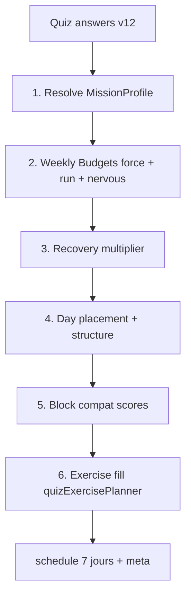

# Moteur v6 — Diagnostic, cible et plan de migration chirurgical

Document maître : **ce qui pose problème aujourd’hui**, **où on veut aller**, et **comment y arriver pas à pas** sans casser le quiz v11 ni le coach v5.

**Public :** produit, dev, QA.  
**Compléments :** [`QUIZ_QUESTIONS_REPONSES_ET_INFLUENCES.md`](QUIZ_QUESTIONS_REPONSES_ET_INFLUENCES.md), [`INCOHERENCES_QUIZ_PROGRAMME_ANALYSE.md`](INCOHERENCES_QUIZ_PROGRAMME_ANALYSE.md), [`SPEC_MOTEUR_COACH_COMPLET.md`](SPEC_MOTEUR_COACH_COMPLET.md), [`ETAT_DES_LIEUX_MOTEUR_QUIZ.md`](ETAT_DES_LIEUX_MOTEUR_QUIZ.md).

**Version quiz actuelle :** 11 · **Moteur génération actuel :** v5 (global load + shadow) · **Cible :** v6 (**ordonnanceur hiérarchisé** volume-first — voir § 14).

---

## 0. Synthèse exécutive

### Nom honnête du système cible

| Terme marketing (à éviter en interne) | Terme exact |
|--------------------------------------|-------------|
| « Solveur de contraintes » | **Ordonnanceur hiérarchisé** (pipeline déterministe + fonction de coût heuristique) |
| « Optimisation » | **Arbitrage par priorités P0→P4** + pénalités continues |
| « IA coach » | **Règles métier versionnées** + traçabilité (`why` / `meta`) |

Ce n’est **pas** (en v6.0) un solveur LP/CP-SAT : pas de garantie d’optimum global. C’est un **générateur enrichi** dont l’ordre de décision est inversé et **explicable**.

### Ce que le moteur fait aujourd’hui (en une phrase)

Il **remplit des journées** avec des exercices **scorés**, puis **corrige** le résultat (caps, charge globale, espacement nerveux).

### Ce qu’il doit faire (en une phrase)

Il doit **ordonnancer** un problème sportif : mission → budgets hebdo → récupération → placement → compatibilité des blocs → **puis** choisir les exercices — avec une **fonction de coût** pour arbitrer les conflits (ex. 32 km + dos 14 séries + fatigue basse).

### La correction n’est pas

- plus d’exercices dans la banque ;
- plus de `+2` dans le scoring ;
- une matrice ❌/✅ rigide sur 15 sports ;
- l’allocation séries globale **avant** de prouver que les blocs + exos peuvent la tenir.

### La correction est

- **inverser l’ordre du pipeline** ;
- **formaliser** objectif + priorités P0–P4 (§ 14) ;
- **v6 minimal** d’abord (§ 15) : mission + budgets + placement + fill — **séries muscle-first en dernier** ;
- quiz et missions **progressifs** (3–5 profils métier en v6.0, pas 15).

---

## 1. Paradigme actuel vs paradigme cible

| Dimension | v5 (aujourd’hui) | v6 (cible) |
|-----------|------------------|------------|
| Unité de pensée | **Jour** (slot upper / cardio) | **Semaine** (budgets puis allocation) |
| Cardio | Minutes + templates (burpees, fractionné) | **km/semaine** + profil (easy / tempo / intervalles) |
| Force | Liste d’exos + séries locales | **Séries/muscle/semaine** puis répartition |
| Objectif | `goalPhysique` (8 labels « physique ») | **`primaryMission`** + sous-objectifs métier |
| Conflits | Heuristiques dispersées | **Score de compatibilité** continu (pas ❌ binaire seul) |
| Exercices | Cœur du système | **Dernier maillon** (remplissage) |
| Programme passé | Patterns reps, boosts templates | **Score préférence** par exercice (+/−) |
| Explicabilité | « Score + archétype » | « Mission 10k → 28 km → 2 easy + 1 qualité + 1 long » |

---

## 2. Pipeline actuel (vérité code — ne pas se tromper)

Ordre réel dans `buildQuizAugmentedSchedule` (`trainingScheduleFromQuiz.js`) :

```text
1. buildQuizCoachContext(answers)     ← récup, archétype, global load, caps familles (AVANT schedule)
2. applyActiveDayCap(schedule)        ← plafond jours actifs
3. activeDayKeys = jours cochés quiz
4. planWeekSessionProfiles(...)       ← PAR JOUR : force / cardio / upper / lower
5. ensureMinDedicatedCardioDays
6. applyNervousSpacingHints           ← partiel (fractionné vs jambes)
7. injectQuizExercisePlan(...)        ← EXOS par jour (scoring banque)
8. planQuizCircuits + plio + drills + étirements
9. applyCycleProgressionToSchedule
10. enforceSessionExerciseLimits
```

**Point critique :** `applyMuscleVolumeCaps` s’exécute dans `buildQuizCoachContext` **avant** l’étape 7, sur une **estimation** (`SETS_PER_STRENGTH_DAY = 10` par jour force), pas sur le plan final. Il ajuste surtout `deformers`, il ne **reconstruit pas** la semaine.

Fichiers clés du paradigme « jour → exo » :

| Fichier | Rôle actuel |
|---------|-------------|
| `quizSessionPlanner.js` | Profils jour (modalité, groupes muscle) |
| `quizExercisePlanner.js` | Tirage pondéré + ancres street |
| `quizVolumeFromBaselines.js` | Séries/reps **par exo** (pas budget hebdo) |
| `quizMuscleVolumeCaps.js` | Caps pull/push/legs/core — **correctif** |
| `quizGlobalLoadEngine.js` | Facteur volume global |
| `quizGoalHierarchy.js` | Hypertrophie > cardio (partiel) |

---

## 3. Défauts structurels (invisibles dans l’UI)

Ces défauts expliquent les programmes « cohérents en apparence, faux en logique » (2×2 tractions, 55 % cardio en hypertrophie, pas de jambes, etc.).

### D1 — Raisonnement jour-par-jour, pas budget global

**Symptôme :** Lun upper+cardio, Mar cardio, Mer upper — sans notion « 14 séries dos / semaine » ou « 25 km / semaine ».

**Cause :** `planWeekSessionProfiles` + `injectQuizExercisePlan` sont indexés par `dayIndex`, pas par `WeeklyPlan`.

**Conséquence :** Le moteur **remplit** des slots ; il ne **répartit** pas un volume cible.

---

### D2 — Cardio sans langage métier

**Symptôme :** `36 min cardio`, `fractionné`, `mountain climbers` — pas « préparation 10 km ».

**Cause :** `cardioTrainingDesire` = intensité **déclarative**, pas objectif course ni km.

**Conséquence :** Impossible de valider : « ce plan correspond à X km/semaine et Y % en Z2 ».

---

### D3 — Pas de modes « plan sportif »

**Symptôme :** Running / triathlon / hybrid sérieux = même pool cardio générique.

**Cause :** Pas de `MissionProfile` (templates contraintes par sport).

**Conséquence :** Le moteur **simule** du cardio au lieu de le **planifier**.

---

### D4 — Hiérarchie des contraintes inversée dans les faits

**Affiché (coach v5) :** global load → distribution → nerveux → génération.

**Réel (schedule) :** jours → profils → **exos** → circuits → progression → limits.

**Ordre cible (non négociable) :**

```text
mission sportive
  → budgets (force + course + nerveux)
    → récupération (coefficient)
      → jours disponibles (faisabilité)
        → structure semaine (split / run layout)
          → interférences (matrice)
            → exercices (remplissage)
```

---

### D5 — Remplissage, pas allocation

**Symptôme :** 2×2 tractions, 2×4 dips, séance « 72 min » avec 4 minutes de travail force.

**Cause :** Séries dérivées par exo (blueprint, baselines, progression, calibrage héritage) sans enveloppe hebdo muscle.

**Conséquence :** Liste d’exercices, pas programme d’entraînement structuré.

---

### D6 — Course : pas de zones ni de progression km

**Symptôme :** Mélange EF / fractionné / burpees sans lien vitesse / seuil / base aérobie.

**Cause :** Absence module RUN (voir section 5).

---

### D7 — Street = 3 mouvements, pas une discipline

**Symptôme :** Tractions + dips + pompes sur tous les jours upper.

**Cause :** `ensureStreetAnchors` sans skill tree (MU, planche, FL, handstand…).

---

### D8 — Quiz sous-spécifie la mission

**Symptôme :** Deux utilisateurs « Athlète de performance » veulent marathon vs sprint vs OCR — même moteur.

**Cause :** `goalPhysique` trop vague ; pas de `primaryMission` + branches.

---

### D9 — Historique utilisateur sous-exploité

**Symptôme :** `Exercice :301` dans les logs ; boosts templates si adhérence ≥ 68 %.

**Manque :** Score par exercice : tractions +18, burpees −11, abandons, séances manquées → **préférence stable**.

---

### D10 — Conflits quiz non résolus par arbitrage explicite

**Symptôme :** Fréquence 5–6 j/sem + 3 jours cochés ; hypertrophie + priorité cardio ; minimal + priorité cardio.

**Cause :** Warnings texte, pas de **résolveur** (« que sacrifier ? »).

---

## 4. Ce qu’il faut conserver (ne pas jeter)

| Brique v5 | Rôle v6 |
|-----------|---------|
| `quizGlobalLoadEngine` | Devient **`recoveryBudget`** sur tous les budgets |
| `quizMuscleVolumeCaps` | Base des **budgets force** — mais en entrée, pas en sortie |
| `quizGoalHierarchy` | Sous-arbre de `primaryMission` |
| `quizArchetype` | Enveloppes par mission (hybrid strict, endurance…) |
| `quizSitePolicy` | Inchangé après placement des blocs |
| `quizVolumeFromBaselines` | Remplissage séries **par exo** une fois budget alloué |
| `quizShadowValidation` | Contrôle cohérence plan final vs mission |
| Banque + `fitnessScore` | Filtrage du **dernier** maillon seulement |
| Correctifs P0/P1/P2 | Restent valides dans l’ancien pipeline jusqu’à bascule phase |

---

## 5. Cible v6 — Architecture « solveur de contraintes »

### 5.1 Les six étapes moteur (ordre d’exécution)



| Étape | Entrée | Sortie | Aucun exercice ? |
|-------|--------|--------|------------------|
| 1 Mission | `primaryMission`, sous-objectifs | `MissionProfile` (règles, templates) | Oui |
| 2 Budgets | Mission + priorités + niveau | `{ back: 14, chest: 12, weeklyKm: 32, ... }` | Oui |
| 3 Récup | sommeil, stress, âge, activité, historique | `recoveryBudget` 0.6–1.2 | Oui |
| 4 Placement | jours cochés + budgets ajustés | `WeekBlockPlan[]` (jour → blocs) | Oui |
| 5 Compatibilité | blocs candidats | réordonnés / pénalisés ; hard block rare | Oui |
| 6 Exercices | blocs + matériel + lieu | `exercises[]` par jour | Non |

Nouveau module central proposé : **`quizWeeklyPlanSolver.js`** (nom à figer en implémentation).

---

### 5.2 Budgets hebdo — granularité cible

**Force (hypertrophie / street / recomp) :**

| Muscle / famille | Séries/semaine (exemple profil « dos/pecs/épaules ») |
|------------------|-----------------------------------------------------|
| Dos | 12–16 |
| Pectoraux | 10–14 |
| Épaules | 8–12 |
| Bras (bis+tri) | 6–10 |
| Quadriceps | 8–14 |
| Ischios / fessiers | 8–12 |
| Mollets | 4–8 |
| Core | 4–8 |

**Course (par mission) :**

| Mission | km/semaine typique | Répartition intensité |
|---------|-------------------|------------------------|
| Santé / reprise | 10–20 | 80 % easy, 20 % modéré |
| 5 km | 15–30 | 70 % easy, 20 % tempo, 10 % intervalles |
| 10 km | 20–40 | idem |
| Semi | 40–80 | + long run |
| Marathon | 60–120+ | 75–80 % easy, long run progressif |
| Triathlon (phase base) | run 30–50 + vélo/nat hors scope v6.0 | — |

**Nerveux (sessions « coût » / semaine) :**

| Type | Cap débutant | Cap avancé |
|------|--------------|------------|
| Fractionné / sprint | 1 | 2 |
| Pliométrie lourde | 1 | 2 |
| Jambes lourdes (squat RPE 8+) | 2 | 3 |

---

### 5.3 Compatibilité des blocs (score continu — pas matrice rigide seule)

**Principe :** le sport réel n’est pas binaire. Un « fractionné + jambes lourdes » peut être **acceptable** si `neuralFatigueTolerance === high`, volume bas, `recoveryBudget ≥ 1.05`, athlète avancé.

**Modèle :** pour chaque paire de blocs `(A, B)` même jour ou J+1 :

```text
compat(A, B) ∈ [0, 1]   // 1 = idéal, 0 = à éviter fortement
penaltySameDay = (1 - compat) * wSameDay
penaltyAdjacent = (1 - compat) * wAdjacent * decay
```

**Exemples de compat de base (avant modulateurs individuels) :**

| A \ B | Easy run | Fractionné | Long run | Squat lourd | Upper lourd |
|-------|----------|------------|----------|-------------|-------------|
| Easy run | 1.0 | 0.6 | 0.2 | 0.85 | 0.9 |
| Fractionné | 0.6 | 1.0 | 0.1 | **0.35** | 0.55 |
| Long run | 0.2 | 0.1 | 1.0 | 0.25 | 0.8 |
| Squat lourd | 0.85 | **0.35** | 0.25 | 1.0 | 0.75 |

**Modulateurs (multiplient compat ou réduisent pénalité) :**

- `recoveryBudget` &lt; 0.85 → toutes penals × 1.25  
- `neuralFatigueTolerance === high` → compat(fractionné, squat) min 0.55 au lieu de 0.35  
- `volumeTolerance === low` → penals × 1.15  

**Décision :** on ne **interdit** (hard block) que si `compat < 0.2` **et** `recoveryBudget < 0.8`. Sinon : réordonnancement ou réduction de budget (soft).

Fichier cible : `interferenceCompat.js` (petite table + fonctions, pas 200 règles métier).

**UI / debug :** chaque conflit → `reasonFr` + `compatScore` + levier utilisé (récup, tolérance).

---

### 5.4 Base de connaissances métier (MissionProfile)

Structure type (une entrée par mission) :

```json
{
  "id": "run_10k",
  "labelFr": "Préparation 10 km",
  "weeklyKmRange": [20, 40],
  "intensitySplit": { "easy": 0.7, "tempo": 0.2, "intervals": 0.1 },
  "sessionTemplates": ["easy_run", "quality_tempo_or_interval", "long_run_optional"],
  "maxStrengthDays": 2,
  "strengthPriority": "maintenance",
  "defaultStructure": "hybrid",
  "cardioCapFractionOfWeek": 0.55
}
```

```json
{
  "id": "hypertrophy_street",
  "weeklySetsLargeMuscles": [10, 18],
  "cardioCapSessionsPerWeek": 1,
  "defaultStructure": "upper_lower",
  "streetSkill": null,
  "priorityMuscleBoost": { "back": 1.15, "chest": 1.1 }
}
```

Fichier cible : `src/features/profileQuestionnaire/data/missionProfiles.js`.

---

## 6. Quiz v12 — Questions et réponses à ajouter

**Principe :** arbre conditionnel — pas 40 écrans pour tout le monde ; **2 à 5 questions** par branche active.

**Rétrocompatibilité :** conserver `goalPhysique` ; mapper vers `primaryMission` à la migration.

---

### 6.1 Nouvelle racine — `primaryMission` (obligatoire)

**Remplace partiellement** la sémantique de `goalPhysique` pour le moteur (pas pour la nutrition tant que mapping explicite).

| Clé | Libellé FR | Branche suivante |
|-----|------------|------------------|
| `hypertrophy` | Hypertrophie / masse musculaire | § 6.4 structure |
| `strength_max` | Force maximale | § 6.4 |
| `recomposition` | Recomposition | § 6.4 |
| `street_strength` | Street Workout (force) | § 6.7 street |
| `running` | Course à pied | § 6.2 RUN |
| `triathlon` | Triathlon | § 6.3 TRI (v6.1) |
| `hybrid_run_strength` | Hybride course + musculation | § 6.2 + § 6.5 |
| `general_health` | Santé / forme générale | budgets modérés |
| `sport_collective` | Sport collectif | § 6.8 (v6.2) |
| `combat_sport` | Sport de combat | § 6.8 (v6.2) |
| `military_prep` | Préparation militaire | § 6.8 (v6.2) |

**Mapping legacy `goalPhysique` → `primaryMission` (migration automatique) :**

| goalPhysique | primaryMission par défaut |
|--------------|---------------------------|
| muscular_defined | hypertrophy |
| bulk_mass | hypertrophy |
| lean_toned | recomposition |
| recomposition | recomposition |
| strong_powerful | strength_max |
| athletic_performance | hybrid_run_strength |
| endurance_lean | running |
| balanced_functional | general_health |

---

### 6.2 MODULE RUN — questions (si `primaryMission` ∈ running, hybrid, triathlon)

#### Q-R1 — `runningGoal` (single)

| Clé | Libellé |
|-----|---------|
| `health` | Santé / remise en forme |
| `5k` | 5 km |
| `10k` | 10 km |
| `half_marathon` | Semi-marathon |
| `marathon` | Marathon |
| `ultra_short` | Trail court |
| `ultra_long` | Trail long / ultra |
| `sprint` | Sprint / vitesse |
| `vo2max` | Améliorer le VO₂max |
| `return_to_run` | Reprise après pause |

**Influence moteur :** sélection `MissionProfile` run ; `weeklyKmRange` automatique (table § 5.2).

#### Q-R2 — `runningWeeklyKmCurrent` (single) — kilométrage actuel

| Clé | Libellé | Plage |
|-----|---------|-------|
| `km_0` | 0 km / reprise | 0–5 |
| `km_1_10` | 1–10 km/sem | |
| `km_10_20` | 10–20 | |
| `km_20_40` | 20–40 | |
| `km_40_60` | 40–60 | |
| `km_60_80` | 60–80 | |
| `km_80_plus` | 80+ | |

**Influence :** rampe de progression (ne pas passer de 15 à 50 km en 1 semaine) ; plafond séances qualité.

#### Q-R3 — `runningSessionProfile` (single)

| Clé | Libellé |
|-----|---------|
| `endurance` | Endurance fondamentale |
| `mixed` | Mix équilibré |
| `speed` | Vitesse / fractionné |
| `return` | Reprise prudente |
| `performance` | Performance / chrono |

**Influence :** `intensitySplit` (easy/tempo/intervals).

#### Q-R4 — `runningLongRunPossible` (single) — contrainte semaine réelle

| Clé | Libellé |
|-----|---------|
| `yes_weekend` | Oui, typiquement week-end |
| `yes_weekday` | Oui, en semaine |
| `no` | Non / pas pour l’instant |

**Influence :** placement long run ; si `no` → long run remplacé par sortie longue easy fractionnée.

#### Q-R5 — `runStrengthPriority` (single) — **remplace le flou cardio+hypertrophie**

| Clé | Libellé |
|-----|---------|
| `run_first` | La course prime |
| `balanced` | Équilibre 50/50 |
| `muscle_first` | Garder / prendre du muscle |
| `maintenance_only` | Muscu entretien uniquement |

**Influence :** `maxStrengthDays`, budgets force plafonnés, `cardioCapFractionOfWeek`.

**Affichage conditionnel :** Q-R5 si `primaryMission` ∈ `hybrid_run_strength`, `running`, `triathlon`, ou `runStrengthPriority` demandé si `hypertrophy` + priorité cardio cochée.

---

### 6.3 MODULE TRI — (phase v6.1, hors v6.0 minimal)

- `triathlonDistance` : sprint / olympic / half_iron / iron
- `triathlonWeakLeg` : swim / bike / run
- Même logique budgets multi-sport (run km + séances force réduites)

---

### 6.4 Structure musculation — `preferredWeeklyStructure` (single)

| Clé | Libellé | Quand proposé |
|-----|---------|---------------|
| `full_body` | Full body | ≤ 3 j force |
| `upper_lower` | Upper / Lower | défaut hypertrophie |
| `push_pull_legs` | Push / Pull / Legs | ≥ 4 j force |
| `bro_split` | Split body part | avancé + ≥ 5 j |
| `running_focus` | Priorité course (≤ 2 muscu) | missions run |
| `hybrid_alternating` | Alternance run / muscu jours séparés | hybrid |

**Influence :** étape 4 placement — **avant** choix des exos.

---

### 6.5 Hybride — `hybridLayoutPreference` (single)

| Clé | Libellé |
|-----|---------|
| `separate_days` | Jours séparés course / muscu |
| `same_day_easy_run` | Course facile + muscu même jour (⚠️ matrice) |
| `same_day_run_then_lift` | Course puis muscu léger |

**Influence :** matrice interférences + ordre dans la journée.

---

### 6.6 Tolérances — trois axes (remplacent l’idée qu’`experienceLevel` suffit)

#### Q-T1 — `volumeTolerance` (single)

| Clé | Libellé |
|-----|---------|
| `low` | Je récupère lentement — peu de séries |
| `medium` | Standard |
| `high` | Je supporte beaucoup de volume |

**Influence :** budgets force × 0.85 / 1 / 1.12.

#### Q-T2 — `impactTolerance` (single) — course

| Clé | Libellé |
|-----|---------|
| `low` | Peu d’impact (marche, vélo OK, run limité) |
| `medium` | Course modérée OK |
| `high` | Gros volumes course OK |

**Influence :** plafond km, fractionné, plyo run.

#### Q-T3 — `neuralFatigueTolerance` (single)

| Clé | Libellé |
|-----|---------|
| `low` | Évite fractionné + jambes lourdes même semaine |
| `medium` | Standard |
| `high` | Accepte charges nerveuses |

**Influence :** matrice interférences (seuils ❌/⚠️), caps fractionné/plyo.

**Lien :** proche de l’ancien concept `fatigueTolerance` — **fusionner** en implémentation avec Q-T3.

---

### 6.7 MODULE STREET — `streetSkillGoal` (si `street_strength` ou hypertrophie + équipement barre)

| Clé | Libellé |
|-----|---------|
| `first_pullup` | Premières tractions |
| `pullups_10` | 10 tractions |
| `pullups_20` | 20 tractions |
| `muscle_up` | Muscle-up |
| `front_lever` | Front lever |
| `back_lever` | Back lever |
| `planche` | Planche |
| `handstand` | Handstand |
| `street_hypertrophy` | Street hypertrophie |
| `street_general` | Street général |

**Influence :** sous-`MissionProfile` street : priorités tirage / dips / gainage / protraction selon skill (voir § 5.4 exemples MU / FL / planche).

---

### 6.8 Arbitrage conflits — `conflictSacrificePriority` (single, si conflits détectés ou toujours en fin de quiz)

| Clé | Libellé |
|-----|---------|
| `keep_strength` | Je sacrifie le cardio |
| `keep_cardio` | Je sacrifie le volume muscu |
| `keep_legs` | Je sacrifie le haut du corps |
| `keep_upper` | Je sacrifie les jambes |
| `keep_mobility` | Je sacrifie une séance pour garder mobilité |
| `sacrifice_nothing` | Je veux tout (→ warning + downgrade réaliste) |

**Influence :** résolveur quand budgets + jours ne tiennent pas ; tranche en priorité **coach**.

---

### 6.9 Contraintes semaine réelle — `weeklyConstraints` (multi)

| Clé | Libellé |
|-----|---------|
| `can_long_run` | 1 sortie longue possible |
| `two_leg_days_ok` | 2 jours jambes OK |
| `two_intensity_days_ok` | 2 séances dures OK (fractionné ou jambes lourdes) |
| `no_morning_hard` | Pas d’effort violent le matin |
| `max_session_45min` | Séances plafonnées 45 min |

**Influence :** placement + coupe budgets.

---

### 6.10 Questions conservées mais reclassées

| Question v11 | Rôle v6 |
|--------------|---------|
| `goalPhysique` | Nutrition + récap + **mapping** mission |
| `priorityMuscleGroups` | Budgets **par muscle fin** (boost séries) |
| `strengthBaselineMaxes` | Remplissage séries + tier — **après** allocation |
| `availableTrainingDays` | Faisabilité **étape 4** |
| `cardioTrainingDesire` | **Secondaire** si module RUN rempli ; sinon fallback |
| `sameDayCardioAddon` | Désactivé si mission run ou hypertrophie structurée |
| `experienceLevel` | Plafonds sécurité + rampes — **pas** seul pilote volume |
| `existingProgramInApp` | Score préférence exercice (§ 7.3) |
| `sleepQuality` / `stressLevel` | `recoveryBudget` |
| `vitalsSelfReport` | Âge → récup ; nutrition |

Document détaillé des questions v11 : [`QUIZ_QUESTIONS_REPONSES_ET_INFLUENCES.md`](QUIZ_QUESTIONS_REPONSES_ET_INFLUENCES.md).

---

## 7. Données et algorithmes à ajouter

### 7.1 Types TypeScript / JSDoc (contrat)

```text
MissionProfile
WeeklyBudgets { muscles: Record<MuscleId, number>, runKm: number, nervous: {...} }
RecoveryState { score: number, budget: number }
WeekBlockPlan { dayKey, blocks: Block[] }  // Block = run_easy | run_quality | legs_hypertrophy | pull | ...
BlockCompatResult { compat: number, hardBlock: boolean, penalty: number, reasonFr: string }
PlanCostBreakdown { missionFit, recoverySafety, muscleCoherence, userPrefs, variety, total }
```

### 7.2 Nouveau pipeline (fichiers)

| Fichier | Responsabilité |
|---------|----------------|
| `quizMissionResolver.js` | answers → MissionProfile |
| `quizWeeklyBudgetBuilder.js` | MissionProfile + quiz → WeeklyBudgets |
| `quizRecoveryBudget.js` | fusion sleep/stress/âge/activité/historique |
| `quizWeekPlacement.js` | jours + structure → WeekBlockPlan |
| `quizBlockCompat.js` | scores compat + hard blocks rares |
| `quizPlanCost.js` | fonction objectif heuristique (§ 14.2) |
| `quizExerciseFill.js` | wrap actuel `quizExercisePlanner` — **fill only** |
| `quizWeeklyPlanner.js` | orchestration 1→6 (ordonnanceur, pas solver) |
| `trainingScheduleFromQuiz.js` | appelle solver au lieu de planner-first |

### 7.3 Score préférence exercice (historique)

À partir de `existingProgramInApp` + snapshot :

| Signal | Poids |
|--------|-------|
| Séances complétées avec exercice | + |
| Abandons / skips | − |
| Répétition volontaire même exo | + |
| Douleur / skip après exo (si loggé) | − |

Sortie : `exercisePreferenceScore: Record<dbKey, number>` — utilisé **étape 6** uniquement.

---

## 8. Plan de migration pas à pas (chirurgical)

> **Ordre recommandé « safe » (§ 15)** : Phases 1 → 2 → 3bis (compat) → 5 (fill) → **4 (séries globales) en dernier**.  
> L’ancien ordre (Phase 4 avant 5) reste documenté ci-dessous comme **v6.1** — plus risqué.

Chaque phase : **objectif**, **livrables**, **fichiers**, **tests**, **risque**, **critère de sortie**.

---

### Phase 0 — Gel et observabilité (1–2 j)

**Objectif :** ne plus dégrader l’existant ; mesurer l’écart.

| Action | Détail |
|--------|--------|
| Fixtures | 5 profils : hypertrophie street 3j, prep 10k, marathon light, hybrid, débutant total |
| Snapshots | Export JSON schedule + meta avant/après chaque PR |
| Flag | `USE_WEEKLY_PLAN_SOLVER=false` (défaut) |

**Critère de sortie :** tests Vitest 66+ verts ; snapshots baseline commités.

---

### Phase 1 — Mission + budgets (sans toucher aux exos) (3–5 j)

**Objectif :** produire `WeeklyBudgets` + `meta.weeklyPlan` **sans changer** `injectQuizExercisePlan`.

| Action | Détail |
|--------|--------|
| Implémenter | `missionProfiles.js`, `quizMissionResolver.js`, `quizWeeklyBudgetBuilder.js` |
| Quiz v12 partiel | `primaryMission` + mapping depuis `goalPhysique` |
| RUN module | Q-R1, Q-R2, Q-R5 minimum |
| Brancher | `buildQuizCoachContext` lit budgets pour **warnings** (« objectif 10k → 32 km cible ») |

**Fichiers touchés :** `constants.js` (+questions), `schema.js`, `buildQuizCompletionRecap.js` (affichage mission).

**Tests :** `quizMissionResolver.test.js`, `quizWeeklyBudgetBuilder.test.js`.

**Critère de sortie :** meta affiche budgets ; **schedule inchangé** avec flag off.

---

### Phase 2 — Placement blocs (jours sans exos précis) (4–6 j)

**Objectif :** `WeekBlockPlan` remplace la sémantique floue de `weekProfiles.groups` seule.

| Action | Détail |
|--------|--------|
| Implémenter | `quizWeekPlacement.js` + `preferredWeeklyStructure` |
| Adapter | `planWeekSessionProfiles` → lit blocs ou double-write |
| RUN | Placement 2 easy + 1 qualité + 1 long (si contraintes OK) |
| Force | Upper/Lower/PPL selon structure |

**Tests :** 3j hypertrophie → 1 lower, 1 upper, pas 2 upper ; 10k → ≥ 2 blocs run.

**Critère de sortie :** `weekProfiles` / meta décrivent blocs ; exos encore ancien pipeline.

---

### Phase 3 — Compatibilité blocs (score continu) (3–4 j) — **v6.0 safe**

**Objectif :** pénaliser / réordonner, **hard block** rare.

| Action | Détail |
|--------|--------|
| Implémenter | `quizBlockCompat.js` (~8 paires de blocs, pas matrice 15×15) |
| Quiz | Q-T3 `neuralFatigueTolerance` + `weeklyConstraints` |
| Intégrer | `applyNervousSpacingHints` → délègue au score compat |
| Trace | `meta.weeklyPlan.compatDecisions[]` |

**Tests :** fractionné + squat même jour + récup basse → déplacement ; même combo + récup haute + tolérance high → autorisé avec pénalité &lt; seuil UI.

**Critère de sortie :** chaque conflit a `compat` + `reasonFr` ; pas de ❌ silencieux sans explication.

---

### Phase 4 — Allocation séries muscle-first (5–8 j) — **v6.1 (après fill validé)**

**⚠️ Point fragile (voir § 14.4)** : ne pas livrer avant preuve de **faisabilité** (blocs + banque exos + circuits/skills).

**Objectif :** répartir séries **après** que le fill démo respecte déjà ~80 % des budgets.

| Action | Détail |
|--------|--------|
| Pré-check | `feasibilityCheck(budgets, availableBlocks, equipment)` → réduit budgets si impossible |
| Implémenter | allocateur : `back 14` → jours pull avec `remainingSets` |
| Refactor | `quizMuscleVolumeCaps` : caps = cible + **écart planifié vs réalisé** en meta |
| Street / circuits | blocs `skill_street` / `circuit` **exemptés** ou budgets séparés (pas 10 séries « dos » sur un circuit abdos) |

**Tests :** profil dos/pecs → somme séries **réalisées** (post-fill) dans [min,max] ; skill street ne force pas 14 séries tractions fictives.

**Critère de sortie :** écart théorique/réel &lt; 15 % par famille muscle ou warning explicite.

---

### Phase 5 — Remplissage exercices (4–6 j) — **v6.0 safe (avant Phase 4)**

**Objectif :** `quizExercisePlanner` = fill sous contraintes de blocs + budgets restants.

| Action | Détail |
|--------|--------|
| Flag | `USE_WEEKLY_PLAN_SOLVER=true` |
| Entrée | `{ block: 'pull', remainingSets: 8, site, equipment }` |
| Street | `streetSkillGoal` → templates progression |
| RUN | blocs run → pas burpees ; EF / tempo / interval selon bloc |
| Préférence | `exercisePreferenceScore` en tie-break |

**Tests :** acceptance profiles + régression hypertrophie street.

**Critère de sortie :** 5 fixtures passent ; incohérences doc utilisateur résolues.

---

### Phase 6 — Cardio km + langage utilisateur (3–5 j)

**Objectif :** UI programme affiche « ~28 km cette semaine », pas seulement « Cardio 36 min ».

| Action | Détail |
|--------|--------|
| Présentation | `quizProgramPresentation.js`, encart coach |
| Validation shadow | `cardioConflictCheck` compare km cible vs planifié |
| Quiz complet | Q-R3, Q-R4, module tri si prêt |

---

### Phase 7 — Quiz v12 complet + migration (2–3 j)

| Action | Détail |
|--------|--------|
| Version | `PROFILE_QUESTIONNAIRE_VERSION = 12` |
| Migration | à l’ouverture profil : inférer `primaryMission` depuis `goalPhysique` |
| UI | Arbre conditionnel dans `ProfileQuestionnaireModal` |
| Doc | Mettre à jour `QUIZ_QUESTIONS_REPONSES_ET_INFLUENCES.md` |

---

### Phase 8 — Préférence exercice historique (3–4 j)

| Action | Détail |
|--------|--------|
| Analyser | logs + adhérence par `exerciseBankKey` |
| Score | ± par exo ; injection étape 6 |
| Récap | « Tu progresses mieux sur tractions que burpees » |

---

## 9. Critères d’acceptation globaux (Definition of Done v6)

Pour le **profil type** (hypertrophie définie, 3 j Lun–Mer, tractions 5, dips 17, priorités upper/lower, barre+dips+haltères) :

| # | Critère |
|---|---------|
| A1 | ≥ 1 jour **lower** avec squat/fentes |
| A2 | Séries dos **≥ 10/sem** (planifiées, pas affichées seulement) |
| A3 | Tractions **≥ 3×3** (ou baseline équivalente) si récup ≥ 0.85 |
| A4 | ≤ 1 jour cardio dédié ; addon cardio **0** si jour cardio présent |
| A5 | Lun ≠ Mer (blocs ou exercices différents) |
| A6 | Durée affichée **~** cohérente avec somme exos |
| A7 | `meta.weeklyPlan` expose budgets + blocs + km si run |

Pour **prep 10k** (mission running, 20–40 km) :

| # | Critère |
|---|---------|
| B1 | `weeklyKm` planifié dans [20,40] × recoveryBudget |
| B2 | ≥ 2 sorties easy, 1 qualité, long run si `can_long_run` |
| B3 | Pas de burpees comme substitut de course |
| B4 | Message utilisateur : « Préparation 10 km » |

---

## 10. Risques et parades

| Risque | Parade |
|--------|--------|
| Casser quiz v11 | Mapping + flag planner off par défaut |
| Quiz trop long | Arbre conditionnel ; v6.0 = 5 missions, pas 15 |
| « Solveur » instable / opaque | Ordonnanceur + `PlanCost` + `meta.arbitration` (§ 14) |
| Sur-spécification métier | Scope minimal § 14.6 ; étendre en v6.1 |
| Phase 4 séries vs faisabilité | Fill d’abord ; `feasibilityCheck` ; Phase 4 en v6.1 |
| Interférences trop rigides | Score compat continu ; hard block rare |
| Banque exos insuffisante | Fallback legacy ; blocs skill/circuit hors budgets classiques |
| Double vérité v5/v6 | Une sortie `schedule` ; `meta.engineVersion` |
| Nutrition désalignée | Garder `goalPhysique` jusqu’à mapping `primaryMission` |
| Moteur statique | Boucle budgets v6.1+ documentée § 14.5 |

---

## 11. Ce qu’on ne fait pas dans v6.0 (scope explicite)

- Plan repas automatique aligné jour par jour.
- Replanification calendrier (swap jours) automatique.
- Triathlon complet (vélo/nat) — phase 6.1.
- Progression automatique semaine N+1 live (reste cycle + live band).
- Gate CI 85 % fitness sur toute la banque.

---

## 12. Ordre de lecture pour l’équipe

1. Ce document (plan v6).  
2. [`INCOHERENCES_QUIZ_PROGRAMME_ANALYSE.md`](INCOHERENCES_QUIZ_PROGRAMME_ANALYSE.md) — symptômes réels.  
3. [`QUIZ_QUESTIONS_REPONSES_ET_INFLUENCES.md`](QUIZ_QUESTIONS_REPONSES_ET_INFLUENCES.md) — état v11.  
4. [`SPEC_MOTEUR_COACH_COMPLET.md`](SPEC_MOTEUR_COACH_COMPLET.md) — archétypes v5 (restent, sous mission).

---

## 13. Résumé manoeuvre (v6.0 safe)

```text
NE PAS : appeler ça un "solveur" ni livrer 15 missions + matrice rigide + allocation séries avant fill.
FAIRE (ordre safe) :
  1. MissionProfile + budgets (Phase 1) — meta only
  2. Placement blocs (Phase 2)
  3. Compat score continu (Phase 3)
  4. Fill exos — ancien planner sous contraintes blocs (Phase 5)
  5. UI km + quiz minimal (Phases 6–7 réduites)
  6. Allocation séries globale — seulement si faisabilité OK (Phase 4 → v6.1)
  7. Boucle feedback N+1 (Phase 8)
```

---

## 14. Formalisation honnête (ordonnanceur, pas solveur LP)

### 14.1 Ce que le système est / n’est pas

| | v5 | v6.0 cible | v6.x futur (optionnel) |
|---|----|------------|-------------------------|
| Nature | Générateur heuristique + correctifs | **Ordonnanceur hiérarchisé** multi-domaines | Peut ajouter recherche locale sur plans candidats |
| Optimisation | Aucune fonction globale | **Coût scalaire** sur 1 plan généré + variantes locales | Plusieurs plans → min coût |
| Garantie | Aucune | **Déterministe** + explicable | — |

### 14.2 Fonction objectif (heuristique) — « qu’est-ce qu’un bon plan ? »

Un **bon plan** minimise `PlanCost` (plus bas = mieux) :

```text
PlanCost =
  w0 * MissionViolation      // écart km, séries mission, blocs manquants
+ w1 * RecoveryOverload      // dépassement charge vs recoveryBudget
+ w2 * MuscleIncoherence     // écart budgets muscle vs réalisé post-fill
+ w3 * UserConflictPenalty   // ignore sacrificePriority / contraintes semaine
+ w4 * AdherenceRisk         // trop de jours vs freq déclarée
+ w5 * NegativeExercisePref  // exos fortement rejetés historiquement
- w6 * MissionProgressSignal // bonus si aligné progression (optionnel logs)
```

**Poids par défaut (à tuner, versionnés `COST_WEIGHTS_V1`) :**

| Terme | w | Sens |
|-------|---|------|
| MissionViolation | 10 | P0 — mission prime |
| RecoveryOverload | 9 | P0 — sécurité |
| MuscleIncoherence | 5 | P2 |
| UserConflictPenalty | 4 | P3 |
| AdherenceRisk | 6 | P1 |
| NegativeExercisePref | 2 | P3 |
| MissionProgressSignal | 1 | P4 |

**Génération :** pipeline déterministe produit un plan `P0`. Si `PlanCost > seuil`, appliquer **opérateurs locaux** (max 3 itérations) :

1. Déplacer bloc J+1  
2. Réduire budget muscle le plus en écart de 10 %  
3. Remplacer bloc run_quality par run_easy  

Pas de recherche exhaustive — **coût borné** CPU.

### 14.3 Hiérarchie d’arbitrage P0 → P4 (formalisée)

Quand **32 km run** + **dos 14 séries** + **fatigue basse** (`recoveryBudget = 0.72`) :

| Priorité | Règle | Décision type |
|----------|-------|----------------|
| **P0** Sécurité / récup | `recoveryBudget < 0.8` | Réduire **d’abord** volume total : km × 0.85, séries force × 0.8 |
| **P1** Mission principale | Si `primaryMission = run_10k` | km cible **ne descend pas** sous borne basse mission (ex. 20) sauf P0 extrême (&lt;0.65) |
| **P1bis** | Si mission = hypertrophy | séries dos **ne descendent pas** sous 8 si P0 OK |
| **P2** Cohérence musculaire | Conflit run + force même semaine | Garder km, **dos 14 → 10**, reporter 4 séries |
| **P3** Préférences | `conflictSacrificePriority = keep_cardio` | Couper force avant km |
| **P4** Variété exos | Dernier levier | Changer templates, pas budgets |

**Sortie obligatoire dans meta :**

```json
{
  "arbitration": [
    { "priority": "P0", "action": "scale_volume", "factor": 0.72, "reason": "récupération limitée" },
    { "priority": "P1", "action": "preserve_run_km", "targetKm": 28 },
    { "priority": "P2", "action": "reduce_back_sets", "from": 14, "to": 10 }
  ]
}
```

Sans ce tableau, le debugging produit est impossible — **exigence v6.0**.

### 14.4 Risque Phase 4 (allocation séries) — faisabilité

**Problème :** budgets théoriques ≠ ce que la banque + blocs (street skill, circuit) peuvent instancier.

**Parades obligatoires :**

1. **`feasibilityCheck`** avant allocation : si &lt; 3 mouvements pull disponibles → cap dos ≤ 12.  
2. **Blocs spéciaux** (`circuit_metabolic`, `street_skill`) ont budget **séries = 0** sur familles classiques (ou bucket `accessory`).  
3. **Écart réalisé** : après fill, si `|planned - actual| > 15%` → warning + suggestion regen, pas silence.  
4. **Phase 4 en v6.1** uniquement quand Phase 5 fill stable sur fixtures.

### 14.5 Boucle de feedback (statique → adaptatif)

| Couche | v6.0 | v6.1+ |
|--------|------|-------|
| Génération | 1 semaine type figée au quiz | — |
| Semaine N+1 | `applyProgressionForWeek` (séries) | Ajuster **budgets** ±5 % selon adhérence / RPE proxy |
| Historique | `exercisePreferenceScore` tie-break | Mettre à jour scores ; down-rank burpees −11 |
| Mission | Fixe jusqu’à regen quiz | Détecter stagnation repères → proposer regen |

**Signal minimum pour adapter budgets :**

- adhérence &lt; 60 % sur 2 sem → `recoveryBudget` −0.05 et −1 jour qualité  
- séances manquées ≥ 2 → volume × 0.9 (déjà partiel v5)  
- utilisateur coche tout → +2 % volume muscle prioritaire (plafonné)

Sans boucle budgets, le moteur reste **intelligent mais statique** — acceptable v6.0 si documenté.

### 14.6 Sur-spécification — garde-fous produit

**v6.0 minimal (livrer) :**

- **5** `MissionProfile` : `hypertrophy`, `hypertrophy_street`, `run_5k_10k`, `run_half`, `general_health`  
- **3** structures : `upper_lower`, `full_body`, `running_focus`  
- **8** paires compat (pas 64 cellules)  
- Quiz : `primaryMission` + RUN (3 questions) + `runStrengthPriority` — pas les 15 missions ni triathlon

**v6.1+ (étendre) :** marathon 60–120 km, tri, 10 street skills, matrice élargie.

**Règle maintenance :** chaque règle métier = test Vitest + entrée `missionProfiles` versionnée.

---

## 15. Feuille de route « v6 réel » (recommandation stratégique)

Alignée avec le risque produit : **intelligent sur le papier, stable en prod**.

| Étape | Contenu | Schedule utilisateur change ? |
|-------|---------|-------------------------------|
| **1** | `MissionProfile` + `WeeklyBudgets` + meta + why | Non (flag off) |
| **2** | Placement jours / blocs | Oui (titres/focus) — exos encore v5 fill |
| **3** | Compat score continu (soft) | Oui (ordre jours) |
| **4** | Fill exos sous blocs (planner legacy bridgé) | Oui — **premier vrai gain** |
| **5** | Quiz v12 minimal + km affichés | UI |
| **6** | Allocation séries globale + faisabilité | v6.1 — dernier |

**Verdict sur la spec initiale :**

| | |
|--|--|
| 👍 Fort | Vision, défauts réels, pipeline inversé, mission/budget, séparation logique |
| ⚠️ À corriger | Mot « solveur », matrice binaire, Phase 4 trop tôt, 15 missions, pas de `PlanCost` ni P0–P4 trace |
| ✅ Ce doc (§ 14–15) | Corrige le cadre pour implémentation stabilisable |

---

*Document rédigé pour aligner produit et implémentation — rev. 2 : ordonnanceur formalisé, route safe, compat continue.*
