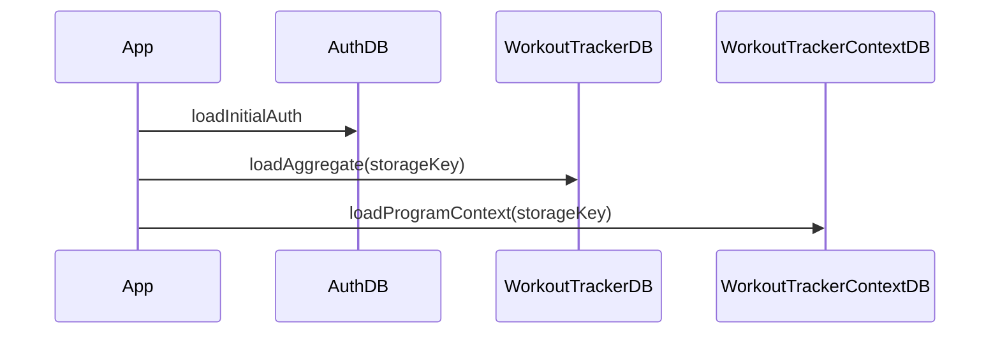

# Phase 0 — Boot & flux de données (vue simplifiée)

Ordre **logique** (réel = lazy selon onglets visités) :

1. **Auth** — `loadInitialAuth` → `WorkoutTrackerAuthDB` + tokens serveur éventuels.
2. **WorkoutContext** — calcule `storageKey` (`main` / `user-<id>` / `anonymous`) → `useWorkoutData` + `useWorkoutContextStorage`.
3. **Données satellite** — au premier accès module : Garmin, Finance, Nutrition, XP (`QuietQuestDB`), etc.

**Repository Phase 1** : `useWorkoutData` s’appuie sur `LocalWorkoutRepository` (`loadRawWorkoutRow` / `saveRawWorkoutRow`) pour le document `workouts` ; le contexte programmes reste dans `useWorkoutContextStorage` jusqu’à alignement.
