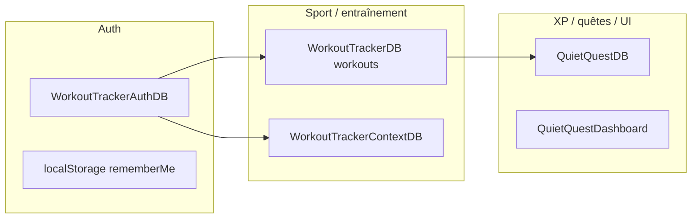

# Registre IndexedDB & localStorage critique (Phase 0 → Phase 1)

*Dernière mise à jour : inventaire étendu (Accueil, Dashboard, Code, Auth, Sidebar, assets livres, etc.) + cartographie sous-onglets et clés `localStorage` fréquentes. Les versions effectives côté navigateur peuvent diverger selon l’historique des migrations `onupgradeneeded`.*

## Schéma de flux (boot données)

L’ordre réel d’ouverture dans l’app dépend des onglets visités ; le graphe montre les **dépendances logiques** (session → `storageKey` → persistance workout + contexte).

---

## Cartographie UI → persistance (rien d’oublié côté onglets)

### Audit navigation (aligné sur le code)

Sources : `src/components/layout/Navigation.jsx`, `FinanceTab.jsx`, `QuestsTab.jsx`, `BooksTab.jsx`, `GarminTab/components/GarminTabContainer.jsx`, `ProgressTab.jsx`, `ApprentissageTab.jsx`.

| Zone | Identifiants (`activeTab` ou équivalent) | Persistance dominante |
|------|------------------------------------------|------------------------|
| Barre principale | `home`, `dashboard`, **Sport** (méta), `quests`, `apprentissage`, `books`, **Code** (méta), `finance`, `settings` | Sport → `localStorage` `sport.lastSubTab` + id sous-onglet sport ; Code → `code.lastSubTab` + id sous-onglet code ; les autres onglets = l’id lui-même |
| Accès refusé | `auth` | `WorkoutTrackerAuthDB` ; tokens / remember-me en `localStorage` (§ Auth) |
| Sport (sous-barre) | `recap`, `today`, `data-entry`, `program`, `addiction-quit`, `nutrition`, `exercises`, `progress`, `endurance`, `calendar`, `charts`, `performance-challenges`, `sport-analytics`, `garmin` | Détail § **Méta-onglet Sport** ; legacy `history` / `stats` / `predictions` / `smart-balancing` → `sport-analytics` |
| Code (sous-barre) | `code-calendar`, `code-journal`, `code-stats` | `code.lastSubTab` ; persistance **`MomentumCodeDB`** pour le journal |
| Finance | `bourse`, `budget`, `investissements`, `smart-shopping`, `planificateur`, `calendrier`, `synthese` | `finance.activeSubTab` ; sous-cache UI : `finance.budget.activeSubTab`, `finance.investissements.activeSubTab`, `finance.planificateur.activeSection` (`SubTabWrapper` / `PlanificateurSubTab`) |
| Quêtes | `today`, `week`, `quests`, `stats`, `security`, `calendar` | `quests.activeSubTab` ; données métier **`quietquest_*`** dans **`WorkoutTrackerDB`** |
| Livres | `library`, `statistics`, `calendar`, `bookfinder` | `books.activeSubTab` ; store **`books`** + **`WorkoutTrackerBooksAssets`** |
| Apprentissage | `matieres`, `sessions`, `trophees`, `calendrier` | `apprentissage.activeSubView` (UI) ; stores **`apprentissage_*`** |
| Garmin (sous-onglet Sport `garmin`) | `dashboard`, `activities`, `metrics`, `charts`, `settings` | `garmin.activeSubTab` ; **`GarminDataDB`** ; lecture body tracking : `garminIntegration.js` |
| Progress (sous-onglet Sport `progress`) | `metrics`, `photos`, `impedance`, `summary`, `reminders`, `correlations`, `predictions`, `stability`, `insights`, `comments` | `progress.activeSection` ; **`workouts`** (scope) + caches body (§ Body tracking) |
| Paramètres | sections internes au composant | `localStorage` / export fichiers ; **`MomentumAppLockDB`** via `AppLockSettingsPanel` ; diagnostic → **`HomepageImagesDB`** |

### Méta-onglet **Sport** (`Navigation.jsx` → `sport.lastSubTab`)

Les ids ci-dessous sont les **sous-onglets Sport** ; la persistance principale est **`WorkoutTrackerDB` / `workouts`** (agrégat `useWorkoutData`, clé `storageKey`) + **`WorkoutTrackerContextDB`** (programmes / `useWorkoutContextStorage`). Exceptions indiquées.

| Sous-onglet `activeTab` | Données dominantes | IndexedDB / autre |
|-------------------------|-------------------|-------------------|
| `recap` | Récap / état lié entraînement | `workouts` |
| `today` | Jour, coches, séances | `workouts` + contexte programmes |
| `data-entry` | Saisie manuelle | `workouts` |
| `program` | Édition programmes | `WorkoutTrackerContextDB` + `workouts` |
| `addiction-quit` | Arrêt tabac / THC | `workouts` (`addictionQuitData`) |
| `nutrition` | Repas, hydratation, favoris | **`WorkoutTrackerDB`** (stores nutrition via `nutritionDataUtils.js`) — *pas* le même store que `workouts` |
| `exercises` | Banque / prefs entraînement | `workouts` |
| `progress` | Suivi corporel, photos | `WorkoutTrackerDB` (entrées body tracking dans `workouts` par scope) + caches dédiés (`BodyTracking/services/*Cache*`) |
| `endurance` | Course, pompes, natation, corde, boxe… | `workouts` (`enduranceData`, défis) |
| `calendar` | Calendrier séances | `workouts` + contexte |
| `charts` | Graphiques (dérivé des données ci-dessus) | lecture `workouts` |
| `performance-challenges` | Perfs, pyramide, retests | `workouts` (`exerciseMax*`, `pyramidSessionLog`, `performanceRetestPlans`, …) |
| `sport-analytics` | Analytique sport | `workouts` |
| `garmin` | Sync montre | **`GarminDataDB`** (`garminDataUtils.js`, sous-vues `garmin.activeSubTab` : `dashboard`, `activities`, `metrics`, `charts`, `settings`) + réglages `localStorage` |

**XP global** (affichage niveaux agrégés) : lecture/écriture **`QuietQuestDB` / `xpSystem`** via `xpStorage` → repository Phase 1 (`services/xp/`). Les sous-moteurs (quêtes, livres, sport…) restent dans leurs stores respectifs.

### **Quêtes** (onglet principal `quests`, hors Sport)

- Sous-vues UI : `today`, `week`, `quests`, `stats`, `security`, `calendar` — persistance du dernier choix : **`localStorage`** `quests.activeSubTab` (`QuestsTab.jsx`).
- Stores **`quietquest_*`** dans **`WorkoutTrackerDB`** : quêtes, validations, userData, performances, app state (`quietQuestIndexedDB.js` + ouverture **`services/quietquest/quietQuestDbGateway.js`**). À ne pas confondre avec **`QuietQuestDB`**, base distincte pour **XP** (`xpSystem`) et **sidebar**.

### **Apprentissage** (`activeTab === 'apprentissage'`)

- **`WorkoutTrackerDB`** : stores **`apprentissage_*`** (`apprentissageIndexedDB.js` + **`services/apprentissage/apprentissageDbGateway.js`**) — même nom de base que workout ; versions peuvent diverger selon parcours (voir risques §).
- Sous-vues UI (`ApprentissageTab.jsx`) : `matieres`, `sessions`, `trophees`, `calendrier` — dernier choix en **`localStorage`** `apprentissage.activeSubView` ; données métier toujours via **`apprentissageIndexedDB`** / moteur associé.

### **Livres** (`books`)

- Sous-vues UI : `library`, `statistics`, `calendar`, `bookfinder` — **`localStorage`** `books.activeSubTab` (`BooksTab.jsx`).
- Store **`books`** dans **`WorkoutTrackerDB`** ; API **`booksIndexedDB.js`** → **`services/books/`** (gateway + `createBooksRepository`).

### **Finance** (`finance`)

| Zone produit | Base / stockage | Fichier d’ancrage |
|--------------|-----------------|-------------------|
| Portefeuille / bourse | **FinanceDB** + backups `localStorage` | `financeStorage.js` |
| Budget | **BudgetDB** | `budgetStorage.js` |
| Investissements | **InvestissementsDB** | `investissementsStorage.js` |
| Planificateur | **PlanificateurDB** | `planificateurStorage.js` |
| **Synthèse** (patrimoine, projections, plan épargne, historique) | **SyntheseDB** | `syntheseStorage.js` — ouverture via **`syntheseDbGateway.js`** (Phase 1) |
| Quotas / synchros / circuit breakers | surtout **`localStorage`** | `financeQuotaManager.js`, `investissementsSyncService.js`, `orPriceService.js`, `yahooFinanceService.js` |

Sous-onglets **`FinanceTab.jsx`** (`finance.activeSubTab` via `useNavigationCache`) : `bourse` → `financeStorage` / API ; `budget` → `budgetStorage` ; `investissements` → `investissementsStorage` ; `smart-shopping` → `smartShoppingStorage` (localStorage) ; `planificateur` → `planificateurStorage` ; `calendrier` → **`FinanceCalendarView`** (agrège Budget / Planificateur / investissements / smart shopping via hooks — pas de IndexedDB dédié) ; `synthese` → **`SyntheseDB`** (`syntheseStorage`).

**FinanceDB** : schéma décrit dans **`services/finance/financeDbGateway.js`** ; `financeStorage.js` appelle `applyFinanceSchemaUpgrade` dans le callback `upgrade` de **`idb`**.

### **Accueil** (`home`)

- **IndexedDB** : **`HomepageImagesDB`** v3, store **`images`** — passerelle **`services/homepage/homepageImagesDbGateway.js`** ; consommateurs : `useHomepageImages.js`, `bannerImport.js`, `bannerExport.js`, `quotaManager.js`, `AuthPage.jsx` (fond onboarding), `StorageDiagnostic.jsx`.
- **localStorage / sessionStorage** (clés **scopées** `guest` vs `user-{id}`) : préfixes `homepage_background_*`, `homepage_images_fallback_*`, `homepage_images_emergency_*`, `homepage_images_sync_emergency_*`, `homepage_images_metadata_*` (détail dans `useHomepageImages.js`). Clés globales historiques encore citées en diagnostic : `homepage_images_primary`, `homepage_images_backup`, `homepage_images_session`.

### **Dashboard** (`dashboard`)

- **IndexedDB** : **`QuietQuestDashboard`** — `dashboardStorage.js` + **`services/dashboard/dashboardDbGateway.js`** (quests, sportSessions, readingSessions, books, patrimony, settings, muscleGroups, performanceHistory, achievements). Données widgets / momentum cohérents avec l’UI dashboard (sidebar modules lisent souvent d’autres sources : voir chaque module).

### **Code** (`code` — dernier sous-onglet mémorisé `localStorage` **`code.lastSubTab`**, `Navigation.jsx`)

| Sous-onglet | Persistance dominante |
|-------------|------------------------|
| `code-calendar` | UI calendrier (à croiser avec composants `components/tabs` / Code) |
| `code-journal` | **`MomentumCodeDB`** — `codeJournalIDB.js` → **`codeJournalDbGateway.js`** |
| `code-stats` | Stats dérivées (journal, GitHub, XP code — voir services Code) |

### **Paramètres** (`settings`)

- Thèmes, export/import, diagnostic : **`localStorage`**, fichiers exportés ; **`StorageDiagnostic.jsx`** peut toucher **`HomepageImagesDB`**. Sauvegardes workout : clés `workoutData_backup*` (`useWorkoutData.js`, `useWorkoutContextStorage.js`).
- Verrou d’application : **`MomentumAppLockDB`** — `AppLockSettingsPanel` + **`services/appLock/appLockDbGateway.js`**.

### **Authentification** (écran `auth`, hors barre principale)

- **`WorkoutTrackerAuthDB`** : `authIndexedDB.js` → **`utils/authDbGateway.js`**.
- **`WorkoutTrackerSecurityDB`** : `authAuditTrail.js` → **`utils/securityAuditDbGateway.js`**.

### **Cartes profil / avatar** (flux inscription & profil)

- **`ProfileCardDB`** : `profileCardStorage.js` → **`services/profileCard/profileCardDbGateway.js`**.

### **Assets livres** (fichiers lourds, distinct du store métier `books` dans WorkoutTrackerDB)

- **`WorkoutTrackerBooksAssets`** : `bookPdfFiles`, `bookImages` — `booksAssetsStorage.js` → **`services/books/booksAssetsDbGateway.js`**.

### **Sidebar** (visible depuis plusieurs onglets)

- **`QuietQuestDB`** : store **`sidebarPreferences`** (sans `keyPath` dédié : clé logique `preferences` côté code) — `sidebarStorage.js` → **`services/sidebar/sidebarDbGateway.js`**. **Même base** que **`xpSystem`** : toute migration doit préserver les deux familles de stores.

### **Body tracking / Sport `progress`** (complément au tableau Sport)

- Cache analyses : **`photoAnalysisCache`** — `advancedCache.js` → **`services/bodyTracking/photoAnalysisCacheDbGateway.js`**.
- Cache pagination photos (dans **`WorkoutTrackerDB`**, store `photoPaginationCache`) : `photoPaginationCache.js` → **`services/workout/photoPaginationCacheDbGateway.js`**.
- Images muscles : **`MuscleImagesDB`** — `MuscleSelector.jsx`, `migrateMuscleImages.js` → **`services/bodyTracking/muscleImagesDbGateway.js`**.
- Lecture Garmin côté body : `garminIntegration.js` ouvre **`GarminDataDB`** avec la même version et **`applyGarminSchemaUpgrade`** que `garminDataUtils.js` / **`garminDbGateway.js`**.

### **Références croisées QuietQuestDB** (hors sidebar)

- `useMuscleGroups.js`, `usePerformanceComparison.js`, `usePersonalHistory.js` ouvrent **`QuietQuestDB`** en réutilisant **`applyQuietQuestMetaDbUpgrade`** (`quietQuestHookStores.js` + **`xpDbGateway.js`**) pour aligner les stores muscles / historique sur le schéma XP.

---

## Table IndexedDB

| Base | Version (code) | Object stores (principaux) | Rôle | Fichiers d’ancrage |
|------|------------------|----------------------------|------|---------------------|
| **WorkoutTrackerDB** | variable (nutrition cible v11 ; schéma `onupgradeneeded` dans **`services/nutrition/nutritionDbGateway.js`**) | `workouts` (`keyPath: id` = scope workout), `photoPaginationCache`, `books`, `nutrition_*`, `quietquest_*`, `apprentissage_*` | Données sport, nutrition (stores dédiés), livres, quêtes, apprentissage, cache pagination photos body | `useWorkoutData.js`, `nutritionDataUtils.js` → gateway, `photoPaginationCache.js` → **`photoPaginationCacheDbGateway.js`**, `booksIndexedDB.js`, `quietQuestIndexedDB.js`, `apprentissageIndexedDB.js` |
| **WorkoutTrackerContextDB** | 1 | `contextData` (`id` = `context:${storageKey}`) | Programmes actifs, historique programmes, variantes | `useWorkoutContextStorage.js` |
| **WorkoutTrackerAuthDB** | 1 | `users`, `userAvatars`, `authState` | Comptes locaux, session | `authIndexedDB.js` → **`utils/authDbGateway.js`** |
| **WorkoutTrackerSecurityDB** | 1 | `authAuditTrail` | Journal d’audit auth (local + POST optionnel serveur) | `authAuditTrail.js` → **`utils/securityAuditDbGateway.js`** |
| **QuietQuestDB** | 1+ (sidebar sans version fixe) | `xpSystem` (`keyPath: userId`), `sidebarPreferences`, autres usages legacy | XP centralisé, préférences sidebar | `xpStorage.js` → **`xpDbGateway.js`**, `sidebarStorage.js` → **`sidebarDbGateway.js`**, `useMuscleGroups.js`, etc. |
| **GarminDataDB** | 5 | `activities`, `dailyMetrics`, `autoSyncHistory` (selon migrations) | Activités / métriques Garmin | `garminDataUtils.js` → **`services/garmin/garminDbGateway.js`** (schéma) |
| **FinanceDB** | 2 | `portfolio`, `yahooCache`, `calculations`, `history`, `exchangeRates` | Finance principale | `financeStorage.js` (`idb`) → **`financeDbGateway.js`** |
| **SyntheseDB** | 1 | `patrimoine`, `projections`, `planEpargne`, `historique` | Synthèse financière | `syntheseStorage.js`, `syntheseDbGateway.js` |
| **BudgetDB** | 2 | `budget`, `categories`, `depenses`, … | Budget | `budgetStorage.js` → **`budgetDbGateway.js`** |
| **InvestissementsDB** | 2 | `or`, `liquidites`, `bourseCrypto`, … | Investissements | `investissementsStorage.js` → **`investissementsDbGateway.js`** |
| **PlanificateurDB** | 1 | `salaire`, `repartition`, `objectifs`, … | Planificateur | `planificateurStorage.js` → **`planificateurDbGateway.js`** |
| **photoAnalysisCache** | 1 | `results` | Cache analyses photo (body tracking) | `advancedCache.js` → **`photoAnalysisCacheDbGateway.js`** |
| **MuscleImagesDB** | 1 | `muscleImages` | Images personnalisées par muscle (dashboard) | `MuscleSelector.jsx`, `migrateMuscleImages.js` → **`muscleImagesDbGateway.js`** |
| **ProfileCardDB** | 1 | `profileCards` | Avatars / cartes profil | `profileCardStorage.js` → **`profileCardDbGateway.js`** |
| **HomepageImagesDB** | 3 | `images` | Fonds / images accueil | `useHomepageImages.js`, `bannerImport.js`, `bannerExport.js`, `quotaManager.js`, `AuthPage.jsx`, `StorageDiagnostic.jsx` → **`homepageImagesDbGateway.js`** |
| **WorkoutTrackerBooksAssets** | 1 | `bookPdfFiles`, `bookImages` | PDF / couvertures livres (hors store `books`) | `booksAssetsStorage.js` → **`booksAssetsDbGateway.js`** |
| **MomentumCodeDB** | 2 | `journalEntries`, `codeMeta` | Journal module Code | `codeJournalIDB.js` → **`codeJournalDbGateway.js`** |
| **MomentumQuotes** | 1 | `quotes`, `settings` | Citations | `quotesStorage.js` → **`services/quotes/quotesDbGateway.js`** |
| **MomentumAppLockDB** | 1 | `appLockByUser` (`keyPath: userId`) | Verrou app | `appLockStorage.js` → **`services/appLock/appLockDbGateway.js`** |
| **QuietQuestDashboard** | 2 | `quests`, `sportSessions`, `readingSessions`, `books`, `patrimony`, `settings`, `muscleGroups`, `performanceHistory`, `achievements` | Données dashboard | `dashboardStorage.js` → **`dashboardDbGateway.js`** |

### Risques notés (dettes Phase 0)

- **WorkoutTrackerDB** : plusieurs sous-systèmes partagent la même base avec **versions potentiellement concurrentes** (nutrition force des upgrades ; workout ouvre parfois sans version). Toute évolution doit passer par **migrations testées** (`onupgradeneeded`).
- **QuietQuestDB** : XP (`xpSystem`) et sidebar partagent la base ; attention aux migrations croisées.

---

## localStorage (sélection « critique » ou feature flags)

| Clé (préfixe / nom) | Usage |
|--------------------|--------|
| `momentum:rememberedUserId`, `momentum:rememberedUserExpiresAt` | Session « se souvenir de moi » |
| `momentum:serverAccessToken`, `momentum:serverRefreshToken` | Auth serveur |
| `USE_REMOTE_API_*` | Bascules repository distant (nutrition, finance, etc.) |
| `finance_portfolio_backup`, `budget_backup` | Sauvegardes finance |
| `garmin_autosync_settings`, `garmin_lastPurge*`, `lastGarminPurge` | Garmin / purge |
| `app_language`, `reading-goals`, `reading*Goal` | Préférences / livres |
| `workoutData_preCleanup_backup` | Secours avant nettoyage données |
| `sport.lastSubTab` | Dernier sous-onglet **Sport** (`Navigation.jsx`, ids : recap, today, garmin, …) |
| `code.lastSubTab` | Dernier sous-onglet **Code** (`code-calendar`, `code-journal`, `code-stats`) |
| `finance.activeSubTab` | Dernier sous-onglet **Finance** (`useNavigationCache`) |
| `finance.budget.activeSubTab`, `finance.investissements.activeSubTab` | Sous-onglets internes Budget / Investissements (`SubTabWrapper`) |
| `finance.planificateur.activeSection` | Section active Planificateur (liste blanche sync `navPreferenceKeys.js`) |
| `books.activeSubTab` | Dernier sous-onglet **Livres** |
| `apprentissage.activeSubView` | Dernière vue **Apprentissage** (matieres, sessions, …) |
| `garmin.activeSubTab` | Sous-vue Garmin (`dashboard`, `activities`, …) |
| `quests.activeSubTab` | Rappel navigation quêtes (`today`, `week`, …) |
| `progress.activeSection` | Section active **Progress** (body tracking) |
| `momentum_phase3_intentions_outbox_v1` | File dual-write **intentions** Phase 3 (`intentionsOutbox.js`) |
| `momentum_phase3_migration_journal_v1` | Journal append-only exécutions `migrateLocalDataToBackend` (`migrationJournal.js`) |
| Divers `*.activeSubTab` | Autres écrans avec `useNavigationCache` / `SubTabWrapper` |

Liste exhaustive : grep `localStorage` dans `src/` lors des prochains inventaires.

---

## Repositories & passerelles Phase 1 (code desktop)

| Domaine | Passerelle(s) | Factory | Tests Vitest |
|---------|---------------|---------|----------------|
| Workout + contexte programmes | `workoutDbGateway.js`, `workoutContextGateway.js` | `createWorkoutRepository` | `src/services/workout/__tests__` |
| XP (`xpSystem`) | `services/xp/xpDbGateway.js` | `createXpRepository` | `src/services/xp/__tests__` |
| Livres (`books`) | `services/books/booksDbGateway.js` | `createBooksRepository` | `src/services/books/__tests__` |
| Synthèse financière | `services/finance/syntheseDbGateway.js` | *(classe `SyntheseStorage` inchangée)* | `src/services/finance/__tests__/syntheseDbGateway.test.js` |
| Bourse / FinanceDB | `services/finance/financeDbGateway.js` | *(`financeStorage.js` + `idb`)* | `src/services/finance/__tests__/financeDbGateway.test.js` |
| QuietQuest (stores `quietquest_*`) | `services/quietquest/quietQuestDbGateway.js` | *(CRUD toujours dans `quietQuestIndexedDB.js`)* | `src/services/quietquest/__tests__/quietQuestDbGateway.test.js` |
| Apprentissage (stores `apprentissage_*`) | `services/apprentissage/apprentissageDbGateway.js` | *(CRUD toujours dans `apprentissageIndexedDB.js`)* | `src/services/apprentissage/__tests__/apprentissageDbGateway.test.js` |
| Auth locale | `utils/authDbGateway.js` | *(CRUD `authIndexedDB.js`)* | `src/utils/__tests__/authDbGateway.test.js` |
| Audit auth | `utils/securityAuditDbGateway.js` | *(append-only `authAuditTrail.js`)* | `src/utils/__tests__/securityAuditDbGateway.test.js` |
| Cartes profil | `services/profileCard/profileCardDbGateway.js` | *(`profileCardStorage.js`)* | `src/services/profileCard/__tests__/profileCardDbGateway.test.js` |
| Journal Code | `services/code/codeJournalDbGateway.js` | *(`codeJournalIDB.js`)* | `src/services/code/__tests__/codeJournalDbGateway.test.js` |
| Assets livres | `services/books/booksAssetsDbGateway.js` | *(`booksAssetsStorage.js`)* | `src/services/books/__tests__/booksAssetsDbGateway.test.js` |
| Images accueil | `services/homepage/homepageImagesDbGateway.js` | *(`useHomepageImages.js` + utilitaires bannières)* | `src/services/homepage/__tests__/homepageImagesDbGateway.test.js` |
| Préférences sidebar | `services/sidebar/sidebarDbGateway.js` | *(`sidebarStorage.js`)* | `src/services/sidebar/__tests__/sidebarDbGateway.test.js` |
| Dashboard | `services/dashboard/dashboardDbGateway.js` | *(`dashboardStorage.js`)* | `src/services/dashboard/__tests__/dashboardDbGateway.test.js` |
| Citations | `services/quotes/quotesDbGateway.js` | *(`quotesStorage.js`)* | `src/services/quotes/__tests__/quotesDbGateway.test.js` |
| Verrou app | `services/appLock/appLockDbGateway.js` | *(`appLockStorage.js`)* | `src/services/appLock/__tests__/appLockDbGateway.test.js` |
| Garmin | `services/garmin/garminDbGateway.js` | *(`garminDataUtils.js`)* | `src/services/garmin/__tests__/garminDbGateway.test.js` |
| Nutrition | `services/nutrition/nutritionDbGateway.js` | *(`nutritionDataUtils.js`)* | `src/services/nutrition/__tests__/nutritionDbGateway.test.js` |
| Budget | `services/finance/budgetDbGateway.js` | *(`budgetStorage.js`)* | `src/services/finance/__tests__/budgetDbGateway.test.js` |
| Investissements | `services/finance/investissementsDbGateway.js` | *(`investissementsStorage.js`)* | `src/services/finance/__tests__/investissementsDbGateway.test.js` |
| Planificateur | `services/finance/planificateurDbGateway.js` | *(`planificateurStorage.js`)* | `src/services/finance/__tests__/planificateurDbGateway.test.js` |
| Cache pagination photos | `services/workout/photoPaginationCacheDbGateway.js` | *(`photoPaginationCache.js`)* | `src/services/workout/__tests__/photoPaginationCacheDbGateway.test.js` |
| Cache analyses photo | `services/bodyTracking/photoAnalysisCacheDbGateway.js` | *(`advancedCache.js`)* | `src/services/bodyTracking/__tests__/photoAnalysisCacheDbGateway.test.js` |
| Images muscles | `services/bodyTracking/muscleImagesDbGateway.js` | *(`MuscleSelector.jsx`, `migrateMuscleImages.js`)* | `src/services/bodyTracking/__tests__/muscleImagesDbGateway.test.js` |

**Dette résiduelle (Phase 3+)** : harmoniser les **numéros de version** ouverts pour **`WorkoutTrackerDB`** selon le premier module qui déclenche l’upgrade ; les passerelles documentent le schéma attendu pour les stores qu’elles créent.

Voir aussi `src/services/workout/README.md`.

## Definition of Done Phase 0 (extrait plan)

- [x] Audit onglets / sous-onglets vs code (`Navigation.jsx`, onglets enfants) — voir § *Audit navigation*.
- [x] Registre stores + flux minimal (ce document).
- [x] ADR brouillons conflits + Garmin + scoping utilisateur.
- [x] Signatures repositories Phase 1 (fichier dédié + JSDoc).
- [ ] Export manuel anonymisé validé par un humain (à faire hors repo).
- [x] Décision stack exécution — **ADR-005** (Supabase + FastAPI) ; tables cloud = **Phase 2**.

**Phase 2 (jalon API / sync)** — *terminé au sens « socle `/api/v1` + contrats + idempotence + miroir optionnel »* : [`PHASE2_BACKEND_DEFINITION_OF_DONE.md`](./PHASE2_BACKEND_DEFINITION_OF_DONE.md), [`PHASE2_API_REFERENCE.md`](./PHASE2_API_REFERENCE.md).

**Phase 3 (jalon dual-write intentions)** — file + journal + flush au login (flags `VITE_PHASE3_*`) : [`PHASE3_MIGRATION_DUAL_WRITE.md`](./PHASE3_MIGRATION_DUAL_WRITE.md). Les stores IndexedDB métier listés ci-dessus restent la référence **locale** ; la bascule **Remote** sur l’ensemble des domaines reste un chantier séparé.
